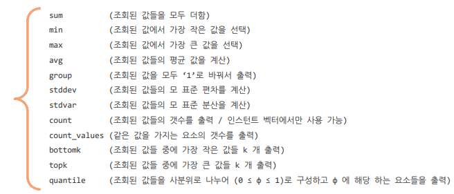
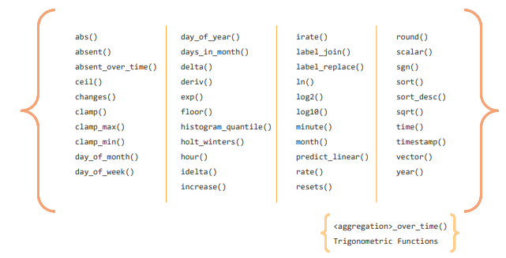

# 02_PromQL

- 수집된 metrix을 가공하기 위함


## 1. Metric Type

- **Gauge** : 특정 시점의 값을 표현하기 위해 사용하는 메트릭 타입
  - CPU 온도, 메모리 사용량 등 현재 시점 값을 알고자 할때 유용하다.
- **Counter** : 누적된 값을 표현하기 위해 사용하는 메트릭 타입
  - 증가하면 구간 별로 변화율을 측정할 때 유용하게 된다. 예를 들어 증가 추세를 보고싶을 때 편하다. 총 Network 사용량을 구할 때 편리하다.
  - 끝에 _total 이 붙으면 대부분 Counter type이다.
- **Summary** : 메트릭 값의 빈도를 측정하여 쉽게 보여주는 메트릭
- **Histogram** : 사전에 미리 정의한 구간 내에 있는 메트릭 값의 빈도를 측정


## 2. Label Matchers

**Label Matcher란?**

- {pod="pod_name"}
- 이런 것들을 Label이라고 하며, 이 label을 Matching해주기 때문에 Label Matcher라고 한다.

**조건문**

- =  : 동일한 값
- != : 동일하지 않은 값
- =~ : 정규식을 표현하는 갓ㅂ
  - ex) 
    - {node=~"w.+"} : w로 시작하는 것을 찾아서 출력
    - {node=~"m-k8s|w1-k8s"} : m-k8s|w1-k8s| 둘다 뽑음
- !~
  - ex) {node!~"w.+"} : w로 시작이외의 모든 값 출력


### 이진 연산자 (Binary Operators)

- 원하는 값으로 변경하기 위한 연산

1. 산술 이진 연산자
2. 비교 이진 연산자
3. 논리/집합 이진 연산자

**1. 산술 이진 연산자**

```
node_memory_Active_bytes/1024/1024
```

**2. 비교 이진 연산자**

```
kube_pod_container_status_restart_total > 3
kube_pod_container_status_restart_total > 1
```

**3. 논리/집합 이진 연산자**

```
kube_pod_container_status_terminated > 0 or kube_pod_container_status_waitting > 0
```


### 집계 연산자 (Aggregation Operators)



```
topk(3,node_cpu_seconds_total)
bottomk(3,node_cpu_seconds_total>0) # 0보다는 큰 것 중에서 bottomk

# node 별로 cpu의 평균
avg(node_cpu_seconds_total{mode="user"}) by (node) 
avg(node_cpu_seconds_total{mode="system"}) by (node)

# instance 별로 request total을 보는 것
sum(kubelet_http_requests_total) by (instance)

# path를 제외하고 instance 별로 보고 싶음
sum(kubelet_http_requests_total) without (instance)


```


### Vector (시간 개념 포함)

1. metric type
2. data type : 시간 개념이 포함된 데이터 타입

**4가지 Data Type**

- Instant Vector : 시점에 대한 메트릭 값만 가지는 데이터 타입
- Range Vector : 구간을 가지는 PromQL 데이터 타입
- Scalar  : 간단한 실수 값을 표현하는 데이터 타입
- String : 문자열 >> 더이상 사용하지 않음


**Range Vector **

```
# 1분 단위로 수집된 값들을 모아준다.
# ex) 15초에 한번씩 수집한다고 한다면 1분이면 4개를 모아준다.
node_memory_Active_bytes[1m] 
```


### Modifier

- 원하는 시간의 값을 조회할 때 사용하는 변경자

**2가지 사용법**

- Offset 변경자 : 현재 시점을 기준으로 단위 시간 전의 값을 출력
- @ 변경자 : 유닉스 시간으로 표시되는 특정 시점의 값을 출력

```
# 12 시간 전 데이터 조회
node_memory_Active_bytes offset 12h

node_memory_Active_bytes @ 유닉스 시간
```


### Function



- **rate (변화율)**
  - 구간의 시작과 끝의 편차를 계산
  - 일반적으로는 rate를 사용하긴 함
- **irate(순간 변화율)**
  - 구간 종료 바로 전의 구간 종료 값을 계산

- **predict_linear**
  - 기존에 있던 메트릭을 기반으로 단순히 일정 시간 이후에 값을 예측해서 추력

```
# system에 대한 5분동안의 변화율 / cpu가 2개이기 때문
avg(rate(node_cpu_seconds_total{node="m-k8s", mode="system"}[5m]))

# 2시간 후 메모리 예측
predict_linear(node_memory_Active_bytes[5m], 60*60*2) / 1024/1024

#
```


### PromQL 응용

```
# 베포 되어있는 pod 개수
count(kube_pod_info)

# namespace 단위로 베포 되어있는 pod 개수
count(kube_pod_info) by namespace 

# pod 소비하고 있는 메모리의 top 3
topk(3, sum(container_memory_working_set_bytes{pod!=""}) by (pod))

```

