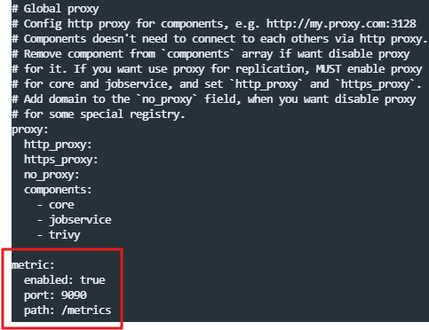
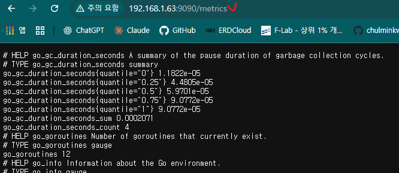
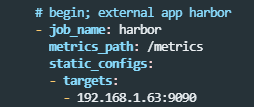
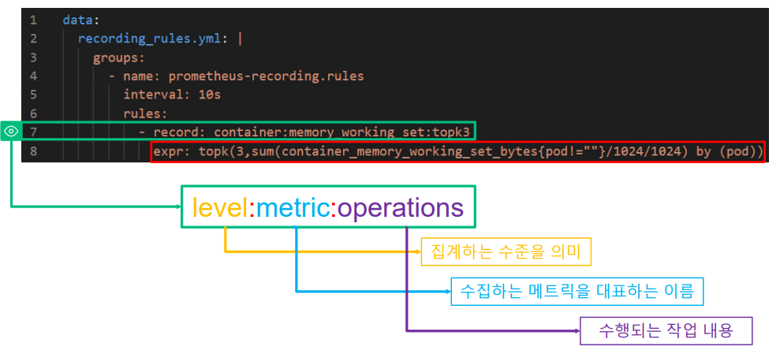
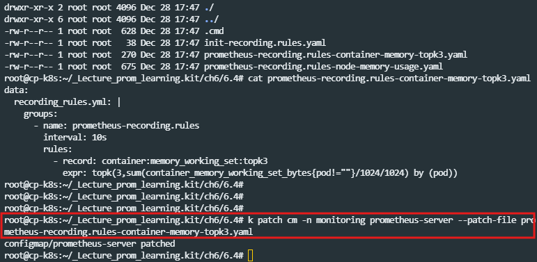
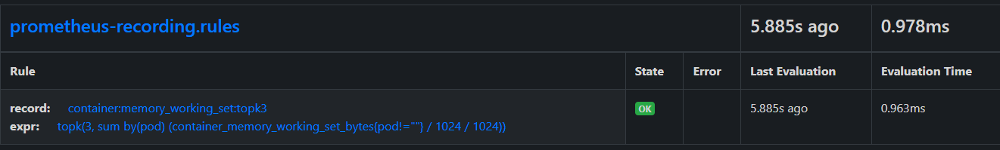
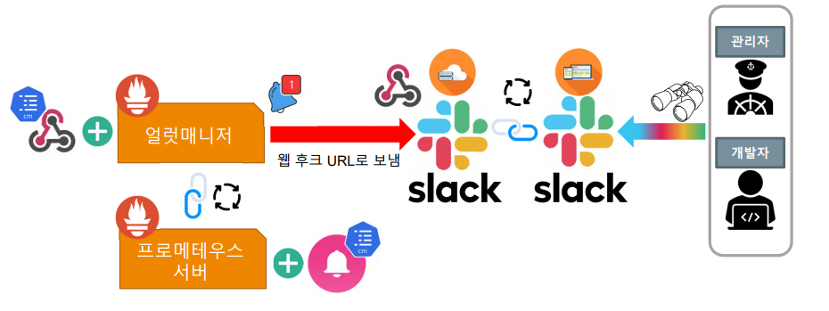
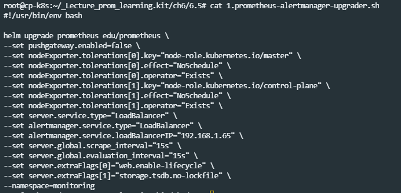

# 03_FunctionSetting


### 외부 Application metric 수집하기

- 어디라도 /metrics만 있으면 사용가능하다.

**실습**

- 다른 외부 Application을 띄워서 metric을 수집하는 것을 목표로 한다.



- harhor 라는 appication의 yaml 확인

- 위와 같이 metric이라는 부분을 설정해준다.

- http://192.168.1.63:9090/metrics

  - 
  - 이렇게 하면 /metrics로 해당 부분의 metrics가 노출되었다는 것을 확인 할 수 있다.

- 이제 prometheus에 yaml로 값을 job을 추가하게 된다.

  - 
  - 이렇게 targets을 고정으로 등록해주게 되고 metrics_path를 등록해준다.

- Patch 시작해야함

  - 

  - ```docker
    k patch configmap -n monitoring prometheus-server --patch-f
    ile 4.add-harbor-to-the-prometheus.yaml   
    ```


### 기록 규칙 만들기



- 기록 규칙 가이드
  - `level:metric:operations`
  - level : 집계하는 수준을 의미 (한번 규칙을 정하면 바꾸지 않아야 함)
  - metric : 수집하는 메트릭을 대표하는 이름
  - operations : 수행되는 작업 내용



- 이렇게 patch를 진행한다.



- 이렇게 rules에 적용된다.


- prometheus는 통짜로 들어가기 때문에 여러개를 한번에 적어줘야한다.


### Alert (알람)





- **이렇게 alert manager를 update하게 되면 기존 config를 덮어버린다.**
- 따라서 다시 세팅해줘야하기 때문에 yaml을 저장해놔야한다.


