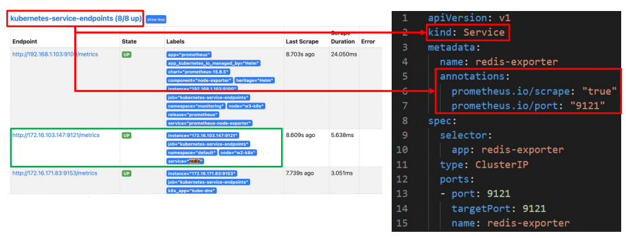
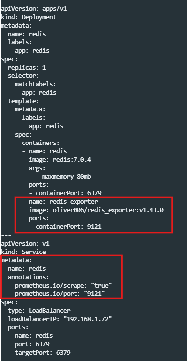
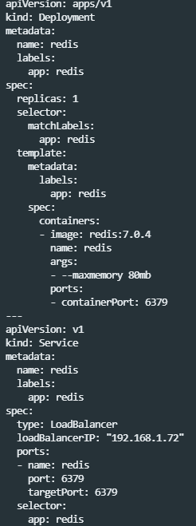
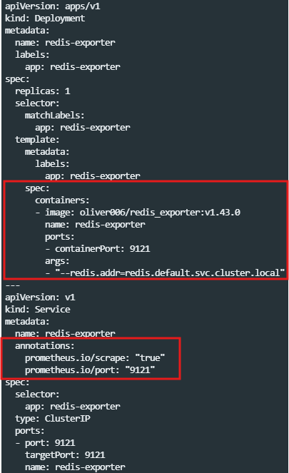

# 04_Monitoring


##  Redis



- Service에서 annotation 형태로 넣어주게 된다.

**version 1 : exporter 같이 배포하는 경우 **



**version 2 : redis와 exporter를 따로 배포하는 경우**

- 보통 2버전을 많이 사용한다. 
- 왜냐하면 이미 배포가 되어있는 경우가 많아서 exporter를 따로 배포하는 경우가 많기 때문이다.

**기존 Redis**



**Redis의 Exportor**



1. 첫번째 박스
   - args에 값이 있는 이유는 배포되어있는 redis를 바라봐야하기 때문에 설정해줘야한다.
2. 두번째 박스
   - annotation >> target을 잡기 위함

```
# promQL
# 사용하고 있는 메모리(%)
100 * redis_memory_used_bytes / redis_memory_max_bytes 

# 가용 가능한 connection 개수
>> 특정 숫자 밑으로 내려올 경우 알람
redis_confg_maxclients - redis_connted_clients

# 응답이 느린 것의 Trand 파악하기 위함 >> 계속 올라간다면 점점 느려진다는 뜻
rate(redis_slowlog_length[2m]) 

```


