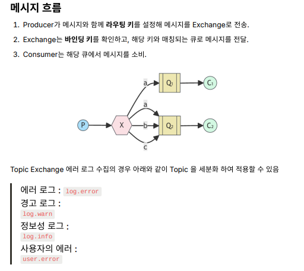

# 04_RoutingModel

- Routing 모델은 메시지를 Routing Key에 따라서 특정 큐에 전달하는 기능
- Fanout, Direct,  Topic Exchange 모두에서 사용이 가능하다.

### Exchange 특징

**Direct Exchange**

- 라우팅 키 매칭 방식 : 정확히 일치해야한다.
- 특징 : 매칭에 제한이 있다.
- 사용사례 : 단순 명확한 목적의 라우팅

**Topic Exchange**

- 라우팅 키 매칭 방식  : 패턴 기반(*, # 을 지원)
  - \* : 한 단어에 해당하는 모든 단어 수신
  - \# : 0개 이상의 단어 (와일드 카드) 
- 특징 : 매우 유연(다양한 패턴 매칭)
- 사용사례 : 복잡하고 동적인 라우팅

### 주요 특징

- 성능이 좋음 : 필요한 곳에만 전달하기 떄문
- Direct Exchange 는 1:1이 아니라 1:N으로 동작하게 된다.
- Fanout 방식과 달리, 메시지가 특정 큐로만 전달되게 된다.
- 바인딩 설정
  - Exchange와 Queue 사이의 관계를 Binding Key를 통해서 메시지가 전달된다.

- 주문의 완료 (order.complete)
- 이후 배송 지시 (order.complete.shipped)
- 재고 차감 (order.complete.inventory)
- 마케팅 이메일 (order.complete.email)
  - 그렇게 되면 order.complete.* 라고 하면 모든 로그 수신 처리가 가능하다.

### 활용 사례

- 로그 수집
- 주문 상태 전이
- 채팅의 방 개설 단위로 분류하여 메시지 전달

