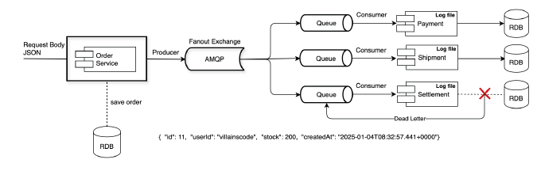

# 06_Transaction

- RabbitMQ 는 트랜잭션 메시징을 지원하여 메시지 전송, 큐 수신

### Transaction Message 의 한계

- 트랜잭션을 꼭 해야하는 것인가?
  - 대량 메시지 처리가 필요한 경우에는 부적합하게 된다.
  - 왜냐하면 대용량 처리하려고 비동기를 사용하기 위함인데 과연 이렇게 하는 것이 맞는가

- 만약 꼭 써야한다면 ?
  - AMQP Confirm Select 추천
    - 하지만 과연 이게 효과가 그정도로 좋을까?
    - **저자는 TCC 방식으로 하는것이 맞다고 생각한다.**

## Publisher Confirms

- 메시지가 Exchange에 도달했는지 확인하는 메커니즘
  - 메시지가 RabbitMQ 브로커에 성공적으로 도달했는지 확인하기 위해 사요오디는 경량화된 메커니즘으로 서로 다른 이기종간의 신뢰성 보정, 대사 기법인 TCC와 비슷한 방법이다.

- 이 방법이 Transaction보다 성능이 뛰어나며, 메시지가 브로커에 안전하게 저장 되었는지 확인하는데 적합하고, 가볍다는 특징이 있다. 시스템 부담이 적다.

### 특징

1. **가볍고 빠름**
   - 개별 메시지 단위로 전송 후 브로커로부터 확인을 받는다.
   - 트랜잭션처럼 모든 메시지 작업을 롤백하지 않고, **실패한 메시지만 다시 처리한다.**
2. **응답처리 방식**
   - Ack   : 브로커가 메시지를 성공적으로 처리
   - Nack : 브로커가 메시지 처리에 실패했음
3. **활용 사례**
   - 대규모 메시지 전송
   - 메시지 손실 방지가 중요한 시스템 (ex_ 결제 시스템, 알림 시스템)

- 처리량이 높다
  - 메시지를 3천건을 넣는다고 하고, Transaction이 예를 들어서 10초정도 걸린다고 하면, Publisher Confirms와 같은 경우에는 5초정도로 50% 이상에 성능이 걸린다고 한다.

### 주의할 점

- 메지시 중복이 있을 수 있어서 중복을 처리해주는 부분이 필요

### TCC (Try-Confirm/Cancel)방식

- 저자는 트랜잭션으로 처리한다는게 비동기 처리에서 사상이 서로 충돌한다고 생각하기 때문에 트랜잭션으로 처리하는게 불합리하다고 생각함
- 따라서 Producer, Consumer 측에서 데이터가 맞는지 확인하는 Recognition, Reconciliation 처리하는 확인 단계를 둔다
- 시간 배치작업이나 일별 배치등으로 양측의 데이터를 재확인하는 Reconciliation 작업을 한 뒹 틀어지는 데이터가 있다면 재보정을 해주는 후처리를 해주는 방식

**TCC의 진행 프로세스**

1. 직접 트랜잭션 레이어가 아니라 방어/보상 로직을 통해 Confirm 혹은 Cancel 하는 방식
2. 전송되는 데이터의 원본(JSON)을 저장하고 호출이 정상종료일 경우 확정, 비정상일경우 취소 처리한다.
3. Consumer가 Confirm 혹은 Exception 시 Cancel을 한 곳의 Queue에 발행한다.
4. 각 경계에서 전달되는 데이터들은 JSON으로 저장하고 이를 이용해서 로직을 처리하고 상태를 확정처리 한다.
5. Timeout 이나 Exception이 발생하면 Cancel 상태를 요청 혹은 Expire 필드를 두어 처리한다.

**Ex_주문 시나리오 예시**

1. Order 도데인 : 주문 상태를 초기 상태로 설정하고 메시지를 전송
2. Consumer(Settlement 도메인) : 주문 상태를 Confirm 처리 또는 Cancel 처리로 변경하여 메시지 발행
3. 최종 큐 : Confirm/Cancel 상태 메시지는 Order 가 바라보는 단일 큐로 수신
4. 배치처리 : Order와 Shipping 도메인에서 시간 단위로 메시지 카운트를 대조하여 보정

**Message 레이어를 통한 Retry와 후처리**

- 각 도메인으로 연결되는 경계 로직에서 Message Queue로 데이터를 Publish하고 각 도메인
  은 이 Queue를 바라보고 Message를 Consume 한다.
- Message 솔루션들은 토픽에 대한 손실을 방지하기 위해 자체적인 저장소를 유지 해야 한다.
- 이 저장소를 통해 미 처리된 Message 에 대해서 retry를 시도하여 최종적으로 요청된 토픽이 처리 될 수 있도록 하며, 전송측과 구독측의 데이터 보정을 위해 주기적으로 Sync하는 추가 로직이 존재해야 한다.

