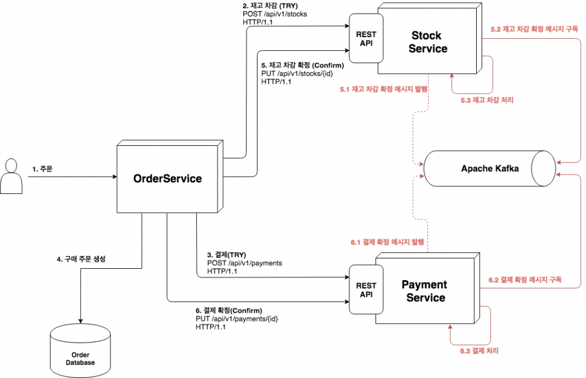

# 07_TCC

> https://www.popit.kr/rest-%EA%B8%B0%EB%B0%98%EC%9D%98-%EA%B0%84%EB%8B%A8%ED%95%9C-%EB%B6%84%EC%82%B0-%ED%8A%B8%EB%9E%9C%EC%9E%AD%EC%85%98-%EA%B5%AC%ED%98%84-1%ED%8E%B8/

## 정상 시나리오

## Fail : Try 시점 (Cancel / Timeout)

## Fail : Confirm 시점 (Eventually Consistency) 

## Fail : Retry

