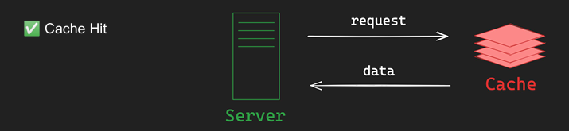
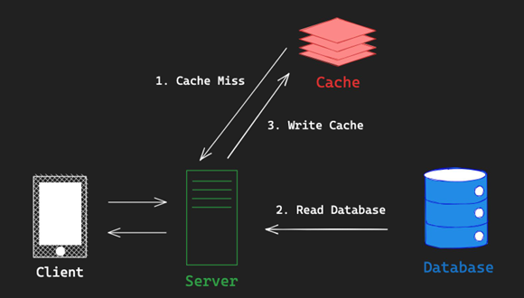

# 01_Redis

## Redis란

- Remote Dictionary Server
  - 원격에 존재 (다수에 서버가 공유하는 해시 테이블로 이해할 수 있음)
  - Key Value
  - Open Source In-Memory Data Sotre sritten in ANSI-C

## Redis 특징

- **In-Memory**
  - 모든 데이터를 RAM에 저장 (백업/스냅샷 제외)
    
- **Single Threaded**
  - 단일 thread에서 모든 task 처리
    
- **Cluster Mode**
  - 다중 노드에 데이터를 분산 저장하여 안정성, 고가용성 제공
    
- **Persistence**
  - RDB(Redis Database) + AOF(Append only file)을 통해 영속성 옵션 제공
    
- **Pub/Sub**
  - Pub/Sub 패턴을 지원하여 손쉬운 어플리케이션 개발 (채팅, 알림 등)

## Redis 사용 사례

- **Caching**
  - 임시 비밀번호 (One-Time Password)
  - 로그인 세션(Session)
    
- **Rate Limiter**
  - Fixed-Window / Sliding-Window Rate Limiter
    
- **Message Broker**
  - 메시지 큐
    
- **실시간 분석/ 계산**
  - 순위쵸
  - 반경 탐색
  - 반문자 수 계산
    
- **실시간 채팅**
  - Pub/Sub 패천

## Persistence (영속성)

- 보통은 캐시이기 서버이기 때문에 손실돼도 무방한 데이터를 저장해야한다.
- 하지만 손실되면 안되는 경우가 존재함
  - SSD와 같은 영구적인 저장 장치에 데이터 저장

### RDB  (Redis Database)

- Point-in-time Snapshot 으로 동일한 데이터를 복제하는데 사용한다.
- 새로운 Snapshot이 생성되기 이전에 일부 데이터의 유실이 있을 수 있음
- Client 요청 지연 발생이 있을 수 있음

### AOF (Append Only File)

- Redis에 적용되는 Write 작업을 모두 log로 저장
- 데이터 유실의 위험이 적지만, 재난 복구시 Write 작업을 다시 적용하기 때문에 RDB보다 느림

**RDB + AOF 함계 사용하는 옵션도 제공한다.**

## Caching

### Cache Hit & Cache Miss

**Cache Hit**

- Cache가 존재하여 data가 return 되었을 경우

**Cache Miss**

- Cache에 데이터가 없어 data를 return하지 못했을 경우

**Cache-Aside pattern**

- Cache Hit 
  - return 된 data를 그대로 사용
- Cache Miss
  - DB에 값 가져와서 cache write 하고 client에 값 보내줌

