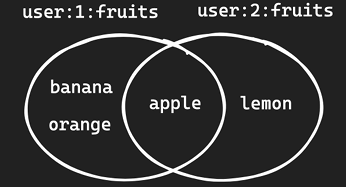

# 02_DataType


## Strings

- 문자열, 숫자, srialized object (JSON string) 등 저장
- 명령어

```
SET key value
- key value 값 저장
	
MSET
- 다수의 string 값을 한번에 저장

MGET
- 다수의 key의 값을 한번에 가져오는 거


INCR price
- redis는 string 형태로 값을 저장하지만 숫자 형태일 경우 +,- 가 가능한다.
- 숫자형 string을 1올릴때 사용

INCRBY price 10
- 숫자형 string을 특정 숫자만큼 더할때 사용된다.

SET inflearn-redis {"price":100, "language":"ko"}
- json 데이터를 직접 저장할 수 있음

SET inflearn-redis:ko:price 200 (naming convention이다.)
- 인프런에 한국어 가격은 200이라는 뜻
- 의미 단위 별로 : 을 나누어 구분해준다.

```

```
127.0.0.1:6379> mget lecture price language
1) "inflearn-redis"
2) "100"
3) "ko"
127.0.0.1:6379> incr price
(integer) 101
127.0.0.1:6379> incrby price 9
(integer) 110
127.0.0.1:6379> mget lecture price language
1) "inflearn-redis"
2) "110"
3) "ko"
127.0.0.1:6379> set inflearn-redis '{"price":100, "languate":ko}'
OK
127.0.0.1:6379> get inflearn-redis
"{\"price\":100, \"languate\":ko}"
127.0.0.1:6379> set inflearn-redis:ko:price 200
OK
127.0.0.1:6379> mget lecture price language
1) "inflearn-redis"
2) "110"
3) "ko"
127.0.0.1:6379> mget lecture price language inflearn-redis
1) "inflearn-redis"
2) "110"
3) "ko"
4) "{\"price\":100, \"languate\":ko}"
127.0.0.1:6379> mget lecture price language inflearn-redis inflearn-redis:ko:price
1) "inflearn-redis"
2) "110"
3) "ko"
4) "{\"price\":100, \"languate\":ko}"
```


## Lists

- string을 Linked List로 저장하는 데이터 타입
- push / pop에 최적화

```
-- queue
LPUSH queue job1 job2 
RPOP queue

LPUSH queue job1 job2 job3 : 
LRANGE queue -2 -1 : 
	- 다수의 item을 조회할 수 있음 (인덱스 이용 )
	- python같이 왼쪽 : 0~N-1 / 오른쪽 : -1 ~ -N 으로 인덱스 사용
	- 위는 뒤에서 2번째 ~ 1번째 item을 조회 : 가장먼저 추가된 item 2개 조회
	
LTRIM queue 0 0
	- 0번 부터 0번까지 냅두고 나머지 다 삭제


-- stack
LPUSH stack job1 job2 job3
Lpop stack

```


## SET



```
SETS
- Unique string을 저장하는 정렬되지 않은 집합
- Set Operation 사용 가능 (intersection, union, difference)

SADD user:1:fruits apple banana orange orange
- 이렇게 해도 orange는 한번만 반영된다.

SMEMBERS user:1:fruits
- set의 모든 member를 출력한다.

SCARD user:1fruits
- cardinality를 출력한다. 고유한 item의 개수

SISMEMBER user:1:fruits banana
- 특정 item이 포함되었는지 확인

SADD user:2:fruits apple lemon

SINTER user:1:fruits user:2:fruits
- user1, user2의 교집합을 출력

SDIFF user:1:fruits user:2:fruits
- user1은 좋아하지만 2는 좋아하지 않는 것을 출력
- 즉 user1 - 교집합

SUNION user:1:fruits user:2:fruits
- 합집합
```


## Hash

```
Hashes
- field-value 구조를 갖는 데이터 타입
- 다양한 속성을 갖는 객체의 데이터를 저장할 때 유용

HSET lecture name inlearn-redis price 100 language ko
- lecture라는 이름으로 key에 name, price, language를 저장

HGET lecture name
HMGET lecture price language invalue

HINCRBY lecture price 10

-----------------------------------------------------------------------
127.0.0.1:6379> HSET lecture name inflearn-redis price 100 language ko
(integer) 3
127.0.0.1:6379> HGET lecture name
"inflearn-redis"
127.0.0.1:6379> HGET lecture price
"100"
127.0.0.1:6379> HGET lecture language
"ko"
127.0.0.1:6379> HMGET lecture name price language invalid
1) "inflearn-redis"
2) "100"
3) "ko"
4) (nil)
```


## Sorted Sets

- Unique string을 연관된 score를 통해 정렬된 집합 (Set의 기능 + 추가로 score 속성 저장)
- `Skip List` + `Hash Table` 로 이루어져 있고,  score 값에 따라 정렬 유지
- score가 동일하면 사전 편찬 순으로 정렬 된다.


```
ZADD point 10 TeamA 10 TeamB 100 TeamC
- 위와 같은 순으로 저장되어있음

ZRANGE points 0 -1
- 전부 조회

ZRANGE points 0 -1 REV WITHSCORES
- 거꾸로
- socre랑 같이 출력

ZRANK points TeamA
- TeamA의 위치를 반환

```


## Streams

- append-only log에 consumer groups과 같은 기능을 더한 자료 구조
- 추가 기능
  - unique id를 통해 하나의 entry를 읽을 때,  O(1) 시간 복잡도
  - Consumer Group을 통해 분산 시스템에서 다수의 consumer가 event 처리
    - 동일한 메시지를 중복처리하는 것을 쉽게 처리할 수 있다.


```
XADD events * action like user_id 1 prodict_id 1
XADD events * action like user_id 2 prodict_id 1
- stream에 entry를 추가하게 됨 [events => key]
- * 옵션 : unique id 가 할당되게 된다.
- 지금 user_id 1이 product_id 1번에 좋아요 행위를 했다는 시나리오 예시임

XRANGE events -+
- 다수의 메시지를 조회할 수 있음

XDEL events ID
- 삭제 기능
```

```
127.0.0.1:6379> XADD events * action like user_id 1 product_id 1
"1739614339221-0"
127.0.0.1:6379> XADD events * action like user_id 2 product_id 1
"1739614454537-0"

- 가장 처음으로 들어갔던 event 부터 아닌거 까지 모두 반환
127.0.0.1:6379> XRANGE events - +
1) 1) "1739614339221-0"
   2) 1) "action"
      2) "like"
      3) "user_id"
      4) "1"
      5) "product_id"
      6) "1"
2) 1) "1739614454537-0"
   2) 1) "action"
      2) "like"
      3) "user_id"
      4) "2"
      5) "product_id"
      6) "1"
```


## Geospatials

- 좌표를 저장하고, 검색하는 데이터 타입
- 거리 계산, 범위 탐색 등을 지원

```
GEOADD seoul:station
	124 37 hong-dae
	128 37 gang-nam

거리 계산
GEODIST seoul:station jong-dae jang-nam KM

```


## Bitmaps 

- 실제 데이터 타입은 아니고, String에 binary operation을 적용한 것
- 최대 42억개 binary 데이터를 표현할 수 있음 = 2^32 (4294967296)

```
SETBIT user:log-in:23-01-01 123 1
SETBIT user:log-in:23-01-01 456 1
SETBIT user:log-in:23-01-02 123 1

BITCOUNT user:log-in:23-01-01 
- 1월1일에 로그인한 USER 수를 출력할 수 있다.

BITOP AND result
	user:log-in:23-01-01 user:log-in:23-01-02
- 1월 1일, 2일 로그인한 유저를 모두 가져올 수 있음
- result라는 bitmap에 저장된다.

GETBIT result 123
- 이렇게 결과값을 가져와야 함
```

```
127.0.0.1:6379> SETBIT user:log-in:23-01-01 123 1
(integer) 0
127.0.0.1:6379> SETBIT user:log-in:23-01-01 456 1
(integer) 0
127.0.0.1:6379> SETBIT user:log-in:23-01-02 123 1
(integer) 0
127.0.0.1:6379> BITCOUNT user:log-in:23-01-01
(integer) 2
127.0.0.1:6379> BITCOUNT user:log-in:23-01-02
(integer) 1
127.0.0.1:6379> BITOP AND result user:log-in:23-01-01 user:log-in:23-01-02
(integer) 58
127.0.0.1:6379> BITCOUNT result
(integer) 1
127.0.0.1:6379> GETBUT result 123
(error) ERR unknown command 'GETBUT', with args beginning with: 'result' '123'
127.0.0.1:6379> GETBIT result 123
(integer) 1
127.0.0.1:6379> GETBUT result 456
(error) ERR unknown command 'GETBUT', with args beginning with: 'result' '456'
127.0.0.1:6379> GETBIT result 456
(integer) 0
```


## HyperLogLog

- 집합의 cardinality를 추정할 수 있는 확률형 자료구조
- **정합성을 일부 포기하는 대신 저장공간을 효율적으로 사용 (평균 에러 0.81)**
  - 매우 정확한 값을 알 필요가 없고, 근사치만 알아도 되는경우 사용함
- Hash 충돌이 발생하면 정확한 값을 반환하지 않음
- vs Set : 실제 값을 저장하지 않기 때문에 매우 적은 메모리를 사용

```redis
PFADD fruit apple orange grape kiwi
PFCOUNT fruit
```


##  BloomFilter

- element가 집합 안에 포함되었는지 확인할 수 있는 확률형 자료구조
- 정확성을 일부 포기하는 대신 저장공간을 효율적으로 사용
- false positive
  - element가 집합에 실제로 포함되지 않는데 포함되었다고 잘못 예측하는 경우
  - element가 존재하는데 없다고 말하는 경우는 없음
- vs. SEt
  - 실제 값을 저장하지 않기 때문에 매우 적은 메모리를 사용

```
BF.MADD fruits apple orange
BF.EXISTS fruits apple
```


