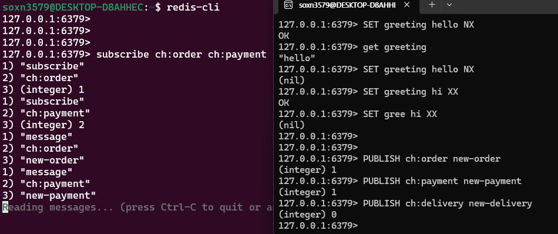

# 03_SpecailCmd


## 데이터 만료

- 데이터를 특정시간 이후에 만료 시키는 기능
- TTL(Time to Live)
  - 데이터가 유효한 시간 (초단위)
- 특징
  - 데이터 조회 요청시에 만료된 데이터는 조회되지 않음
  - 데이터가 만료되자마자 삭제하지 않고, **만료로 표시했다가 백그라운드에서 주기적으로 삭제**

```
SET greeting hello
EXPIRE greeting 10
TTL greeing
GET greeting

SETEX greeting 10 hello
```

```
127.0.0.1:6379> TTL
(error) ERR wrong number of arguments for 'ttl' command
127.0.0.1:6379> TTL greeting
(integer) -1
127.0.0.1:6379> EXPIRE greeting 10
(integer) 1
127.0.0.1:6379> TTL greeting
(integer) 8
127.0.0.1:6379> EXPIRE greeting 10
(integer) 1
127.0.0.1:6379> TTL greeting
(integer) 7
127.0.0.1:6379> TTL greeting
(integer) 3
127.0.0.1:6379> GET greeting
(nil)
127.0.0.1:6379> TTL greeting
(integer) -2
```

- -1은 아직 EXPIRE가 적용되지 않은 상태
- -2는 EXPIRE 된 상태 따라서 데이터가 존재하지 않음


## SET NX/XX

- NX
  - 해당 Key가 존재하지 않는 경우에만 SET
- XX
  - 해당 Key가 이미 존재하는 경우에만 SET

- Null Replay
  - SET이 동작하지 않은 경우 (nil) 응답

```
SET greeting hello NX
SET greeting hello XX
```

```
127.0.0.1:6379> SET greeting hello NX
OK
127.0.0.1:6379> get greeting
"hello"
127.0.0.1:6379> SET greeting hello NX
(nil)
127.0.0.1:6379> SET greeting hi XX
OK
127.0.0.1:6379> SET gree hi XX
(nil)
```


## Pub/Sub

- Pub/Sub
  - Publisher와 Subscriber가 서로 알지 못해도 통신이 가능하도록 decoupling 된 패턴
  - 두 시스템 간에 강한 coupling을 줄일 수 있다는 장점이 있다.
    - Publisher는  Subscriber에게 직접 메시지를 보내지 않고, Channel에 Publish
    - Subscriber는 관심있는 Channel을 필요에 따라 Subscriber하며 메시지 수신

- vs. Stream
  - 메시지가 보관되는 Stream과 달리 Pub/Sub은 Subscribe하지 않을 때 발행된 메시지가 수신 불가
    - 즉 구독한 이후의 메시지들만 수신이 가능하다.
    - 이전 것들은 볼 수 없음


```
SUBSCRIBE ch:order ch:payment

PUBLISH ch:order new-order
PUBLISH ch:payment new-payment
```



- 왼쪽 : subscribe
- 오른쪽 : publisher


## Pipeline

- 다수의 commands를 한 번에 요청하여 네트워크 성능을 향상 시키는 기술
- Round-Trip TImes를 최소화 하기 위함
  - Round-Trip TImes : 왔다갔다 하는 시간
- 대부분의 클라이언트 라이브러리에서 지원


## Transaction

- 다수의 명령을 하나의 트랜잭션으로 처리 => 원자성 보장
- 중간에 에러 발생 => Rollback
- 하나의 트랜잭션이 처리되는 동안 다른 클라이언트의 요청이 중간에 끼어들 수 없음
- Pipeline은 네트워크 퍼포먼스 향상을 위해 여러개의 명령을 한 번에 요청
  - 즉 실행은 하나씩 되는거임

```
MULTI
- Transaction 사용할 경우

INCR foo
- TRANSACTION에서 처리할 명령어

DISCARD
- Rollback 시키고 싶을 경우

EXEC
- Transaction 적용

```

```
127.0.0.1:6379> multi
OK
127.0.0.1:6379(TX)> incr foo
QUEUED
127.0.0.1:6379(TX)> incr foo2
QUEUED
127.0.0.1:6379(TX)> get foo
QUEUED
127.0.0.1:6379(TX)> get foo2
QUEUED
127.0.0.1:6379(TX)> exec
1) (integer) 2
2) (integer) 1
3) "2"
4) "1"
127.0.0.1:6379>
```


