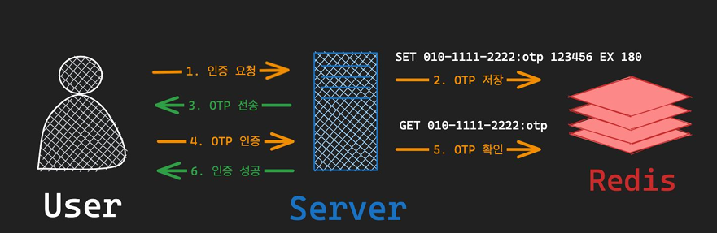
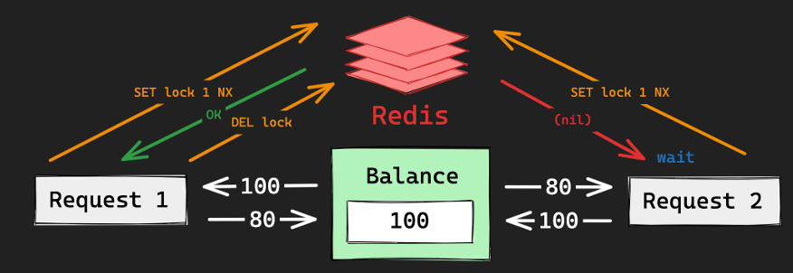
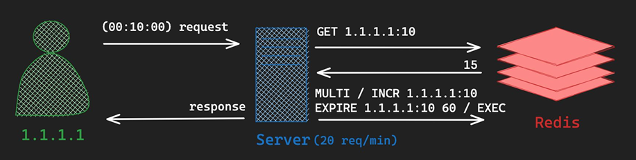
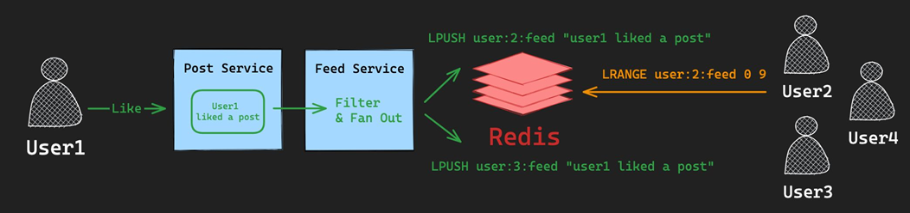
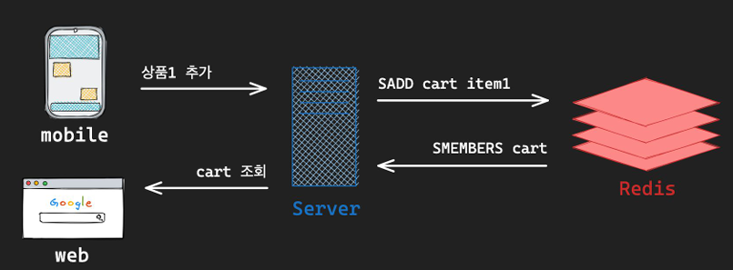
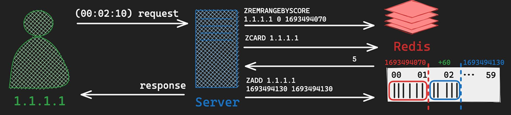
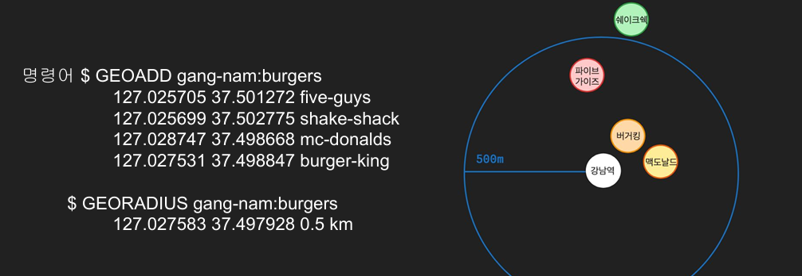
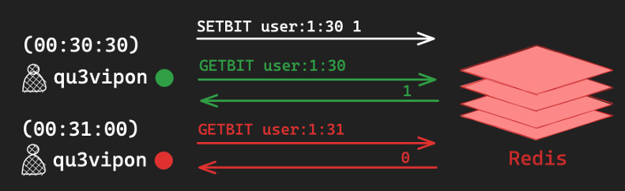
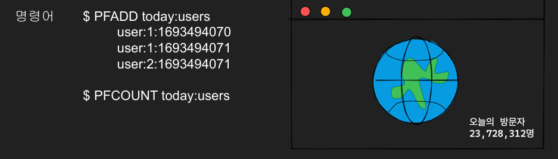
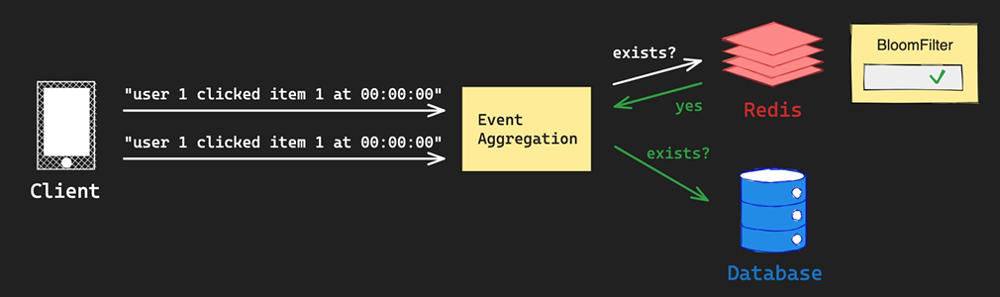

# 04_Examples

## One Time Password

- 사용자가 인증 요청을 한다.
- OTP를 생성 => OTP를 TTL을 사용해서 Redis에 저장한다.
  - `SET user의 정보 OTP번호 EX 180초`
- OTP를 user에게 전송한다.
  - 비교해서 일치하는지 확인
  - `GET user의 정보` => otp비교

## Distributed Lock

- 상황
  - balance가 100인 상황
  - request 1 : -20 차감
  - request 2 : +20 증가
  - 동시에 balance를 100으로 읽어서 동시성 문제 발생
    
- 해결 방안
  - `SET lock 1 NX` : 해당 KEY가 존재하지 않는 경우 => LOCK을 채움
  - 이렇게 락을 걸어놓을 수 있음
  - 그리고 작업이 끝나면 DEL lock으로 LOCK을 지움

## Fixed Rate Limiter

- 요청의 수를 제한하는 기술
- 고정된 시간 안에 요청수를 제한하는 방식 (ex_1분에 몇개의 요청이 됐는지 확인)
  - 단점
    - 59초에 20회 처리 요청이 오고 1분 1초에 20회 요청이 오면 2초동안 40회를 처리해야할 수도 있음

- ip를 기준으로 분당 요청하는 수를 제한하는 방법

- 분당 20회에 정보를 저장한다고 가정
  - 분당 IP마다 새로운 값을 생성 
- `GET 1.1.1.1:10` 를 하면 10~11분 동안 몇번 요청했는지 만들어 내면 됨
  - 20회 이상일 경우 ERROR 띄움 
  - 20회 미만일 경우
    - Transaction 걸어서 증가시킴
    - MULTI
    - INCR 1.1.1.1:10 => 1증가
    - EXPIRE 1.1.1.:10 60 => 60초 동안 유효함
    - EXEC

## SNS Activity Feed

- **Fan-out**
  - 단일 데이터를 한 소스에서 여러 목적지로 동시에 전달하는 메시징 패턴

## Shopping Cart

- 사용자가 구매를 원하는 상품을 임시로 모아두는 공간
- 특징
  - 수시로 변경이 발생
  - 실제 구매로 이어지지 않을 수 있음 

- 이건 근데 그냥 캐시로 사용해야할듯?
- `SAAD user1:cart item1` : 집합에다가 넣어둠
- `SMEMBERS user1:cart` : 중복되지 않은 값들을 모아서 보내줌

## Silding Window Rate Limiter

- ip 1.1.1.1로 Request 요청

  - 현재 시간에서 60초를 뺴면 됨

    

- `ZREMRANGEBYSCORE` : 
  주어진 key에서 주어진 min, max 이내의 (inclusive) score를 가지는 member를 삭제하고, 삭제된 memeber의 수를 리턴

  - `ZREMRANGEBYSCORE 1.1.1.1 0 1693494070`

  - IP 1.1.1.1 이 0부터  1693494070까지 score를 가지는 member를 삭제하고

  - 삭제된 member의 수를 리턴한다.

    

- `ZCARD 1.1.1.1`

  - 삭제 시킨 후 1.1.1.1의 요청수를 가져온다.

    

- `ZADD 1.1.1.1 163494130 163494130`

  - 163494130 SOCRE, 163494130 NAME을 저장

## Geofencing(반경 탐색)

- 

## Online Status 

- 사용자의 현재 상태를 표시하는 기능
- 특징
  - 실시간성을 완벽히 보장하지는 않는다. 
  - 수시로 변경되는 값이다.

- 현재 시간에 key로 분을 생성해서 서버와 통신을 하고 있으면 bit 값을 1로 변경한다.

- 그냥 cache로 사용한다는 뜻

## 방문자 수 계산

- 특정한 action을 counting하여 추정하는 경우
- 정확한 획수를 셀 필요가 없고 어림치만 필요한 경우라면?
  - HyperLogLog를 사용하면 됨

- 위와 같이 key값에 시간도 넣어서 같은 유저 중복 count를 할 수도 있음
- `user:1` 로 하여 중복은 count하지 않아도 됨

## Unique Event

- 동일 요청이 중복으로 처리되지 않기 위해 빠르게 해당 item이 중복된 것인지 확인하는 방법
- RDB에 부하가 높을 경우 부하를 분산시키기 위한 기술

- 값이 존재하지 않는다고 할 경우

  - 위와 같이 로그가 생성된다고 할 때

  - REDIS에 물어봄

    - `BF.MADD user 1 cliked item 1 at 00:00:00`

    - 존재하지 않음?

    - RDB에 값을 save 함

      

- 값이 존재한다고 할 경우

  - REDIS에 물어봄
  - `BF.MADD user 1 cliked item 1 at 00:00:00`
  - 존재해! => 그짓말일 수 있기 때문에 RDB에 다시 물어봄
  - 존재하지 않으면 save
