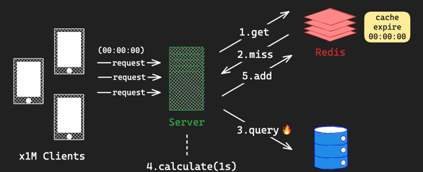

# 05_Caution


## O(N) 명령어

- **Redis의 특징**
  - 대부분 O(1) 시간 복잡도, 하지만 일부 명령어 O(N)
  - Single Thread로 명령어 수행

```
KEYS
- 지정된 패턴과 일치하는 모든 키 조회
- Prodiction 환경에서 절대 사용 금지 => 특정 패턴의 key를 조회한다면 SCAN을 사용하자 

SMEMBERS
- SET의 모든 member 반환 (N = Set Cardinary)
- 따라서 한 Set에 1만개 이상의 item을 넣지 않는 것이 좋음
- 만약 그 이상이 필요하다면 set을 분리하자

HGETALL
- Hash의 모든 field 반환 (N=Size of Hash)

SORT
- LIST, SET, ZSET의 ITEM 정렬하여 반환 => O(n)

```


## Thundering Herd Problem

- 병렬 요청이 공유 자원에 대해서 접근할 떄, 급격한 과부화가 발생
  - cache의 expire로 인해서 생길 수 있음
  - cron job에서 주기적으로 expire를 늘려주는 방법이 있음



- 연산에 1초가 걸리는 통계 테이터가 있어서 해당 데이터를 미리 캐싱해 두었다고 할 경우
- 1만개의 request가 들어왔고 이때 cache가 만료 됐다고 가정
- 이때 모든 request가 DB로 몰리게 됨


## Stale Cache Invalidation

- 캐시의 유효성이 손실되었거나 변경되었을 때 , 캐시를 변경하거나 삭제할 필요가 있음


