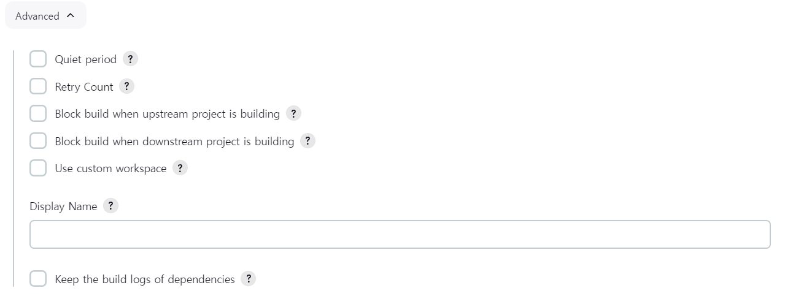

# Jenkins


## pulgin

### Advanced setting 

- ####  [프록시 서버를 거쳐야만 인터넷을 사용할 수 있는 경우]

  - 젠킨스에서 프록시 구성을 해야한다. 

  - **HTTP Proxy Configuration** 에서 Setup을 진행해야한다.

    - Server : 서버 IP

      - Port : Port no

      - User Name : 

      - 인증 기능이 설정 된 경우 : 자격 증명을 위해 사용자 이름을 입력

      - 인증 기능이 설정 안된 경우 : 빈칸

      - Pasword

      - User Name과 동일

      - No Proxy Host

        - 프록시를 거치지 않아야 하는 IP 주소나 호스트 이름 패턴을 지정

        - 여기서 지정한 값은 프록시 서버를 거치지 않는다.

          

- #### 특정 Plugin 사용하기

  - 필요한 플러그인 버전의 .HPI 파일을 다운로드 한다. 

  - Choose Filie 버튼

  - Deply 버튼

  - 젠킨스 플러그인은 Update Site 세션 내에 지정된 URL로부터 다운로드 되는것

    

### Proxy Server

- Proxy Server란
  - 클라이언트가 자신을 거쳐 다른 네트워크레 접속할 수 있도록 중간 대리해주는 서버

- 목적
  - 캐시 데이터 사용
  - 보안 : IP숨기기, 즉 프록시 서버를 방화벽으로 사용하기도 한다.
  - 접속 우회


문제 발생

- does not match와 관련된 오류
  - 문제 원인 
    - 젠킨스 서버가 프록시 뒤에서 발생하는 문제
  - 해결
    - HTTP Proxy Configuration 세션에 인증이 설정돼 있지 않으면 User Name, Password 항목을 비워둔다.
    - Test URL 항목에 젠킨스 업데이트 센터의 URL을 입력한 후, 검증
    - 프록시 검증이 성공하면 다시 설치 및 재시작 
- unable to find certification path or requested target
  - 문제 원인
    - 젠킨스는 https를 기본적으로 사용한다.
    - JDK에 CA가 존재하지만 없는 경우도 없기 때문에 오류가 발생 할 수 있음
  - 해결
    - https를 http로 변경
    - 자바 최신 다운 
    - 자바 설치 경로의 lib/security 폴더에서 .war파일로 젠킨스 서버 시작


## Security

Option

- Security Realm 
  - Delegate to servlet container (서블릿 컨데티너에 위임)
    - 젠킨스 => 제티, 톰캣과 같은 자바 서블릿 컨테이너에서 실행되는 자동화 서버
    - 만약 이들 컨테이너에 수겅된 사용자로 젠킨스를 실행하고 싶을 떄 사용
  - Jenkins'own user database
    - 서드 파디 제품을 사용하지 않을 때
    - 젠킨스 자체 DB에서 사용자 생성하고 관리하려고 할 때 사용
    - 방법
      - dashboard 이동
      - Manage Jenkins >> Manage User 
      - Create User
    - Allow users to sign up
      - 이 항목은 check하지 않는 것이 좋음
      - 아무나 계정을 만들어서 사용할 수 있게 될 수 

- Agents
  - TCP port inbound agents
    - Option
      - Fixed : 보통 port번호 지정하는 방법 사용
      - Random : 임의로 사용가능한 port로 설정됨
      - disable : 분산 빌드를 사용하지 않을 때 체크한다.
    - distributed build(분산 빌드)와 관련된 기능
      - 분산 빌드에서는 별도의 젠킨스 에이전트(노드)를 구성해야한다.

- CSRF Protection
  - Cross-Site Request Forgery (사이트 간 요청 위조) 공격 보호 기능
    - 사용자가 양식 제출, 변경하는 경우 토큰을 전송해야한다.
    - 이 토큰은 사용자 정보기반으로 만들어서 제공된다.
    - 젠킨스에선 이 토큰을 Crumb이라고 한다.
  - Crumb 해시값
    - 사용자 이름
    - 웹 세션 아이디
    - 사용자 컴퓨터의 IP 주소
    - 젠킨스 인스턴스의 고유한 salt값

- API Token
  - Rest API, CLI 명령, 다른 APP등을 통해 젠킨스에 접속할 때, 접근을 제어하는 구성과 관련돼 있다.
  - Option
    - Enable API Token usage statistics
      - 젠킨스 내부 인스턴스에 값을 저장해서 사용하는  것

- LDAP
  - Lightweight Directory Access Protocol
    - 인터넷이나 인프라넷같은 환경에서 조직,개인, 리소스 등을 찾을 수 있게 해주는 소프트웨어 프로토콜
  - 용도
    - 사용자 이름, 비밀번호 저장, 이증 기능 제공
    - 도커나 젠킨스의 사용자 이름과 비밀번호를 검증하는데도 사용 가능
  - 필요성
    - 자체 도메인 사용자 이름과 비밀번호를 사용해도 젠킨스에 로그인할 수 있도록 해준다.
    - Authorize Project 플러그인을 사용하면 도메인 사용자 이름과 비밀번호를 사용해서 젠킨스를 로그인하면, 빌드를 실행하는 사용자가 접속할 수 있도록 요청할 수 있음 
    - IT 부서에서 LDAP를 관리하는 정보를 얻어야한다.

artifact : 사람이 만들어낸 산출물이다 (메이븐에선 .jar, .war 파일)


## Credential

- 기법
  - 기본 인증
  - SSH
  - API 토큰
  - certificate
- Scope
  - global : 모든 젠킨스 작업, 젠킨스 버서 시스템에서 사용
  - system : 
    - 젠킨스 인스턴스에서 이메일 인증이나 에이전트 연결 등과 같은 시스템 기능을 수행하는데만 사용
    - 젠킨스 작업에서는 사용할 수 없다.
      - 왜냐하면 젠킨스 작업은 빌드 수명 주기를 자동화하기 위해 일련의 단계를 정의한 것이기 때문이다.
- domain
  - 자격 증명을 그룹화하는 방법
    - ex_ git lab, AWS와 같이 증명을 도메인화하여 더 쉽게 check항목을 설정할 수 있도록 도와준다.


## Role

- 젠킨스 역할

  - Role Based Stratege 플러그인 다운

  - Security에서 Authorize를 Role Base로 설정

  - Manage and Assign Roles에서 Role을 만들고 권한을 부여할 수 있다.

- 프로젝트 역할
  - 젠킨스는 애플리케이션마다 각기 다른 CI/CD 작업을 수행하는 작업을 다양하게 생성할 수 있다.
  - 즉 특정 사용자에게 일부 작업만 수행하도록 project-based role에서 제한할 수 있다.
  -  예시
    - 단위 테스트와 E-E 테스트 작업만 접속을 허용하는 역할 생성
    - Role to add : 이름 작성
    - Pattern
      - .*Testing
      - 위와 같이 작성하게 되면 UnitTesting, e-e Testing 처럼 작업명에 Testing이라는 단어가 포함된 작업에 접속할 수 있다.
      - 


## Task

### 작업 순서 

1. **Trigger**
   - 작업을 수행하는 시점
   - task가 언제 시작될지를 젠킨스에게 지시
2. **Build Step**
   - 작업을 구성하는 단계별 태스크
   - 특정 목표를 수행하기 위한 태스크를 step으로 구성할 수 있음
   - ex_ 빌드스템에서 간단한 배치 명령을 실행할 수도 있음
3. **Post-build action**
   - task가 완료 후 수행할 명령
   - ex_ 작업 완료여부를 사용자에게 알려주는 후속 동작, 파일을 특정위치로 이동시키거나 복사하는 작업 등

### Task 구성

#### Description 

- 작업에 대한 설명이나 목적


#### Discards old build

- Build Age : 지정된 시간이 지나면 삭제
- Build Count : 지정된 빌드 개수 초과하면 오래된 빌드부터 삭제
- default : 14일/50개
- 디스크 값을 절약하는 데 있어 매우 중요하다.


#### Advanced



upstream/downstream  이란?

- 작업 A에서 생성된 아티팩트가 작업 B의 작업에 사용되도록 구성할 수 있음
- 즉 작업 B를 작업 A에 종속되게 구성할 수 있음 
   A > B
- 작업 A를 작업 B의 upstream job이라고 부른다.
- 작업 B를 A의 downstream job이라고 부른다.

workspace란?

- 빌드가 실행되는 디렉토리를 의미한다.
- 빌드가 시작되면 ${JENKINS_HOME}/workspace 폴더에 실행 중인 작업의 이름으로 쿼크스페이스 디레터리가 생성된다.

- **Quiet period**

  - 새로운 빌드가 즉시 실행되지 않는다.

  - 빌드 큐에 추가되고 지정된 시간이 지나야 빌드가 시작된다.

  - 여러 개의 코드 commit 을 모아서 수행할 때 유용하다.

    - ex_5초를 설정했을 경우 동시에 여러명이 commit 을 진행했을 때 5초안에 커밋을 찍은 것들을 모아서 한번에 빌드를 진행한다. 

      

- **Retry Count**

  - 작업 실패로 쵸시하기 전에 몇 번 더 체크아웃을 시도할지 정할 수 있다.

  - ex_ count 값을 3으로 지정하면 젠킨스는 체크아웃을 3번 시도하며, 재시도 사이의 시간 간격은 10초이다.

    

- **Block build when upstream project is building**

  - upstream project가 build queue에 있을 때 젠킨스가 이 프로젝트를 실행하지 않는다.

    - 즉 작업 A가 build queue에 있으면 작업 B를 시작하지 않는다. 

      - 무조건 작업 A가 먼저 실행되게 하는 것 (upstream 먼저 실행)

        

- **Block build when downstream project is building**

  - 작업 B가 build queue에 있으면 작업 A를 실행하지 않음

  - 즉 작업 B를 (downstream)을 먼저 실행시키고 작업 A(upstream)을 실행

    

- **Use custom workspace**

  - workspace 위치를 변경할 때 사용

  - 현재 작업의 아티ㅣ팩트를 다른 작업이 사용하고 있고 이 경로가 다른 작업에서 하드코딩돼 바꿀 수가 없다면, 혀냊 작업의 워크스페이스 위치를 변경할 수 있음

    

- **Display Name**

  - 이름 지정

    

- **Keep the build logs of dependencies**

  - 현재 작업과 관련된 모든 빌드가 log rotation 기능에서 제외된다.
  - log rotation : 젠킨스의 빌드 로그를 자동으로 압축하고, 삭제하는 기능


## 빌드

- 젠킨스 작업의 특정 실행 버전
  - 콘솔 출력이나 실행 후 생성된 아티팩트 등을 모두 포함한다.
- 실행될 때마다 고유한 빌드 번호가 부여된다.
- **동시 빌드**
  - 기본적으로 task 실행은 한 번에 하나씩만 가능
  - 작업실행 버튼을 여러번 클릭하면 큐에 추가되는 형식
  - 디렉터리와 파일들에 대한 독점 권한을 갖는 것이 중요할 때 사용
  - 빌드를 병렬로 수행하고 싶을 경우
    - Execute concurrent builds if necessary 옵션 사용
    - 독립적인 여러 단계로 분리될 수 있는 긴 빌드 프로세스를 실행할 때 유용


## 프리스타일

- 일반적인 형태의 빌드 작업(task)
- 테스트 실행, 애플리케이션 빌드 및 패키징, 보고서 전송 같은 간단한 작업을 할 수 있다.


## Source Code Management

**Repository**

- 일반적으로 신규 소프트웨어 빌드를 생성하는 젠킨스 작업은 중앙 리포지터리로 커밋된 최신 코드에서 작동

- 젠킨스가 푀신 코드를 다운로드해 빌드할 수 있도록 Repo URL을 추가해야한다.

- 개인 Repo일 경우

  - username, pw, ssh 개인키 등을 제공해야한다.

  - Windows 자격 증명 관리자에서 자격증명을 추가하면 Credentials 트롭다운 메뉴에서 자격증명 항목을 선택하지 않더라고 URL 필드에 에러가 발생하지 않는다.

    

**Build Branch**

- 기본  
  - 마스터 브랜치를 기준으로 변경사항을 확인
  - 원격 Repo의 브랜치에서 코드를 다운로드한다.
- 다른 브랜치를 지정하고 싶다면 이 옵션에 브랜치를 추가하면 된다.


## Build Triggers

> 젠킨스에서 작업에 착수하는 시점을 설정할 수 있음

- **Trigger builds remotely**

  - Meaning

    - git repo같은 외부 서비스에서 젠킨스 작업을 시작할 수 있음
    - 개발자가 코드를 master branch에 merge하면 젠킨스 작업이 시작

  - Options

    - Polling Source Code Repository
      - 특정 시간 간격마다 소스코드 리포지터리의 변경여부를 확인
      - 변경이 있다면 즉시 작업을 시작
    - Triggering Jenkins Job from SCM on a specific event
      - 특정 이벤트가 발생할 경우 작업을 시작하도록 설정
      - 코드가 특정 브랜치에 병합될 때 발생하는 병합 이벤트
      - 이 옵션같은 경우 Trigger Build Remotely옵션을 선택해야한다.

  - how to use

    - `<젠킨스_URL>/job/<작업_이름>/build?token=<토큰_이름>`
      - **젠킨스_URL** : 젠킨스 인스턴스에 접근하기 위한 URL
      - **작업_이름** : 젠킨스 작업 이름. 표시 이름이 아닌 작업이름을 입력해야함
      - 토큰 이름 : 시작하는 데 사용할 엑세스 토큰

    

- **Buiild after other projects are build**

  - Meaning

    - 다른 작업을 완료한 후에 이 작업을 시작하고 싶을때 사용
    - ex
      - 현재 작업이 CompileJavaApplication이라는 선행 작업의 결과로 생성되는 아티팩트를 사용하는 경우, 이 옵션을 선택하고 CompileJavaApplication을 Project to watch에 추가하는 식으로 현재 작업을 설정

  - Options

    - Trigger only if buiild is stable

    - Trigger even if the build is unstable

      - 컴파일은 성공했지만 Unit test는 실패한 경우 unstable
      - 이 경우에도 Trigger 실행하도록 설정

    - Trigger even if the build fails

      - 실패하거나 중단된 경우에도 작업시작

        

- **build periodically**

  - Meaning

    - 매일, 매월, 매주 같은 특정 시간과 간격에 따라 빌드를 시작할 수 있음

    - 윈도우의 작업 스케줄러나 유닉스 시스템의 cron 작업과 같은 기능을 제공

    - **CI/CD원칙에 부합하지 않는다.**

      - CI/CD는 코드에 변경이 발생하는 즉시 빌드가 진행되고 그 결과를 피드백하는 방식이기 때문이다.
      - 따라서 유용한 경우는 애플리케이션이 빌드돼 테스트 환경에 배포된 후, E-E 테스트를 실행하는 작업을 시작하는 경우 유용하다.

    - ```
      MINUTE HOUR DOM MONTH DOW
      DOM : DAY OF MONTH
      SOW : DAY OF WEEK
      
      매월, 매일, 모든 요일마다 오전 8시 45분에 실행
      45 8 * * *
      ```

- **GitHub hook trigger for GISTcm polling**

- **Poll SCM**

  - 일정시간 마다 SCM을 확인해서 코드변경이 있는 경우 빌드를 진행한다.


## Build Steps

> - 1개 이상의 step을 하나씩 실행하는 식으로 현재 작업에 할당된 task를 수행할때 사용
> - 배치파일 실행, 빌드 도구 실행 등

- how to use
  - 윈도우 터미널의 명령을 실행하는 step을 추가하고 싶은 경우
    - Execute Windows batch command
    - echo "Hi there"
  - 여러 개의 step을 추가할 수 있으며, 위 부터 순차적으로 실행


## Post-Build Action

> - 할당된 Task가 완료된 이후 수행하려는 작업이 있을 떄 사용
>   - ex_ email
