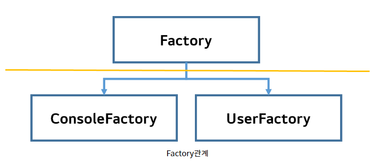
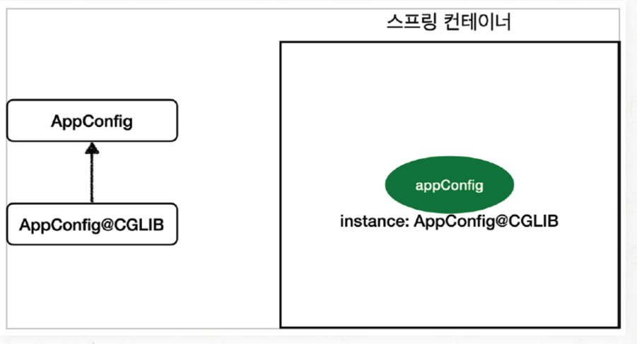
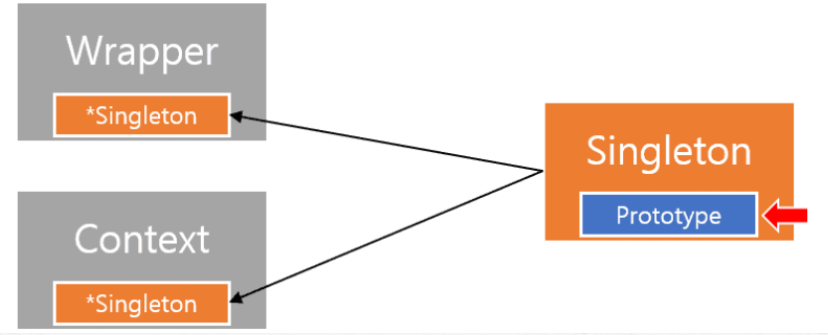
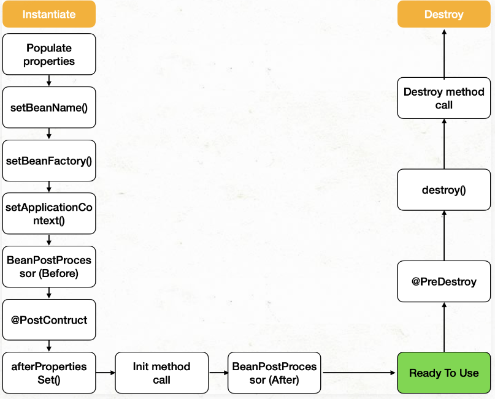

# 02_Bean

> 01_Spring Bean이란?
>
> 

https://mangkyu.tistory.com/75

https://steady-coding.tistory.com/594

https://velog.io/@falling_star3/Spring-Boot-%EC%8A%A4%ED%94%84%EB%A7%81-%EB%B9%88bean%EA%B3%BC-%EC%9D%98%EC%A1%B4%EA%B4%80%EA%B3%84

https://cnu-jinseop.tistory.com/36

## 01_Spring Bean이란?

> - Spring의 Bean은 Spring IoC Container가 관리하는 객체들을 의미한다.
> - Spring의 DI Container에 의해 관리되는 POJO(Plain Old Java Object)를 Bean이라고 부르며, 이러한 Bean들은 Spring을 구성하는 핵심 요소이다.

- **POJO(Plain Old Java Object)**로써 Spring 애플리케이션을 구성하는 핵심 객체이다.

- **Spring IoC컨테이너( 또는 DI컨테이너)**에 의해 **생성 및 관리**된다.
- class, id, scope, constructor-arg등을 주요속성으로 지닌다.


[Spring Bean의 구성 요소]

- class : Bean으로 등록할 Java클래스
- id : Bean의 고유 식별자
- scope : Bean을 생성하기 위한 방법 (singleton, prototype 등)
- constructor-arg : Bean생성 시 생성자에 전달할 파라미터
- property : Bean 생성 시 setter에 전달 할 인수


## Bean의 장점

**1) 의존성 관리**

**2) 스코프**

- 싱글톤 : 하나만 만들어서 사용
- 프로토타입 : 매번 다른 객체 사용


**3) 라이프사이클 인터페이스**

- 어떤 빈이 만들어졌을 때 추가적인 작업을 하고 싶을 경우
- postconstruct등을 사용하여 어느 시점에서 특정한 작업을 할 수 있게 만들 수 있다.


## Spring IoC Container

- Bean Factory
- 애플리케이션 컴포넌트의 중앙 저장소
- 빈 설정 소스로 부터 빈 정의를 읽어들이고, 빈을 구성하고 제공한다.


## Bean을 등록하는 방법

> 1_ Component Scan
>
> 2_ 직접 자바로 등록하기
>
> 3_Autowired사용

#### 1_ Component Scan

> 클래스 위에 @Component를 붙이면 스피링이 알아서 스프링 컨테이너에 빈을 등록한다.


**컴포넌트 스캔의 대상**

> @Component 외에 @Controller, @Service, @Repository, @Configuration는 @Component의 상속을 받고 있으므로 모두 컴포넌트 스캔의 대상이다.

- @Controller
  - 스프링MVC 컨트롤러로 인식된다.
- @Repository
  - 스프링 데이터 접근 계층으로 인식하고 해당 계층에서 발생하는 예외는 모두 DataAccessException으로 변환한다.
- @Service
  - 특별한 처리는 하지 않으나, 개발자들이 핵심 비즈니스 계층을 인식하는데 도움을 준다.
- @Configuration
  - 스프링 설정 정보로 인식하고 스프링 **빈이 싱글톤을 유지하도록 추가 처리를 한다.** (물론 스프링 빈 스코프가 싱글톤이 아니라면 추가 처리를 하지 않음.)


#### Java 코드로 등록

> Java 코드로 빈을 등록할 수 있다. @Configuration 어노테이션을 활용한다.

```java
@Configuration
public class AppConfig {

    @Bean
    public MemberRepository memberRepository() {
        return new MemoryMemberRepository();
    }

    @Bean
    public MemberService memberService() {
        return new MemberServiceImpl(memberRepository());
    }

}
```

- 위와 같이 @Configuration과 @Bean을 사용하여 bean을 주입가능하다.
- 라이브러리 혹은 내장 클래스 등 **개발자가 직접 제어 불가능한 클래스의 경우 사용**한다.
  - spring security같은 경우 bean으로 등록하는 이유이지 않을까? 생각한다.


#### Autowired사용

https://life-with-coding.tistory.com/433

**DI의 필요성** : 객체 간 의존성

- Factory interface를 상속받는 ConsoleFactory, UserFactory가 존재
- 클라이어느는 Factory클래스만을 호출해야한다.
  - 그것이 Consolefactory인지 UserFactory인지 몰라야한다.
  - 이유
  - 고객마다 전용 Factory를 생성할 경우 코드 생산성이 떨어지며, 고객이 몰라도 되는 코드가 노출되기 때문이다.
- 스프링은 Factory가 ConsoleFactory인지 UserFactory인지를 프레임워크가 자동으로 객체간 의존성을 주입해준다




**Autowired 개념**

> 스프링 DI(Dependency Injection)에서 사용되는 어노테이션이다
>
> 즉 해당 변수 및 매서드에 스프링이 관리하는 Bean을 자동으로 매칭해주는 개념
>
> - 변수, Setter메서드, 생성자, 일반 메서드에 적용가능

- 생성자에 @Autowired가 있으면 **스프링이 연관된 객체를 스프링 컨테이너에서 찾아서 넣어준다.**

- 생성자가 1개만 있으면 생략이 가능하다

**등록 방법**

1. **생성자**에서 사용 (최근에 사용하는 방법)
2. **설정자**에서 사용 (최근에는 잘 사용되지 않는다.)
   - run time에 변경될 일이 거의 없는데 개발자들이 접근을 할 수 있게 메소드를 열어놓기 때문입니다.
3. **필드**에서 사용


**@Autowired 사용**

```java
@Controller
public class StudyContoroller{

	@Autowired
	private StudyService studyService;
    
	public void studyPrint(){
		System.out.println(studyService.getClass());
	}
}
```


**같은 타입의 Bean이 여러개일 경우**

```java
public class CafeStudy implements StudyService {....}
public class SchoolStudy implements StudyService {....}
```

```java
@Controller
public class StudyContoroller{

	@Autowired
	private StudyService studyService;
}
```

- 어떤 것을 선택해야할 지 모르기 때문에 에러가 발생한다.
- 즉 **우선순위(Primary)**, 또는 **선택(Qualifier)**을 해주어야한다.


**@Primary**

```java
@Primary
public class CafeStudy implements StudyService {....}

public class SchoolStudy implements StudyService {....}
```


**@Qualifier**

```java
@Qualifier("cafestudy")
public class CafeStudy implements StudyService {....}

@Qualifier("SchoolStudy")
public class SchoolStudy implements StudyService {....}
```

```java
@Controller
public class StudyContoroller{

	@Autowired
	@Qualifier("cafestudy")
	private StudyService studyService;
}
```


## @Configuration과 싱글톤

https://steady-coding.tistory.com/594

default : singleton

```java
@Configuration
public class AppConfig {

    @Bean
    public MemberService memberService() {
        return new MemberServiceImpl(memberRepository());
    }

    @Bean
    public OrderService orderService() {
        return new OrderServiceImpl(memberRepository(), discountPolicy());
    }

    @Bean
    public MemberRepository memberRepository() {
        return new MemoryMemberRepository();
    }
}
```

- memberService와 orderService는 모두 memberRepository를 호출한다.
- 이렇게 되면 싱글톤이 깨진다고 생각할 수 있지만 CGLIB를 사용하여 싱글톤을 보장한다.
- CGLIB
  - 클래스의 바이트 코드를 조작하는 라이브러리
  - 프록시 객체의 일종으로 AppConfig가 빈으로 등록될 때, AppConfig 대신 AppConfig를 상속 받은 **AppConfig$CGLIB 형태로 프록시 객체가 등록**된다.



- 실제 등록되는 스프링 빈은 CGLIB 클래스의 인스턴스가 등록된다.

마치 아래와 같이 구현되어 있다고 생각하면 편하다고 한다.

```java
@Bean
public MemberRepository memberRepository() {
    if(memorymemberRepository가 이미 스프링 컨테이너에 등록되어있으면?) {
        return 스프링 컨테이너에서 찾아서 반환;
    } else { // 스프링 컨테이너에 없으면
        기존로직을 호출해서 MemoryMemberRepository를 생성하고 스프링 컨테이너에 등록
        return 반환;
    }
}
```

- 이 덕분에 **싱글톤이 보장**되는 것이다.

- **AppConfig$CGLIB는 AppConfig의 자식 타입**이므로 AppConfig 타입으로 조회가 가능하다고 한다. 


## Bean Lite Mode

```java
@Component
public class AppConfig {

    @Bean
    public MemberService memberService() {
        return new MemberServiceImpl(memberRepository());
    }

    @Bean
    public OrderService orderService() {
        return new OrderServiceImpl(memberRepository(), discountPolicy());
    }

    @Bean
    public MemberRepository memberRepository() {
        return new MemoryMemberRepository();
    }
}
```

- Bean Lite Mode로 설정하려면 @Configuration이 아닌 @Component로 변경하면 된다.
- 매번 다른 객체를 반환해 줄 수 있다.


## 스프링 빈 스코프

> 스프링에서 singleton과 prototype 빈 스코프를 제공한다.

#### singleton

- 싱글톤 빈은 스프링 컨테이너에서 한 번만 생성되며, 컨테이너가 사라질 때 제거된다.
  - 생성된 하나의 인스턴스는 **Spring Beans Cache에 저장**되고, 해당 **빈에 대한 요청과 참조가 있으며 캐시된 객체를 반환**한다. **하나만 생성되기 때문에 동일 참조를 보장**한다.
- **적합한 객체**
  - **상태가 없는** 공유객체
  - **읽기 전용**으로만 상태를 가진 객체
  - **쓰기가 가능한 상태**를 지나면서도 **사용 빈도가 매우 높은 객체**
    - 이때는 **동기화 전략이 필요**하다고 한다.


#### Prototype

-  DI가 발생할 때마다 **새로운 객체가 생성**되어 주입된다
- 빈 소멸에 스프링 컨테이너가 관여하지 않고, **gc(galbage collector)에 의해 빈이 제거**된다.
- 대상 클래스에 `Scope("prototype")` 을 붙이면 된다.
- **적합한 객체**
  - **사용할 때마다 상태가 달라져야하는** 객체
  - **쓰기가 가능한 상태**가 있는 객체


#### Singleton과 Prototype을 같이 사용할때 생기는 문제


- 이렇게 protorype 객체가 singleton을 가지고 있는 것은 문제가 되지 않는다고 한다.




- 하지만, singleton객체가 prototype을 가지고 있을때는 문제가 된다.
- 이미 싱글톤 빈으로 생성되는 시점에 프로토 타입 빈이 생성되어 들어오기 때문에 싱글톤 빈 내 프로토타입 빈을 호출하게 되면 **매번 같은 값을 가져온다**


#### singleton 내부의 prototype을 사용할때 마다 다른 인스턴스를 받아오기

**1) provider**

```java
@Component
class ClientBean {

    @Autowired
    private Provider<PrototypeBean> provider;    //javax.inject 하위 클래스로 import해야함

    public int logic() {
        PrototypeBean prototypeBean = provider.get();    // 컨테이너에 빈 요청
        prototypeBean.addCount();
        return prototypeBean.getCount();
    }
}
```

- `logic()` 메소드를 호출할 때마다 다른 PrototypeBean 인스턴스가 호출된다. Provider는 자바 표준이라서 스프링에 독립적이라는 장점이 있다.


**2) @Scope의 proxyMode 설정**

```java
@Component
@Scope(value = "prototype", proxyMode = ScopedProxyMode.TARGET_CLASS)
public class ProtoProxy {}

@Component
@AllArgsConstructor
public class ScopeWrapper {
    ...

    @Getter
    ProtoProxy protoProxy;
}
```

- 위와 같이 Protytpe에 **proxyMode 설정을 추가**한다. 프록시 적용 대상이 **클래스면 TARGET_CLASS, 인터페이스면 INTERFACE**를 선택한다.


#### Webscope

- 웹 환경에서만 동작하는 스코프이다.
- 필요할때 더 알아보기

종류

- Requets
- Session
- Application
- WebSocket


## Spring Bean life cycle


#### Singleton Bean



1. 스프링 컨테이너 생성
2. 스프링 빈 생성
3. 의존 관계 주입
4. 초기화 콜백
5. 사용
6. 소멸 전 콜백
7. 스프링 종료

```java
@Component
public class OrderServiceImpl implements OrderService {

    private final DiscountPolicy discountPolicy;

    public OrderServiceImpl(DiscountPolicy discountPolicy) {
        this.discountPolicy = discountPolicy;
    }

    @Override
    public Order createOrder(int age, String itemName, int itemPrice) {
        int discountPrice = discountPolicy.discount(age, itemPrice);
        return new Order(itemName, itemPrice, discountPrice);
    }

    @PostConstruct
    public void init() {
        System.out.println("초기화 콜백입니다.");
    }

    @PreDestroy
    public void close() {
        System.out.println("소멸 전 콜백입니다.");
    }
}
```

- @PostConstruct를 사용하면 초기화 콜백 호출
- @PreDestory를 호출하면 소멸 전 콜백 호출


#### Prototype Bean


- 프로토 타입 빈은 스프링 컨테이너가 빈의 생성까지만 관리를 하고, 그 이후에는 제어권이 사라진다

1. 스프링 컨테이너 생성
2. 스프링 빈 생성
3. 의존 관계 주입
4. 초기화 콜백
5. 사용
6. GC에 의해 수거


## Singleton Bean은 Thread-Safe한가?

```java
public class Singleton {

    private static Singleton instance = new Singleton();

    private Singleton() {
    }

    public static Singleton getInstance() {
        return instance;
    }
}
```

-  인스턴스가 전체 애플리케이션 중에서 단 한 번만 초기화되어 애플리케이션이 종료될 때까지 메모리에 상주한다는 특징
-  만약 싱글톤이 상태를 갖게 된다면 멀티 스레드 환경에서 동기화 문제가 발생할 수 있다.
-  그런데, 우리는 싱글톤 빈을 사용할 때 위와 같이 private 생성자, static 변수, static 메소드를 정의하지 않고도 싱글톤으로 잘 사용한다. 그래서 간혹 가다 개발자들이 싱글톤 빈은 상태를 가져도 Thread-Safe할 것이라는 착각을 하는 경우가 있다.

- 결론부터 말하자면, 스프링은 싱글톤 레지스트리를 통해 private 생성자, static 변수 등의 코드 없이 비즈니스 로직에 집중하고 테스트 코드에 용이한 싱글톤 객체를 제공해 주는 것 뿐이지, **동기화 문제는 개발자가 처리**해야 한다. 

- 만약에 싱글톤 빈이 상태를 갖게 되고, 아무런 **동기화 처리를 하지 않는다면 멀티 스레드 환경에서 부작용이 발생**할 수 있으니 주의해야 한다.


