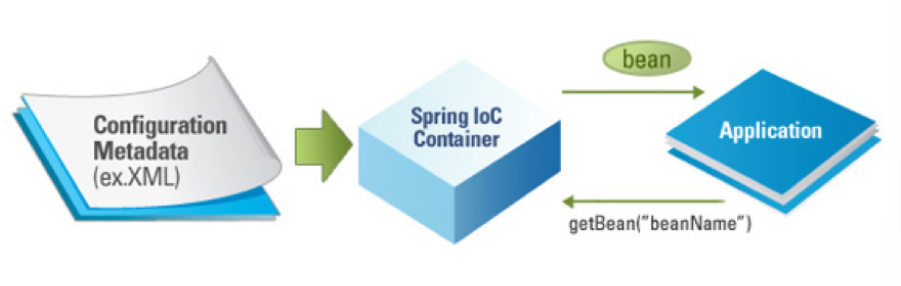

# 02_Bean

https://mangkyu.tistory.com/75

https://steady-coding.tistory.com/594

https://velog.io/@falling_star3/Spring-Boot-%EC%8A%A4%ED%94%84%EB%A7%81-%EB%B9%88bean%EA%B3%BC-%EC%9D%98%EC%A1%B4%EA%B4%80%EA%B3%84

https://cnu-jinseop.tistory.com/36

## Spring Bean이란?

> - Spring의 Bean은 Spring IoC Container가 관리하는 객체들을 의미한다.
> - Spring의 DI Container에 의해 관리되는 POJO(Plain Old Java Object)를 Bean이라고 부르며, 이러한 Bean들은 Spring을 구성하는 핵심 요소이다.

- **POJO(Plain Old Java Object)**로써 Spring 애플리케이션을 구성하는 핵심 객체이다.

- **Spring IoC컨테이너( 또는 DI컨테이너)**에 의해 **생성 및 관리**된다.
- class, id, scope, constructor-arg등을 주요속성으로 지닌다.



[Spring Bean의 구성 요소]

- class : Bean으로 등록할 Java클래스
- id : Bean의 고유 식별자
- scope : Bean을 생성하기 위한 방법 (singleton, prototype 등)
- constructor-arg : Bean생성 시 생성자에 전달할 파라미터
- property : Bean 생성 시 setter에 전달 할 인수


## Bean의 장점

**1) 의존성 관리**

**2) 스코프**

- 싱클톤 : 하나만 만들어서 사용
- 프로토타입 : 매번 다른 객체 사용


**3) 라이프사이클 인터페이스**

- 어떤 빈이 만들어졌을 때 추가적인 작업을 하고 싶을 경우
- postconstruct등을 사용하여 어느 시점에서 특정한 작업을 할 수 있게 만들 수 있다.


## Spring IoC Container

- Bean Factory
- 애플리케이션 컴포넌트의 중앙 저장소
- 빈 설정 소스로 부터 빈 정의를 읽어들이고, 빈을 구성하고 제공한다.


## Bean을 등록하는 방법

> 1_ Component Scan
>
> 2_ 직접 자바로 등록하기
>
> 3_Autowired사용

#### 1_ Component Scan

> 클래스 위에 @Component를 붙이면 스피링이 알아서 스프링 컨테이너에 빈을 등록한다.


**컴포넌트 스캔의 대상**

> @Component 외에 @Controller, @Service, @Repository, @Configuration는 @Component의 상속을 받고 있으므로 모두 컴포넌트 스캔의 대상이다.

- @Controller
  - 스프링MVC 컨트롤러로 인식된다.
- @Repository
  - 스프링 데이터 접근 계층으로 인식하고 해당 계층에서 발생하는 예외는 모두 DataAccessException으로 변환한다.
- @Service
  - 특별한 처리는 하지 않으나, 개발자들이 핵심 비즈니스 계층을 인식하는데 도움을 준다.
- @Configuration
  - 스프링 설정 정보로 인식하고 스프링 **빈이 싱글톤을 유지하도록 추가 처리를 한다.** (물론 스프링 빈 스코프가 싱글톤이 아니라면 추가 처리를 하지 않음.)


#### Java 코드로 등록

> Java 코드로 빈을 등록할 수 있다. @Configuration 어노테이션을 활용한다.

```java
@Configuration
public class AppConfig {

    @Bean
    public MemberRepository memberRepository() {
        return new MemoryMemberRepository();
    }

    @Bean
    public MemberService memberService() {
        return new MemberServiceImpl(memberRepository());
    }

}
```

- 위와 같이 @Configuration과 @Bean을 사용하여 bean을 주입가능하다.
- 라이브러리 혹은 내장 클래스 등 **개발자가 직접 제어 불가능한 클래스의 경우 사용**한다.
  - spring security같은 경우 bean으로 등록하는 이유이지 않을까? 생각한다.


#### Autowired사용 => 스프링 autowired 구글링해서 정리

https://life-with-coding.tistory.com/433

- 생성자에 @Autowired가 있으면 **스프링이 연관된 객체를 스프링 컨테이너에 찾아서 넣어준다.**

- 생성자가 1개만 있으면 생략이 가능하다

**등록 방법**

1. 생성자에서 사용 (최근에 사용하는 방법)
2. 설정자에서 사용 (최근에는 잘 사용되지 않는다.)
   - run time에 변경될 일이 거의 없는데 개발자들이 접근을 할 수 있게 메소드를 열어놓기 때문입니다.
3. 필드에서 사용

```java
@Autowired
public MemberService(MemberRepository repository){
	this.repository = repository;
}
```


