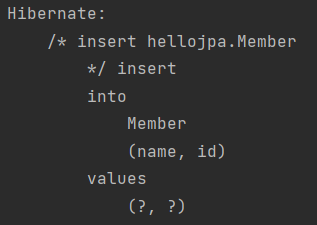
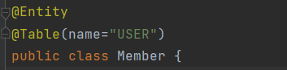
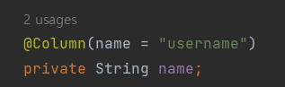

# 03_

## JAP 구동 방식


1. META-INF에서 설정 정보들을 조회하게 된다.
2. 설정 정보들을 통해서 EntityManagerFactory를 만든다.
3. 필할때 마다 EntityManager를 만들어낸다.


## @Entity

- Entity를 사용해야 JPA에서 Entity를 사용하는 class구나라고 인식하게 된다.


## Member 저장하기

```java
EntityManagerFactory emf = Persistence.createEntityManagerFactory("hello");
EntityManager em = emf.createEntityManager();
```

- EntityManagerFactory는 로딩시점에서 딱 하나만 만들어놔야한다.
- 실제 DB에 저장되거나 하는 것들은 Transaction단위로 EntityManager를 만들어 줘야한다.


**JPA에서 해주어야하는 것**

- JPA에서는 **Transaction이라는 단위**가 굉장히 중요하다.
  - **모두 Transaction안에서 작업이 진행되어야 한다.**

- Transaction

```java
public static void main(String[] args) {
    // 1. factory를 만들고
    // 2. 필요할때마다 manager를 만든다.
    EntityManagerFactory emf = Persistence.createEntityManagerFactory("hello");
    EntityManager em = emf.createEntityManager();
    EntityTransaction tx = em.getTransaction();

    tx.begin();// transaction불러오기
    try{
        Member member = new Member();
        member.setId(1L);
        member.setName("HelloA");
        em.persist(member);
        tx.commit(); // transaction commit하기
    }catch (Exception e){
        tx.rollback(); // 에러발생시 rollback
    }finally {
        em.close(); 
        // 끝나면 무조건 close를 해주어야한다. 
        // em이 결국 DB connection을 물고 동작하기 때문에 항상 끝나면 닫아 주어야 한다.
    }
    emf.close();
}
```




#### @Table



- 만약 이런식으로 Ta**ble에 USER를 쓰게 되면 User table에 저장**이 되게 된다.
- 만약 **아무것도 쓰지 않는다면 Member**로 저장되게 된다.


#### @Column(name="")



- 원하는 컬럼 이름으로 저장할 수 있음


## Member 조회


```java
public class JpaMain {
    public static void main(String[] args) {
        EntityManagerFactory emf = Persistence.createEntityManagerFactory("hello");
        EntityManager em = emf.createEntityManager();
        EntityTransaction tx = em.getTransaction();
		
        // 조회
        tx.begin();
        try{
            Member findMember = em.find(Member.class, 1L);
            System.out.println(findMember.getId());
            System.out.println(findMember.getName());
        }catch (Exception e){
            tx.rollback();
        }finally {
            em.close();
        }
        emf.close();
    }
```


## 삭제

```java
public class JpaMain {
    public static void main(String[] args) {
        EntityManagerFactory emf = Persistence.createEntityManagerFactory("hello");
        EntityManager em = emf.createEntityManager();
        EntityTransaction tx = em.getTransaction();

        tx.begin();
        //삭제
        try{
            Member findMember = em.find(Member.class, 1L);
            em.remove(findMember);
            
            
        }catch (Exception e){
            tx.rollback();
        }finally {
            em.close();
        }
        emf.close();
    }
```


##  업데이트

```java
Member findMember = em.find(Member.class, 1L);            
findMember.setName("HelloJPA");
```

- set만 해도 별도에 조작없이 값이 바뀌게 된다.
- **JPA를 통해서 엔티티를 가져오면 JPA가 관리**하게 된다.
  - **Transaction이 commit하는 시점에서 변경된 것이 있는지 없는지 다 확인**하게 된다.
  - 즉 변경된 것이 있다고 판단하게 되면 **update쿼리를 날리게 된다.**
  - 따라서 set만 해주어도 값이 자동으로 변경되게 되는 것이다.


## JPA사용 할때 주의할 점

- **EntityManagerFactory**는 하나만 생성해서 애플리케이션 **전체에서 공유**하게 된다.
- EntityManager는 고객의 요청이 올때마다 사용하고 close하고를 반복하게 된다.
  - 즉 **EntityManager는 쓰레드간에 공유가 안된다**. ( 사용하고 버려야 한다. )
- JPA의 **모든 데이터 변경은 트랜잭션 안에서** 실행해야한다.


## JPQL소개

> 만약 나이가 18세 이상인 회원을 모두 검색하고 싶다면?
>
> - JPQL로 전체 회원 검색
> - JPQL로 ID가 2이상인 회원만 검색
> - JPQL로 이름이 같은 회원만 검색


전체 회원 검색

```
List<Member> result = em.createQuery("select m from Member as m", Member.class)
                    .getResultList();
            for (Member member : result){
                System.out.println(member.getName());
            }
```


#### JPQL의 존재 이유

- JPA를 사용하면 Entity객체를 중심으로 개발을 하게 된다. 

- 문제는 검색 쿼리 : 

  - 검색을 할 때도 **테이블이 아닌 Entity 객체를 대상**으로 검색
  - 모든 DB데이터를 객체로 변환해서 검색하는 것은 불가능

- 애플리케이션이 필요한 데이터만 DB에서 불러오러면 결국 검색 조건이 포함된 SQL이 필요하다.

- **Entity객체를 대상으로 쿼리를 할 수 있는 JPQL을 제공**하게 된다.

  - JPQL은 엔티티 객체를 대상

  - SQL은 데이터베이스 테이블을 대상으로 쿼리

**장점**

- DB를 바꾸더라도 즉 Dialect를 바꾸더라도 jpa를 그대로 사용할 수 있게 된다.


