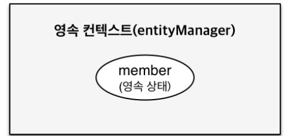

# 04_PersisenceContext


## 영속성 컨텍스트

> jpa는 실제 내부에서 어떻게 동작하지?

#### Entity Manager Factory와 Entity Manager


- Entity Manager Factory에서 요청이 올때마다 Entity Manager를 생성해서 사용하게 된다.


#### 영속성 컨텍스트

> '엔티티를 영구 저장하는 환경'이라는 뜻이다


**EntityManager.persist(entity)**

- 왜 save가 아니라 persist라는 용어를 사용할까?
- DB에 저장한다는 것이 아니라 영속성 컨텍스트라는 곳에 영속화한다는 뜻이다
  - 즉 DB에 저장 X => 영속성 컨텍스트 저장 O


EntityManager를 통해서 영속성 컨텍스트에 접근한다. 


#### J2SE환경


## Entity의 생명주기


**비영속성(new/transient)**

- PersistenceContext와 전혀 관계가 없는 새로운 상태


**영속(managed)**

- PersistenceContext에 관리 되는 상태


**준영속(detached)**

- PersistenceContext에 저장되었다가 분리된 상태


**삭제(removed)**

- 삭제된 상태


#### 비영속성(new/transient)


- EntityManager에 아무것도 하지 않은 상태

```java
// 객체를 생성한 상태(비영속)
Member member = new Member();
member.setId("member1");
member.setUserName("회원1");
```


#### 영속(managed)



- EntityManager에 member가 영속된 상태
- 이때는 DB에 저장이 되지는 않는다.
- 그럼 언제 DB에 저장되지?
  - 그것은 transaction이 commit되는 시점에 저장이 되게 된다.

```java
// 객체를 생성한 상태(비영속)
Member member = new Member();
member.setId("member1");
member.setUserName("회원1");

EntityManager em = emf.createEntityManager();

// 객체를 저장한 상태(영속)
em.persist(member)
```


#### 준영속(detached), 삭제(remove)

```java
// 회원 엔티티를 영속성 컨텍스트에서 분리, 준영속 상태
em.detach(member)

//객체를 삭제한 상태(삭제) => db삭제를 요청한 상태
em.remove(member)
```


## PersistenceContext의 장점

- 1차 캐시
- 동일성(identity) 보장
- 트랜잭션을 지원하는 쓰기 지연
  (Transactional write-behind)
- 변경 감지(Dirty Checking)
- 지연로딩 (Lazy Loading)


