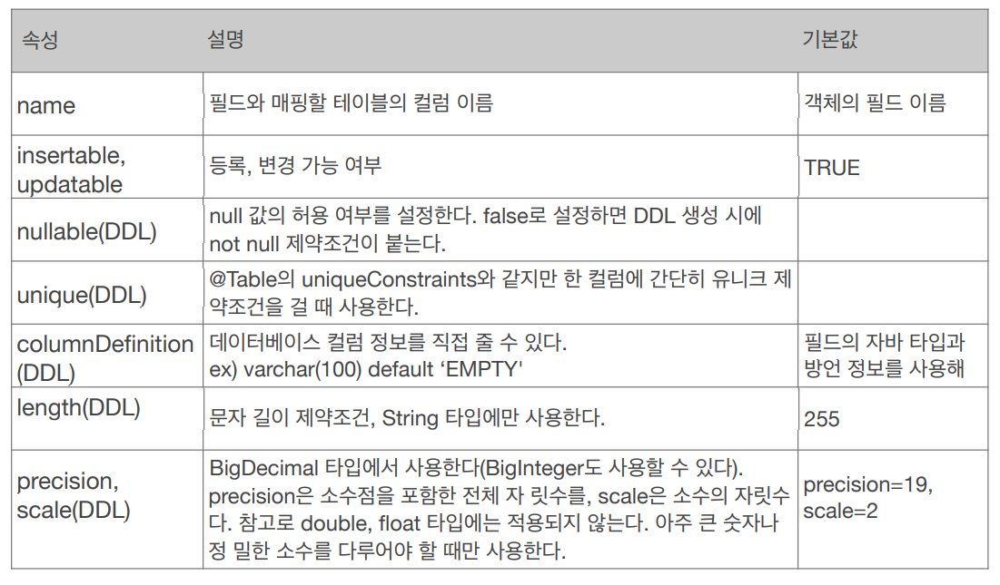
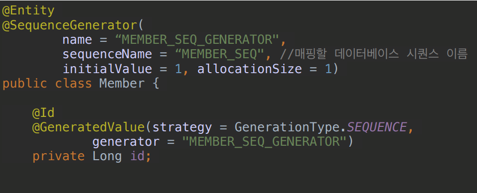
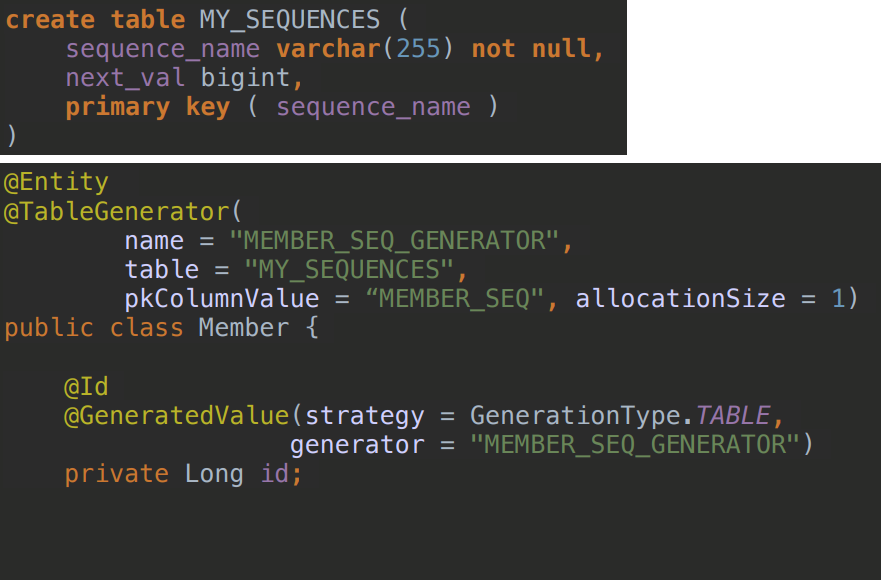

# 05_Entity_Mapping

> - 객체와 테이블 맵핑
> - DB 스키마 자동 생성
> - field와 column맵핑
> - 기본 키 맵핑

#### Entity Mapping소개

- 객체와 테이블 : @Entity, @Table
- 필드와 컬럼     : @Column
- 기본 키             : @Id
- 연관관계          : @ManyToOne, @JoinColumn


## 01_객체와 테이블 맵핑

#### @Entity

- @Entity가 붙은 클래스는 JPA가 관리하는 엔티티이다.
- 주의
  - **기본생성자는 필수** (파라미터가 없는 public 또는 protected생성자)
  - final class, enum, interface, inner클래스에는 사용할 수 없다.
  - DB에 저장하고 싶은 필드에는 final을 사용할 수 없다.

#### @Table

- Entity와 Mapping할 테이블을 지정한다.
- 테이블을 다른이름과 mapping하고 싶을 경우에 사용
  - @Table(name = "mapping하고 싶은 이름")
- uniqueConstraints(DDL)
  - 


## 02_DB스키마 자동생성

- DDL을 애플리케이션 실행 시점에 자동으로 생성해준다.
  - 운영에서는 사용하지 않는다
  - 개인 개발할때는 꽤나 유용하다.
- 데이터베이스 방언을 활용해서 **DB에 맞는 적절한 DDL생성**
  - 이렇게 생성된 DDL은 개발 장비에서만 사용
- 생성된 DDL은 **운영서버에서는 사용하지 않거나**, 적절히 **다듬은 후 사용**


**사용 방법**

```java
<property name="hibernate.hbm2ddl.auto" value="create" />
```


**주의**

- **운영 장비에는 절대 create, create-drop, update를 사용하면 안된다.**
- 개발 초기 단계 : create 또는 update
- 테스트 서버     : update 또는 validate <다른 사람이 테스트 했던 데이터가 다 날아간다. >
- 운영서버          : validate 또는 none <>
  - 직접 치는 것을 권장하고 있음


#### DDL생성 기능

> DDL이란?
>
> - Data Definition Language
> - 테이블과 같은 데이터 구조를 정의하는데 사용되는 명령어들로(생성, 변경, 삭제, 이름변경) 데이터 구조와 관련된 명령어들을 말한다.
> - 명령어 : CREATE, ALTER, DROP, RENAME, TRUNCATE


- 제약조건 추가 : 회원 이름은 **필수**, 10자 초과 x

  - `@Column(nullable = false, length = 10)`

- 유니크 제약조건

  - ```java
    @Table(uniqueConstraints = {@Uniqueconstraint(name = "NAME_AGE_UNIQUE",
    							colunmNames = {"NAME","AGE"})})
    ```

- DDL생성기능은 **DDL을 자동생성할 때만 사용**되고, **JPA의 실행 로직에는 영향을 주지 않는다**.


## 03_필드와 컬럼 매핑

**요구사항**

```
1. 회원은 일반 회원과 관리자로 구분
2. 회원 가입일과 수정일이 있어야함
3. 회원을 설명할 수 있는 필드가 있어야한다. 이 필드는 길이 제한이 없다.
```

```java
package hellojpa; 
import javax.persistence.*; 
import java.time.LocalDate; 
import java.time.LocalDateTime; 
import java.util.Date;

@Entity 
public class Member {
    @Id 
    private Long id;

    @Column(name = "name") 
    private String username; 
    private Integer age;

    // DB에는 enum이 없다. 
    // enum을 사용하기 위해선 Enumerated를 사용
    @Enumerated(EnumType.STRING)
    private RoleType roleType;

    @Temporal(TemporalType.TIMESTAMP) 
    private Date createdDate; 

    @Temporal(TemporalType.TIMESTAMP) 
    private Date lastModifiedDate; 

    @Lob 
    private String description; 
    //Getter, Setter… 
} 
```

@Enumerated(EnumType.STRING)

@Lob

- 큰 컨텐츠를 넣고 싶을 때 사용한다.
- description과 같이 클 때

@Transient

- DB적용시키고 싶지 않을때 사용한다.


#### @Column



- **insertable or updatable = false**로 지정할 시에 column이 절대 변경되지 않는다.
- **nullable**
  - false => not null : 항상 값이 들어가야 된다는 것을 의미

- **length = 10** 이렇게 사용 가능


#### @Enumerate

- **EnumType**
  - ORDINAL : enum의 순서를 DB에 저장
  - STRING : enum 이름을 DB에 저장

- **ORDINAL 을 사용하지 않는다**
  - enum을 변경해서 guset를 첫번째 자리에다가 추가해줌
  - 그러면 guest를 0번으로 인식하게 된다.
  - 따라서 STRING으로 사용하게 된다.


## 기본키 맵핑

**사용하는 어노테이션**

- @Id
- @GeneratedValue


#### 기본 키 맵핑 방법

사용방법

```java
@GeneratedValue(strategy = GenerationType.AUTO)
@GeneratedValue(strategy = GenerationType.IDENTITY)
@GeneratedValue(strategy = GenerationType.SEQUENCE)
@GeneratedValue(strategy = GenerationType.TABLE)
```


**직접 할당** : **@Id만 사용**

**자동 생성 (@GeneratedValue())**

- **IDENTITY** : DB에 위임, MySQL// DB가 알아서 해줘라는 뜻이다.
- **SEQUENCE** : DB 시퀀스 오브젝트 사용, ORACLE
  - @SequenceGenerator필요
- **TABLE** : 키 생성용 테이블 사용, 모든 DB에서 사용
  - @TableGenerator필요
- **AUTO** : 방언에 따라 자동 지정, 기본값


#### IDENTITY전략 특징

- 기본 키 생성을 DB에 위임
- 주로 MySQL, PostgreSQL, SQL server, DB2에서 사용한다.
  ex) MySQL의 AUTO_INCREMENT
- JPA는 보통 트랜잭션 커밋 시점에 INSERT SQL실행 => 하지만 IDENTITY는 그렇지 않음
- AUTO_INCREMENT는 DB에 INSERT SQL을 실행한 이후에 ID 값을 알 수 있음
- IDENTITY전략은 **em.persist()시점에 즉시 INSERT_SQL실행** 하고 DB에서 식별자를 조회

  - 이유 : 밑에 있는 문제점을 해결하기 위해서
  - 즉 모아서 보내는 것이 IDENTITY전략에서는 불가능하다.
    - 하지만 크게 메리트가 있거나 하지 않는다.


**IDENTITY전략의 애매한 점**

- 내가 id값을 직접 넣으면 안된다. 그리고 db에 insert를 해야한다.
  - 즉 **db에서 null**(내가 id값을 설정하지 않아야 했기 때문)로 **insert 쿼리가 날라오면** 
    **그때 값을 세팅**을 해준다.
  - 이렇게 되면 문제가 생김
- **문제점**
  - id값을 알수 있는 시점이 언제인가?
  - db에 값이 들어가봐야 id값을 알수 있게 된다.
  - 하지만 jpa에서 PersistanceContext에 관리 되기 위해서는 무조건 pk값이 있어야 한다.


#### SEQUENCE전략

- 데이터베이스 시퀀스는 **유일한 값을 순서대로 생성**하는 특별한 데이터베이스 오브젝트
  (예: 오라클 시퀀스)
- 오라클, PostgreSQL, DB2, H2 데이터베이스에서 사용
- 순서
  - sequence전략이면 db에서 값을 얻어와야한다고 생각함
  - db에서 값을 얻어옴
  - 그리고 다음 id값을 넣어준다
  - 그리고 영속성 컨텍스트에 넣어주게 된다.
  - 따라서 영속성 컨텍스트에 id값을 넣어줄 수 있게 된다.
  - 즉 buffer를 사용할 수 있게 된다. => commit 시점에 쿼리를 날리게 된다.





**allocationSize를 이용해서 성능 높이기**

- persist를 사용할 때마다 db에서 값을 가져오게 된다.
  - 즉 계속 왔다 갔다해야하기 때문에 네트워크상에서 성능상 비효율이 발생하게 된다.
- 미리 50개를 땡겨 쓴다고 생각하면 편하다.
  - db에서 미리 키값을 몇개를 가져와서 한번에 사용하는 방법이라고 생각하면된다.
  - 그렇다면 여러번 왔다갔다하지 않고 한번에 호출로 영속성 컨텍스트에 id값을 부여할 수 있다.


#### Table전략

- 키 생성 전용 테이블을 하나 만들어서 데이터베이스 시퀀스를 흉 내내는 전략
- 장점 : 모든 DB에 적용가능
- 단점 : 성능
- 잘사용하진 않음




#### 식별자 전력

- **제약 조건**
  - **null이면 안됨** / **유일**해야함 / **변하면 안됨**
- 미래까지 이 조건을 만족하는 자연키(비지니스적으로)는 찾기 힘들다.
  - 따라서 **대체키**(비즈니스와 상관없느 키)를 쓰는 것을 **추천**한다.
- **권장**
  - **Long + 대체키 + 키 생성전략**을 사용한다.
  - Long => 10억 넘어도 동작하게 하기 위해서
