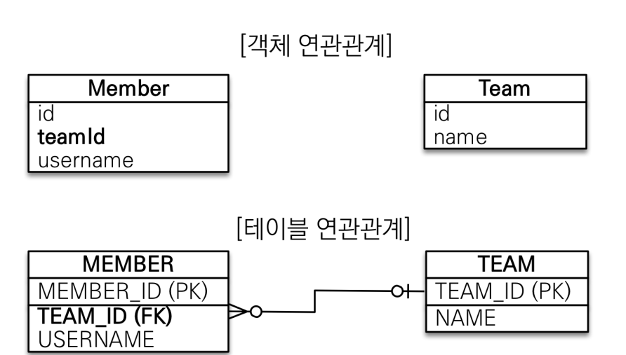
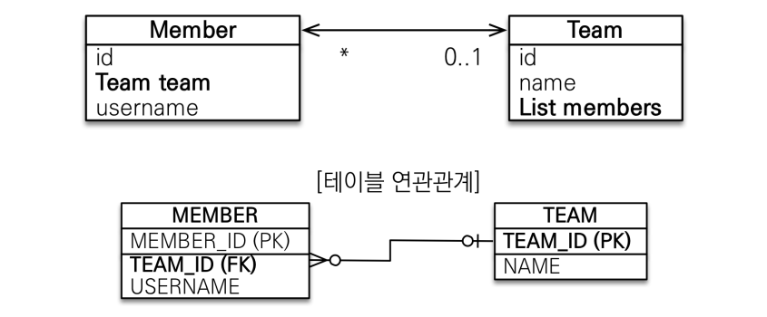
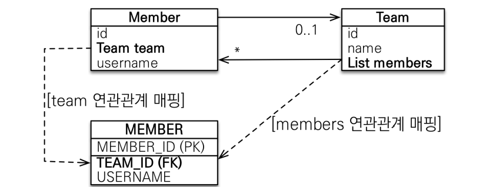
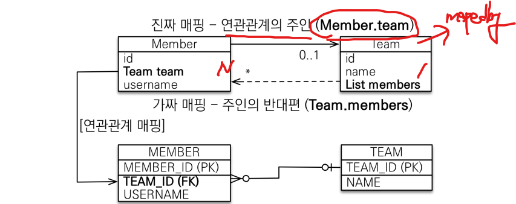

# 07_연관관계

> 

**용어**

- 방향(Direction) : 단방향, 양방향
- 다중성(Multiplicity) : N:1/ 1:N / 1:1 / N:M

- **연관관계 주인(Owner)**
  - 객체 양방향 연관관계는 관리주인이 필요 


## 연관관계가 필요한 이유

#### 테이블에 맞춰 모델링을 하는 경우



- 이런식으로 객체 연관관계에서 teamId를 가지게 된다.
- 그렇다면 외례키로 객체를 다시 가져와야하는 상황이 오게 된다.
  - 즉 객체지향적이지 않다는 뜻

```java
try{
    Team team = new Team();
    team.setName("TeamA");
    em.persist(team);
    
    Member member = new Member();
    member.setUserName("member1");
    member.setMemberId(team.getTeamId()); //과연 이렇게 id값을 가져와서 쓰는게 맞을까?
    em.persist(member);
    
    //조회할 때
    Member findMember = em.find(Member.class, member.getId());
    
    //어느 소속인지 알고 싶어 => 이런식으로 계속 물어봐야한다.
    Team findTeam = em.find(Team.class, findMember.getTeamId())
}
```

- 데이터 중심으로 모델링하면, 협력 관계를 만들 수 없다
  - **테이블** : **외래키로 조인**을 사용해서 연관된 테이블을 찾는다
  - **객체**     : **참조**를 사용해서 연관된 객체를 찾는다


## 단방향 연관관계

#### 객체지향 모델링


- 객체를 통째로 가져왔음
- 이렇게 설계를 할 경우 JPA가 어떤 관계인지 알려주어야 한다. 
  - Member ( N )
  - Team ( 1 )

```java
// Entity
public class Member{
    // ...
    @ManyToOne
    @JoinColumn(name="team_id") //어느 컬럼에 조인을 할것인지 명시해주는 것
    private Team team
}
```


## 양방향 연관관계(연관관계의 주인)



```java
// 단방향일 경우
Team findTeam = findMember.getTeam // 가능
Member findMember = findTeam.getMember // 불가능 => 단방향이기 때문
```

**Table일 경우**

- Member와 Team 둘다 외례키를 가지고 있음
  - table은 외례키하나로 양방향을 결정할 수 있음
  - 양쪽의 관계 항상 알 수 있음

**Jpa일 경우**

- Member에서는 Team으로 갈 수 있지만 Team에서는 Member로 갈 수 없음
- 따라서 Team에서 **List members라는 것을 넣어줘야 양방향으로 갈 수 있음**


#### 양방향 mapping하는 방법

```java
// Member
public class Member{
    @ManyToOne
    @JoinColumn(name="team_id")
	private Team team;
}

// Team
public class Team{
	// new ArrayList<>() 이렇게 하면 add할 때 null포인트가 안뜬다
    @OneToMany(mappedby = "team") // Member에 team에 걸려있다는 뜻
    private List<Member> members = new ArrayList<>(); 
}
```

- 객체는 **가급적이면 단방향mapping**이 좋다
  - 양방향으로 mapping할시 신경써야할 것들이 늘어난다.


### mappedby란?

> **객체와 테이블**간에 **연관관계를 맺는 차이를 이해**해야 한다.

```java
@OneToMany(mappedby = "")
```


**객체와 테이블이 관계를 맺는 차이**

- **객체 연관관계** = **2개**
  - 회원 => 팀 연관관계 1개 (단방향)
  - 팀    => 회원 연관관계 1개 (단방향)
  - 즉 양방향 관계는 사실 양방향 관계가 아님 => **2개의 단방향 관계**
- **테이블 연관관계** = **1개**
  - 회원 <=> 팀의 연관관계 1개 (양방향) => 방향이 없다고 생각해도 된다.
  - 양쪽을 조인할 수 있다는 뜻


#### Rule ) 둘중 하나는 외래 키를 관리해야한다?



- 테이블은 이 **둘 중에서 어느것을 Mapping해야하지?**
  - Member에 있는 team값이 변경 되었을때 Update를 해야하나?
  - Team에 있는 List members값을 Update를 해야하나?
    - ex) 새로운 팀에 들어가고 싶어!! => Member의 팀값을 바꿔야할지
      	  아니면 팀에 있는 members의 list값을 바꿔야 할지.....
  - DB입장에서는 객체가 어떻게 되든 Member에서 TeamId값만 어떻게 잘 바꿔주면 된다.

- 이게 왜 문제인가?
  - ex_
  - Member의 team에는 값을 넣음, List members에는 값을 넣지 않음


#### 연관관계 주인 ( Owner)

**양방향 맵핑 규칙**

- 주인
  - mappedBy X : 주인
  - mappedBy  : 주인x
- 연관관계의 **주인만이 외래 키를 관리**(등록, 수정)
- 주인이 **아닌쪽은 읽기만** 가능
  - 즉 **mappedBy있는 쪽은 읽기만** 가능하다.


그렇다면 **누구를 주인**으로 지정할 것인가?

- **외래키가 있는 곳을 주인**으로 정해야한다.
  - 즉 Member를 주인으로 잡는다
  - N이 되는 쪽으로 ManyToOne
  - 1이 되는 쪽 OneToMany 쪽에 mappedby를 잡아준다.
- 진짜 : (등록, 수정 가능)
- **가짜 : (읽기만 가능)**
- 이유
  - 만약 Team의 List members에 주인을 잡아줬다고 한다.
  - 그렇게 된다면 분명 Team에서 변경을 주었는데 update쿼리가 member가 나가게 된다.
  - 즉 개발을 하다가 헷갈릴 여지가 있기 때문에 객체가 하나만(N, member, List같은 것이 아닌 곳) 있는 쪽을
     주인으로 설정한다.


### 양방향 Mapping시 많이하는 실수

- 연관관계의 주인에 값을 입력하지 않음


**실패 이유**

- team은 주인이 아니다. 즉 **읽기만 할 수 있다.**
  그 뜻은 add로 추가한다고 해봤자 **member의 값이 등록, 수정이 되지 않아 null값이 들어간다**는 뜻
  그렇다면 어떻게 해야할까?

```java
// 저장 실패 => Team id에 null값이 들어가게 된다.
Member member = new Member();
member.setName("member1");
em.persist(member);

Team team = new Team();
team.setName("TeamA");
team.getMembers.add(member);
em.persist(team);
```


**성공 이유**

- 연관관계에 **주인에게 값을 넣어주었기 때문**이다.
- 즉 **주인만 등록, 수정**을 할 수 있다.

```java
// 저장 성공 
// => team을 먼저 저장해준다.
// => 그리고 member에 team을 넣어준다.
Team team = new Team();
team.setName("team1");
em.persist();

Member member = new Member();
member.setName("member1");
member.setTeam(team); // 이부분이 point
```


#### 하지만 두군데 다 값을 넣어주는 것이 맞다

- **값이 나오지 않는 현상**
  - 이유 : **1차캐시 때문** => 영속성 컨택스트
  - 1차 캐시에 있는 값을 가져온다?
    - 1차 캐시에 있는 값의 뜻? => Team에 members에는 **update가 아직 되지 않은 상태**이다.
    - 따라서 **둘다 값을 넣어주고 사용하는 것을 권장**한다.

```java
Team team = new Team();
team.setName("team1");
em.persist();

Member member = new Member();
member.setName("member1");
member.setTeam(team);
em.persist(); 

// 값들이 1차 캐시에 있는 값을 가져오게 된다.
Team findTeam = em.find(Team.class, team.getId());
List<Member> members = findTeam.getMembers();

for (Member m : members){
    // members => Team에 있는 값이다.
    sout(m.getUsername());
}
```


- **선호 하는 방식**
  - 순수 객체 상태를 고려해서 **항상 양쪽에 값을 설정**하자
  - 이렇게 하는 것이 맞음 하지만 설계상 편리하지 않음
  - 따라서 2번째 코드 방법을 선호하게 된다.

```java
Team team = new Team();
team.setName("team1");
em.persist();

Member member = new Member();
member.setName("member1");
member.changeTeam(team); // set => change로 변경 이유는 밑에 코드 주석
em.persist(); 

// 이부분이 윗부분과 다르다. => 즉 양쪽으로 값을 넣어줌
// 하지만 실수를 줄이기 위해서 Entity에서 값을 넣어준다.
// team.getMembers().add(member); 
Team findTeam = em.find(Team.class, team.getId());
List<Member> members = findTeam.getMembers();

for (Member m : members){
    sout(m.getUsername());
}
```

```java
// 엔티티 부분에 getter setter 부분
@Entity
public class Member{
    // this => Member
   	// set => changeTeam으로 바꾼 이유 : 관례상 그렇게 함
    public void changeTeam(Team team){
        this.team = team;
        team.getMembers().add(this);
    }    
}
```


#### 주의!! : 무한 루프!!

- **toString, Lombok, JSON** 생성 라이브러리
  - 값을 다 만들어 버려서 member에서 team을 부르고 team에서 member를 부르는 상황이 발생
  - 즉 무한 루프를 만들어 버린다.
- 해결?
  - toString
    - lombok에서 toString은 가급적 사용하지 말자
    - 만약 사용할 경우에는 저런경우를 빼고 사용하자
  - JOSN일 경우
    - **Controller**에는 **절대 Entity를 반환하지 말아라**
    - Controller에서 Entity를 반환할 경우 josn으로 잘 뽑게 된다.
    - 문제 1) 무한 루푸
    - 문제 2) Entity가 변경 될 시 => Entity의 스펙이 바뀌게 된다.
    - **DTO로 변환해서 반환하는 것을 추천** (Controller에서)


## 정리

- **초기에 단방향 맵핑으로** 설계를 해놓는다.
- 양방향?
  - 단방향 맵핑에서 **반대방향으로 조회 기능이 추가** 되는 것뿐이다.
- 언제 양방향 사용?
  - JPQL에서 역방향으로 탐색할 일이 많음 => 이때 사용한다.
- 결론
  - 단방향 매핑을 잘해주고 => **양방향은 필요할 때만 추가**하면 된다.
  - Table에 영향을 주지 않기 때문
  - 연관관계의 **주인**은 **외래 키의 위치를 기준**으로 한다.


