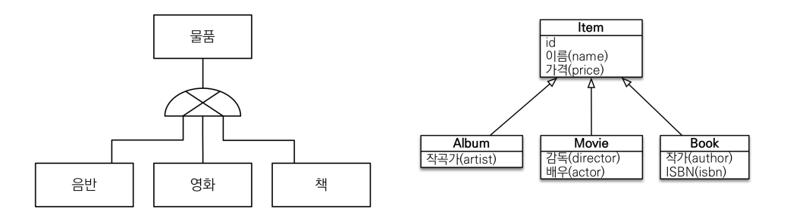
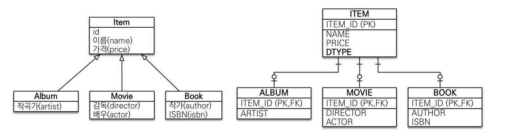
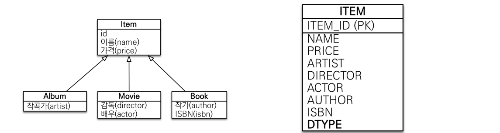
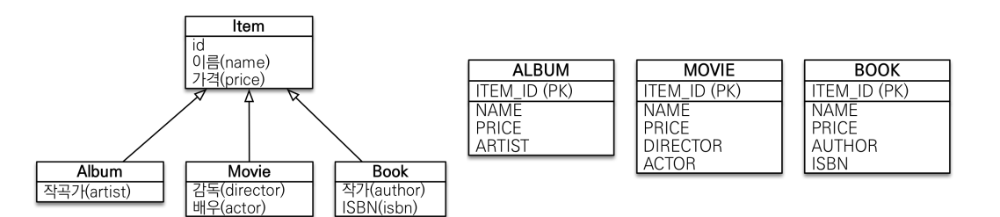

# 09_상속관계 매칭

> - 상속관계 맵핑
> - @MappedSuperclass

## 상속관계 매핑



- 객체의 상속과 구조와 DB의 슈퍼타입 서브타입 관계를 매핑
  - DB는 상속관계 없음
  - 하지만 슈퍼타입과 서브타입의 개념이 상속과 유사하다.
- Table은 **논리모델**과 물리모델이 존재한다. (왼 : DB, 오 : 객체)
  - **슈퍼타입** : 물품
  - **서브타입** : 음반, 영화,책


## 논리모델을 물리모델로 전화 방법 3가지

#### 1) 조인 전략



- 데이터를 가져올 때 조인으로 가져오는 방법이다.
- pk가 같아서 그것을 통해 조인해서 가져옴
- Item에는 Name,  Price와 같은 정보가 들어가고 Album에는 artist 정보가 들어간다.
  - insert를 두번함 (item, album)
  - 조회 => PK,FK로 조인해서 가져옴
  - 따라서 구분하는 Column을 넣는다

**Spring으로 구현하기**

```java
// Item
@Entity
@Inheritance(strategy=InheritanceType.JOINED)// 조인전략을 사용할 때 사용
@DiscrimivatorColumn 
// DTYPE을 테이블에 생성해준다. Enitity명이 들어감. 사용해주는 것이 좋음
public abstract class Item{
    @Id @GenerateValue
    private Long Id;
    private String name;
    private int price;
}

// movie
@Entity
public class Movie extends Item{
    @Id @GenerateValue
    private Long Id;
    private String director;
    private String actor;
}

```

- **`@Inheritance(strategy=InheritanceType.JOINED)`**
  - 이런식으로 사용하면 JOIN전략으로 DB에 저장되게 된다.
- **`@DiscrimivatorColumn `**
  - DTYPE을 테이블에 생성해준다. 
  - Enitity명이 들어감. 사용해주는 것이 좋음

**조인 전략으로 insert, select할때**

```java
//insert
Movie movie = new Movie();
movie.setDirector("감독");
movie.setActor("배우");
movie.setName("name");
movie.setPrice("price");
em.persist();


//select
Movie findMovie = em.find(Movie.class, movie.getId());

```

- **insert**
  - 따로 item을 만들어서 넣어주지 않아도 된다.
  - 위에 예시처럼 **movie로만 setting을 해줘도 insert가 된다.**
- **selelct**
  - 위처럼 movie를 조회할때 **Item이 조인되어 반환**된다.


#### 2) 단일 테이블 전략



- 논리 모델을 한 테이블에 전부 넣는다.

```java
// Item
@Entity
@Inheritance(strategy=InheritanceType.SINGLETABLE)
					// 싱글테이블 전략을 사용할 때 사용
@DiscrimivatorColumn 
// DTYPE을 테이블에 생성해준다. Enitity명이 들어감. 사용해주는 것이 좋음
public abstract class Item{
    @Id @GenerateValue
    private Long Id;
    private String name;
    private int price;
}
```

- 단일 테이블같은 경우에는 @DiscrimivatorColumn가 없어도 자동으로 들어간다.
  - 왜냐하면 어떤것이 필요한지 말해줘야하기 때문

- 장점 : 성능면에서 좋음


#### 3) 구현 클래스마다 테이블 전략

- 잘사용하지 않음



```
```


- @Inheritance(strategy=InheritanceType.TABLE_PER_CLASS)

- 각각 하나씩 만들어 버린다.
- 되도록이면 사용안하는 것이 좋음

- 단점
  - 무비에서 Item이 필요해서 가져오려고 할때(조회할때) JPA는 union all로 전부 살펴보게 된다.
  - 즉 비효율적으로 동작하게 된다.


## 각각의 장단점

### 조인 전략(정석)

**장점**

- 테이블 정규화

- 외래키 참조 무결성 제약조건 활용가능

  - 주문테이블 에서 item을 봐야한다면 album을 따로 보거나 하는 행위등을 하지 않아도 된다.
  - 즉 item테이블만 확인하면 됨 왜냐하면 price부분이 item테이블에 있기 때문이다.

- 저장공간 효율화 => null값등이 없기 때문?

  

**단점**

- 조인 많이 사용 => 성능 저하
- 조회 쿼리 복잡
- 데이터 저장시 insert 2번 호출


### 단일 테이블 전략

**장점**

- 조회 성능이 빠름
- 조회 쿼리 단순

**단점**

- 필요없는 컬럼을 null허용을 다 만들어준다.

  - 데이터 무결성 입장에서는 애매한 경우가 있음
  - 테이블이 커질 수 있음

  

### 구현 클래스마다 테이블

**DB설계자와 ORM전문자 둘 다 추천하지 않음**

단점

- 무안가 묶어내는 것이 없어서 의미가 없음
- 예를 들어서 정산을 하거나 해야할때 각각의 테이블을 다 확인해주어야 한다.


