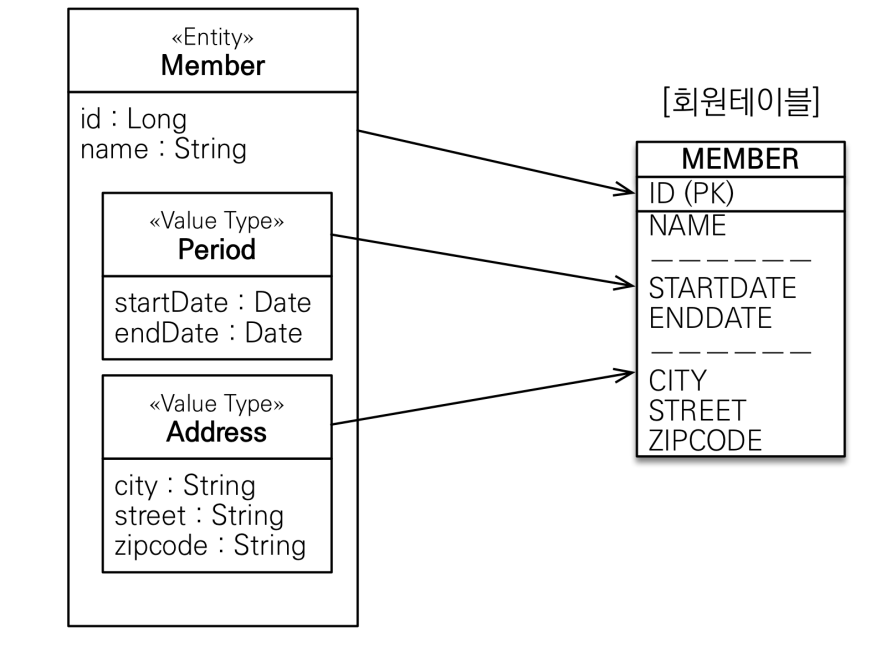
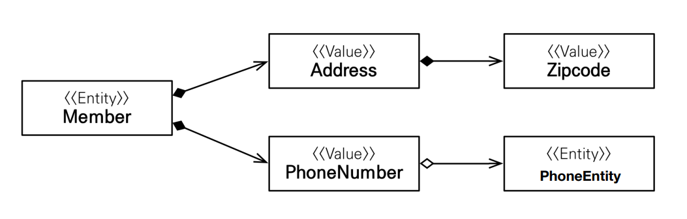
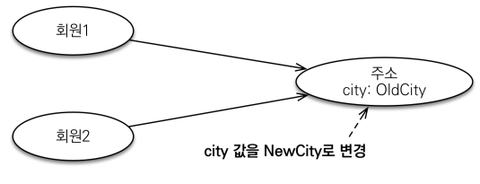

# 11_

> - 기본값 타입
> - 임베디드 타입(복합 값 타입)
> - 값타입과 불변객체
> - 값 타입의 비교
> - 값 타입 컬렉션


## JPA의 데이터 타입 분류

#### 엔티티 타입

- @Entity로 정의하는 객체
- 데이터가 변해도 **식별자로 지속해서 추적 가능**
- ex) 회원 엔티티의 키나 나이 값을 변경해도 **식별자로 인식 가능**

#### 값 타입

- int, Integer, String처럼 단순히 값으로 사용하는 자바 기본 타입이나 객체
- **식별자가 없고** 값만 있으므로 **변경시 추적 불가**
- ex) 숫자 100=> 200변경 ==> 완전히 다른 값으로 대체


### 값타입의 분류

> - **기본값 타입**
>   - 자바 기본 타입 (int, double)
>   - wrapper class (Integer, Long)
>   - String
> - **임베디드 타입** :
> - **컬렉션 값 타입**

#### 기본값 타입

- String name, int age

- **생명주기를 엔티티의 의존**

  - ex) 회원을 삭제하면 이름, 나이 필드도 함께 삭제되는 것

- **값 타입은 공유하면 x**

  - ex) 회원 이름 변경시 다른 회원의 이름도 함께 변경되면 안되기 때문

- **참고 : 자바의 기본 타입은 절대 공유되지 않느다**

  - primitive type은 절대 공유 안됨

  - 기본 타입은 항상 복사됨 => a=10, b = a라고 하면 a가 복사해서 사용

  - **Integer같은 wrapper class나 String같은 특수한 클래스는 공유가능한 객체**이지만 변경하지 않음 => 따라서 변경자체를 불가능하게 만듦

  - ```java
    // a가 복사가 되어서 b로 저장된다. 즉 a와 b는 다른 주소에 있음
    int a = 10;
    int b = a; 
    
    // 하지만 Integer같은 경우 => 주소값만 넘어감 =>  공유 됨
    // 따라서 b를 바꾸면 a도 바뀜
    Integer a = 10;
    Integer b = a;
    ```

​	

#### 임베디드 타입

- 새로운 값 타입을 직접 정의할 수 있음
- 주로 기본 값타입을 모아서 만들어서 복합 값 타입이라고도 함
- int, String과 같은 값 타입


**임베디드 타입의 장점**


- 재사용
- 응집도가 높음
- Period.isWork()처럼 해당 값 타입만 사용하는 의미 있는 메소드를 만들 수 있음
  - 근무기간에 속하니?? 이런 메소드를 뽑을 수 있다는 뜻
- 임베디드 타입을 포함한 모든 값 타입은 값 타입을 소유한 엔티티에 생명 주기를 의존함
  - 엔티티 죽으면 다 죽고
  - 엔티티 살아나면 다 살아난다는 뜻
- 객체와 테이블을 아주 세밀하게 mapping하는 것이 가능

**사용법**



-  **@Embeddable** : 값타입을 정의하는 곳에 표시
- **@Embedded** : 값타입을 사용하는 곳에 표시
- 기본 생성자 필수

```java
@Entity
public class Member {
    @Id
    @GeneratedValue
    @Column(name="member_id")
    private Long id;
    
    @Column(name="username")
    private String username;
    
    // period로 묶고 싶음
    // private LocalDateTime startDate;
    // private LocalDateTime endDate;
    @Embedded
    private Period workPeriod
    
    // address로 묶고 싶음
    // private String city;
    // private String street;
    // private String zipcode;
	@Embedded
    private Address homeAddress
}

@Embeddable
public class Period{
    private LocalDateTime startDate;
    private LocalDateTime endDate;
    
    public boolean isWork(){
        if endDate - startDate // 이런식으로 메소드를 만들어서 사용가능
    }
}

@Embeddable
public class Address{
    private LocalDateTime startDate;
    private LocalDateTime endDate;
}
```


#### 임베디드 타입과 연관관계



- 임베디드 타입에 **Entity가 들어오는 것이 가능**

**만약에 한 엔티티에서 같은 값 타입을 사용하면??**

- 컬럼 명이 중복됨
- @AttributeOverrides를 사용해서 컬럼 명 속성을 재정의


#### 임베디드 타입과 null관계

- 임베디드 타입에 null값이 들어가면 컬럼 값들 모두 null로 세팅


## 값 타입과 불변 객체

> **값 타입**은 복잡한 객체 세상을 조금이라도 **단순화하려고 만든 개념**이다. 따라서 값 타입은 **단순하고 안전하게 다룰수 있어야 한다**

**값 타입 공유 참조**



- 임베디드 타입 같은 값 타입을 **여러 엔티티에서 공유하면 위험함**
- 부작용 발생

```java
Address address = new Address("city","street","10000");
Member member1 = new Member();
member1.setUsername("member1");
member1.setHomeAddress(address);
em.persist(member1);

Member member2 = new Member();
member2.setUsername("member2");
member2.setHomeAddress(address);
em.persist(member2);

member1.getHomeAddress().setCity("newCity");
// 이렇게 하면 member1과 member2의 city가 동시에 바뀌게 된다.
// 왜냐하면 서로 주소를 공유하고 있기 때문에
```


**값 타입은 복사해서 사용해야한다.**

 ```java
 Address address = new Address("city","street","10000");
 Member member1 = new Member();
 member1.setUsername("member1");
 member1.setHomeAddress(address);
 em.persist(member1);
 
 Address copyAddress
 = new Address(address.getCity(),address.getStreet(),address.geZipcode());
 
 Member member2 = new Member();
 member2.setUsername("member2");
 member2.setHomeAddress(copyAddress);
 em.persist(member2);
 
 member1.getHomeAddress().setCity("newCity");
 // 이렇게 하면 2번째를 공유하지 않는다.
 ```


**객체 타입의 한계**

- 항상 값을 복사해서 사용하면 공유 참조로 인해 발생하는 부작용 을 피할 수 있다.
- **직접 정의한 값** 타입은 자바의 기본 타입이 아니라 **객체 타입**
- 객체 타입은 참조 값을 직접 대입하는 것을 막을 방법이 없다.
- **객체의 공유 참조는 피할 수 없다.**


## 불변 객체

- 객체 타입을 **애초에 수정할 수 없게 만들면** 부작용을 원천 차단한다.
- **값 타입은 immutable object로 설계**
  - 생성 시점 이후 절대 값을 변경할 수 없는 객체
- 생성자로만 값을 설정하고 **Setter를 애초에 만들어버리지 않으면 된다.**
  - 또는 **setter부분을 private**으로 만들면 된다.
- 참고 : Integer, String은 자바가 제공하는 대표적인 불변 객체

**그럼 변경하고 싶을때는 어떻게 하나?**

- 직접 다시 만들어 버린다.
- 통으로 바꿔버린다.

```java
Address address = new Address("city","street","10000");
Member member1 = new Member();
member1.setUsername("member1");
member1.setHomeAddress(address);
em.persist(member1);

Address newAddress
= new Address(address.getCity(),address.getStreet(),address.geZipcode());
member.setHomeAddress(newAddress);
// 통으로 바꿔버린다.
```


## 값 타입의 비교

- 인스턴스가 달라고 그 안에 값이 같으면 같은 것으로 봐야함

```java
int a = 10;
int b = 10;
// a == b => true

Adress a = new Address("서울시");
Adress b = new Address("서울시");
// a==b => false
```

**동일성(identity) 비교**

- 인스턴스의 참조 값을 비교
- ==을 사용

**동등성(equivalence) 비교:**

- 인스턴스의 값을 비교
- equals()사용

따라서 값타입은 a.equals(b)를 사용해서 동등성 비교를 해야한다.

값 타입의 **equals() 메소드를 적절하게 재정의** (주로 모든 필드에 사용)

```java
int a = 10;
int b = 10;
// a == b => true

Adress a = new Address("서울시");
Adress b = new Address("서울시");
// a.equals(b) => true가 


// 그 값 class로 가서 사용해야한다. 
// 자동으로 생성해주는 equals를 사용해야함
// overide해서 사용해야한다.
@Overide
public boolean equals(Object o){
    if (this == o) return true;
    if (o==null || getClass() != o.getClass()) return false;
    Address address = (Address) o;
    return Objects.equals(city, address.city)
}
// hash도 같이 해줘야한다.
@Overide
public int hasCode(){
    return Objects.hash(city)
}
```


