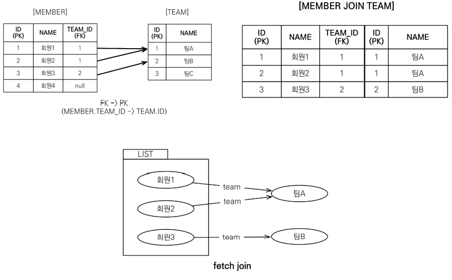

# 02_

## 1) 경로 표현식

- 점을 찍어서 객체 그래프를 탐색하는 것

```sql
select m.username	 # 상태 필드
	from Member m	 
	join m.team t	# 단일 값 연관필드
	join m.orders o # 컬렉션 연관필드
where t.name = '팀A'
```

- 필드에 따라서 결과가 달라지기 때문에 잘 알고 있어야한다.

**상태 필드 **

- state field
- 단순히 값을 저장하기 위한 필드
  - ex) m.username
- **경로 탐색의 끝, 탐색 x**

```sql
# m.username 이라고 하면 더이상 m.username.xxxxx.xxxx=> 더이상 이렇게 늘어날 수 없음
select m.username from Member m
```


**연관 필드**

- **단일 값 연관 필드**
  - @ManyToOne, @OneToOne, 대상이 엔티티 (ex: .m.team)
  - **묵시적 내부조인(inner join)** 발생, 탐색 O
  - 되도록이면 이렇게 쿼리를 짜기보다 join을 붙혀서 사용하는 것이 좋음

```sql
# inner join이 된다. => 즉 조심해서 사용해야한다.
select m.team from Member m

# 탐색 가능 .(점) 찍고 더 쓰기가 가능하다는 뜻
select m.team.name from Member m
```


- **컬렉션 연관 필드**
  - @ManyToMany, @OneToMany, 대상이 컬렉션 (ex : m.orders)
  - **묵시적 내부조인(inner join)** 발생, **탐색 X**
  - **from 절에서 명시적 조인**을 통해 별칭을 얻으면 별칭을 통해 탐색이 가능하다.

```sql
# 탐색 X
select t.members.name 등등 from Team t # 불가능

# from 절에서 명시적 조인
# 만약 team 안에 member에서 usernam들을 가져오길 원한다면?
select m.username from Team t join team.members m
```


## Fetch Join

- JPQL에서 성능 최적화를 위해 제공하는 기능

**ex_ 회원을 조회하면서 연관된 팀도 함께 조회**

- SQL을 보면 회원뿐만 아니라 팀도 함께 select해야한다.

```sql
# JPQ
select m from Member m join fetch m.team

#SQL
SELECT M.*, T.* FROM MEMBER M
INNER JOIN TEAM T ON M.TEAM_ID=T.ID
```



- 회원과 팀을 조인을 해서 한번에 값을 내주는 역할을 한다.
- 지연로딩으로 설정을 하더라도 fetch join이 먼저 실행된다.


**컬렉션 fetch join**

- 일대다 관계

```sql
# JPQL
select t from Team t join fetch t.members where t.name='팀A'

# SQL
SELECT T.*,M.* FROM TEAM T INNER JOIN MEMBER M ON T.ID = M.TEAM_ID
WHERE T.NAME = '팀A'
```

- **주의**
  - 컬렉션일 때는 **데이터가 뻥튀기**가 된다.
  - 왜냐하면 **N을 기준으로 테이블을 생성**하기 때문이다.


- team과 member가 조인을 할 경우
  - teamA와 연관된 member가 회원1과 회원2가 존재
  - 그러면 결과가 예상했던 것과 다르게 된다.
  - 이런 경우에 JPA에서 **batch size를 통해서** 이 문제를 해결하게 된다.
    - distinct로 해결할수 있지만 paging이 안되기 때문이다.
    - 같은 엔티티를 제거함


### fetch join과 일반 join의 차이

```sql
# join
select t from Team t join t.members m

# fetch join
select t from Team t join fetch t.members m
```

**일반 join**

- 연관된 **엔티티를 함께 조회하지 않음**
  - team을 먼저 조회를 한뒤에
  - member를 보고 member가 필요하다는 것을 인지
  - member 쿼리를 날림 => 영속성 컨텍스트에 member가 없을 것이기 때문에
  - 즉 **데이터가 loading할 시점에 loading이 되지 않은 것**
- select 절에 지정한 엔티티만 조회한다.
  - 팀 엔티티만 조회하고, 회원 엔티티는 조회X

**fetch join**

- fetch join을 사용할 때만 **연관된 엔티티도 함께 조회 (즉시 조회)**
- fetch join은 **객체 그래프를 SQL 한번에 조회**하는 개념


## Fetch join의 한계

- Fetch join 대상에는 **별칭을 줄 수 없다**
  - 하이버네이트는 가능한데, **사용하지 말자** => join fetch t.members as **m**
  - fetch join은 자신과 연관되어 있는 것들을 다 끌고 오는 것이다.
  - 애초에 설계가 연관관계를 누락없이 다 가져오는 것을 목표로 하기 때문
    - 따라서 이상하게 동작할  수 있음
- **둘 이상의 컬렉션**은 fetch join할 수 **없다**.
  - 1대 다 대 다? ==> 데이터가 엄청 커질 수 있

- 컬렉션 fetch join => Paging API를 사용할 수 없다.


**정리!!**

- 여러 테이블을 조인 => **엔티티가 가진 모양이 아닐때** => 전혀 다른 결과를 내야할 때
  - fetch join보다는 **join을 사용** => **필요한 데이터만 조회** => DTO반환하는 것이 효과적
