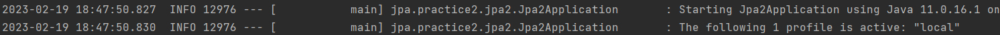

# 04_


https://mangkyu.tistory.com/70 : Optional에 대한 설명

.get을 사용하지 않는것이 좋음 => Optional에 대한 공부가 필요해 보인다.


\> 참고: 동시성 문제는 걱정하지 않아도 된다. 왜냐하면 여기서 스프링이 주입해주는 엔티티 매니저는 실제 동작 시점에 진짜 엔티티 매니저를 찾아주는 프록시용 가짜 엔티티 매니저이다. 이 가짜 엔티티 매니저는 실제 사용 시점에 트랜잭션 단위로 실제 엔티티 매니저(영속성 컨텍스트)를 할당해준다. > 더 자세한 내용은 자바 ORM 표준 JPA 책 13.1 트랜잭션 범위의 영속성 컨텍스트를 참고하자.

이것 확인

- Predicate는 무엇?
- BooleanExpression??4

Predicate가 보다 BooleanExpression가  더 좋다고 한다. 나중에 조합할 수 있기 때문이다.


```
BooleanExpression
```


조회 API Controller 개발

- 편리한 데이터 확인을 위해 샘플 데이터 추가
- 샘플 데이터 추가시 test case실행에 영향을 주지 않도록 분리하는 작업을 한다.

@Component란?



