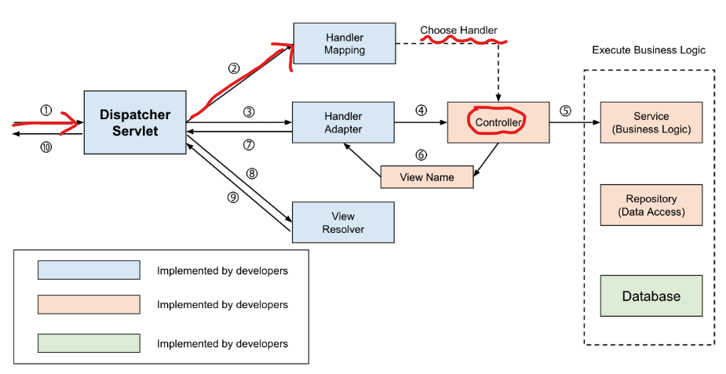
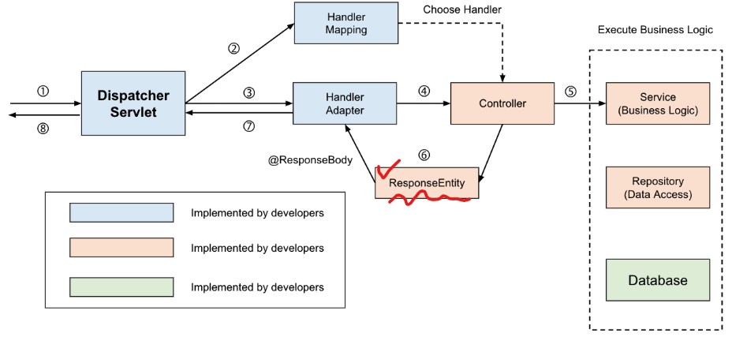

# 99_

Controller와 RestContorller

https://mangkyu.tistory.com/49


Optional 활용하기

https://www.latera.kr/blog/2019-07-02-effective-optional/

## 1) @Controller 

- Controller 와 RestController의 차이는 HTTP Response Body가 생성되는 방식에 있다.

### 1-1) DispatcherServlet

- Servlet Container(Tomcat과 같은)에서 HTTP프로토콜을 통해 들어오는 모든 요청을 프레젠테이션 계층의 제일앞에 둬서 **중앙집중식으로 처리해주는 프론트 컨트롤러**(Front Controller)

### 1-2) Handler Mapping

- **각각의 Controller로 위임** 처리
- Handler Mapping 전략 5가지 ( **세부 controller** )
  - BeanNameUrlHandlerMapping
  - ControllerBeanNameHandlerMapping
  - ControllerClassNameHandlerMapping
  - SimpleUrlHandlerMapping
  - DefaultAnnotationHandlerMapping

### 1-3) Handler Adapter

- Handler Mapping을 통해서 찾은 컨트롤러를 **직접 실행**
  - HandlerAdapter 인터페이스를 구현해서 생성한다.
  - Handler Adaptor들의 supports매서드에 대입하며 지원 여부를 살핀다.

- 4가지 핸들러 어댑터 
  - SimpleServletHandlerAdapter(Servlet interface)
  - HttpRequestHandlerAdapter(HttpRequestHandler interface)
  - SimpleControllerHandlerAdapter(Controller interface)
  - AnnotationMethodHandlerAdapter


### 1-4) @Controller란?

- View를 반환하기 위해서 사용



- URL로 서비스 요청
- Handler Mapping 탐색
- Handler Mapping을 통한 요청을  Controller로 위임
- Controller는 요청을 처리한 뒤 VIewName을 반환
- DispatcherServlet은 ViewResolver를 통해 ViewName에 해당하는 View를 찾아 사용자에게 반환

**+ Data 반환?**

- 테이터를 반환하기 위해선 @ResponseBody를 사용
- 이를 통해서 JSON 형태로 데이터 반환 가능



- 위와 다른 점
  - 반환되는 객체가 **JSON으로 Serialize되어 사용자에게 반환**된다.
  - 컨트롤러를 통해서 객체를 반환 => 일반적으로 ResponseEntiy로 감싸서 반환 된다.
- 객체 반환시
  - ViewResolvor 대신에 **HttpMessageConverter**가 동작함
    - 반환해야할 때마다 여러 Converter가 작동된다.
    - HTTP Accept헤더와 서버의 컨트롤러 반환 타입 정보 둘을 조합해서 적합한 HttpMessageConver가 사용된다.
    - ex_ 
      - 단순 문자열 => StringHttpMessageConverter
      - 객체인 경우 =>  MappingJackson2HttpMessageConverter

```java
@GetMapping(value = "/users")
public @ResponseBody ResponseEntity<User> findUser(
    									@RequestParam("userName") String userName){
    return ResponseEntity.ok(userService.findUser(user));
}
```


## 2) @RestController 

- **@RestController => @Controller + @ResponseBody**

```java
@GetMapping(value = "/users")
public ResponseEntity<User> findUserWithResponseEntity(
    								@RequestParam("userName") String userName){
    return ResponseEntity.ok(userService.findUser(user));
}
```

- Controller를 사용했을 때와 코드가 다른점
  - public 뒤에 @ResponseBody가 존재하지 않는다.
  - 동작은 똑같이 한다. 
- ResponseBody를 사용한 이유는 JSON으로 반환해주기 위해서이다.
- 대부분 REST api를 사용하기 때문에 json으로 반환하게 된다. 따라서 이렇게 하나로 합치게 된것


## 3) Optional이란?

- NPE( NullPinterException )의 부담을 줄이기 위해 등장한 Wrapper class이다.
- Optional은 Wrapping하고 Null일 경우에는 대체하는 함수를 호출
  - 즉 성능이 저하 될 수 있다.
  - 따라서 결과가 null이 될 수 있으며, **null에 의해 오류가 발생할 가능성이 높을 때만 사용**한다.


### orElse 과 orElseGet의 차이

- orElse
  - 파라미터로 값을 필요요함
  - 값이 미리 존재하는 경우에 사용
- orElseGet
  - 파라미터로 함수를 필요
  - 값이 미리 존재하지 않는 거의 대부분의 경우 orElseGet을 사용


