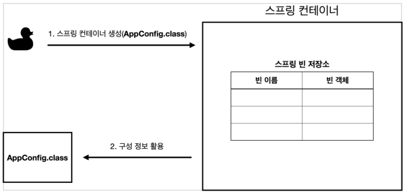
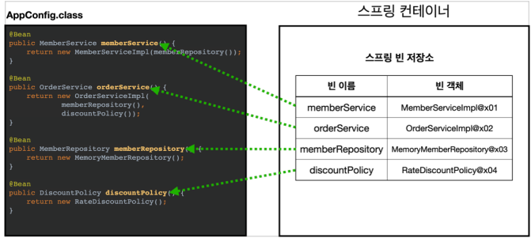
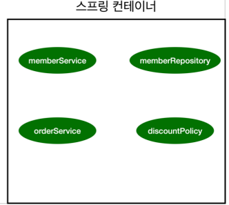
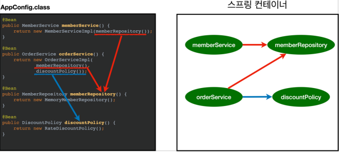
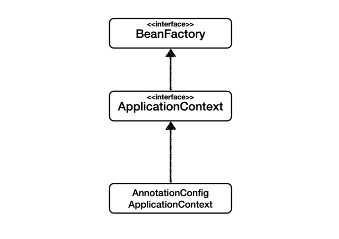
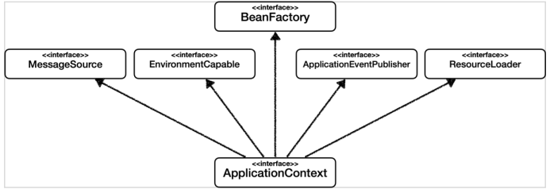

# 03_Bean

**순수 자바 AppConfig**

```java
public class AppConfig {
    
 public MemberService memberService() {
     return new MemberServiceImpl(memberRepository());
 }
    
 public OrderService orderService() {
     return new OrderServiceImpl(
                 memberRepository(),
                 discountPolicy());
 }
    
 public MemberRepository memberRepository() {
 	return new MemoryMemberRepository();
 }
    
 public DiscountPolicy discountPolicy() {
	// return new FixDiscountPolicy();
 	return new RateDiscountPolicy();
 }
    
}
```


**Spring을 사용한 Config**

 ```java
 @Configuration
 
 public class AppConfig {
      @Bean
      public MemberService memberService() {
          return new MemberServiceImpl(memberRepository());
      }
     
      @Bean
      public OrderService orderService() {
      return new OrderServiceImpl(
                  memberRepository(),
                  discountPolicy());
      }
     
      @Bean
      public MemberRepository memberRepository() {
         return new MemoryMemberRepository();
      }
     
      @Bean
      public DiscountPolicy discountPolicy() {
          return new RateDiscountPolicy();
      }
 }
 ```

- @Configuration 추가
- 각 매소드에 @Bean 를 추가
  - Spring Container가 빈 등록 된 것을 다 관리해주게 된다.

**사용하기**

```java
public class MemberApp {
 public static void main(String[] args) {
// AppConfig appConfig = new AppConfig();
// MemberService memberService = appConfig.memberService();
 ApplicationContext ac = new AnnotationConfigApplicationContext(AppConfig.class);
 MemberService memberService = ac.getBean("memberService", MemberService.class);
 }
```

- AnnotationConfigApplicationContext를 생성( AppConfig 를 넣어줌 )
- getBean을 통해 얻음


**스프링 컨데이너**

- ApplicationContxt를 스프링 컨테이너라고 한다.
- **@Bean이라 적힌 매서드**를 모두 호출 => 반환된 객체를 **스프링 컨테이너에 등록**한다.


## Spring Container

```java
//스프링 컨테이너 생성
ApplicationContext applicationContext 
    				= new AnnotationConfigApplicationContext(AppConfig.class);
```

- `ApplicationContext` => **스프링 컨테이너** 
  - 스프링 컨테이너를 부를 때 bean factory,  ApplicationContext로구분해서 이야기 하지만
    BeanFactory를 직접사용하는 경우가 없기 때문에 일반적으로 ApplicationContext를 스프링 컨테이너라고 부른다.
- `AnnotationConfigApplicationContext` => Application Context의 **구현체**이다.

### 01_ 스프링 컨테이너 생성



1. `new AnnotationConfigApplicationContext(AppConfig.class)`
2. 스프링 컨테이너를 생성할 때는 구성 정보를 지정해주어야 한다.


### 02_스프링 빈 등록



- @Bean이 붙은것을 확인
- 모두 호출함


### 03_스프링 빈 의존 관계 설정  - 준비




### 04_스프링 빈 의존관계 설정 - 완료



- 의존 관계가 필요한 것들을 다 주입해준다.
- 스프링은 빈을 생성하고, 의존관계를 주입하는 단계가 나누어져 있음
- 빈이 등록될때 구현체도 빈으로 조회 할 수 있다.
  - 즉 `MemberServiceImpl`과 같은 것도 빈으로 조회 가능


## 스프링 빈 조회

### 상속관계

- **부모 타입으로 조회**하면 **자식 타입도 함께** 조회가 된다.
- Object ( 자바 객체의 최고 부모 ) 타입으로 조회시 => **모든 스프링 빈을 조회**


## BeanFactory와 ApplicationContext



**BeanFactory**

- 스프링 컨테이너의 **최상위 인터페이스**
- 기능 : 스프링 빈을 관린하고 조회하는 역할을 담당
  - getBean()


**ApplicationContext**



- **빈 관리기능 + 편리한 부가 기능**
- BeanFactory 기능을 **모두 상속** 받아서 제공
- **여러가지 interface들도 상속**받음
  - 메시지소스를 활용한 국제화 기능
  - 환경변수
  - 애플리케이션 이벤트
  - 편리한 리소스 조회
  - 등등


## 스프링 빈의 설정 메타 정보 - BeanDefinition


- 역할과 구현을 개념적으로 나눔
- 따라서 다양한 설정 형식을 지원할 수 있음
- **동작**
  1. AppConfig  (빈에 등록한 정보가 있는 곳)의 설정 정보를 읽는다.
  2. 그것을 토대로 BeanDefinition을 생성
  3. 이 BeanDefinision을 사용하여 스프링은 정보를 알 수 있다.
     - 이것을 추상화 하고 **역할과 구현을 나누어 두었기 때문에 다양한 설정을 제공할 수 있음**

