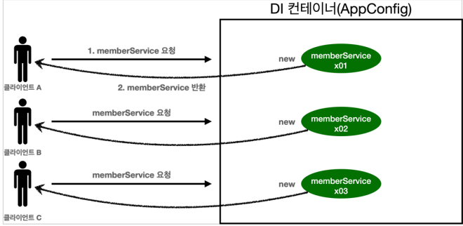

# 04_singleton_configuration


## 웹 어플리케이션과 싱글톤

- 웹 애플리케이션은 보통 여러 고객이 동시에 요청한다.
  - 예를 들어서 **고객에 3번 요청**하게 되면 객체를 그때마다 **새로 만들어야 한다.**



- 고객 트래픽이 초당 100이 나오면 초당 100개 객체가 생성되고 소멸된다 
   => **메모리 낭비가 심함**

  

-  해결방안은 해당 객체가 딱 1개만 생성되고, 공유하도록 설계
  => **싱글톤 패턴**


## 싱글톤 패턴

### 싱글톤 패턴이란?

- 클래스의 **인스턴스가 1개만 생성됨**을 보장하는 디자인패턴
- 즉 객체 인스턴스를 2개 이상 생성하지 못하도록 막아야함
  - => private 생성자를 사용해서 외부에서 임의로 new 키워드를 사용 못하도록 막아야함

```java
public class SingletonService{
    
    // 1. 자기자신을 객체로 생성
    private static final SingletonService instance = new SingletonService();
    
    // 2. public으로 열고, 인스턴스가 필요하면 이 static 매서드를 통해서만 조회가능
    public static SingletonService getInstance(){
        return instance;
    }
    
    // 3. 생성자를 private으로 선언 
		// => 외부에서 new 키워드를 사용한 객체 생성을 못하게 막음
   	private SingletonService(){}
    
}
```

1. 자기자신을 객체로 생성
   - static 영역에 객체 instance를 미리 하나 생성해서 올려둔다.
   - private이기 때문에 외부에서 접근 불가능
   - static 영역에서는 고정된 값이기 때문에 딱 하나만 존재하게 된다.
   - final이기 때문에 변경되지 않는 값을 가짐
     - **즉! 외부 접근 x + 하나만 존재 + 변경되지 않음**
2. public으로 열고, 인스턴스가 필요하면 이 static 매서드를 통해서만 조회가능
3. private으로 new로 선언못하게 막아버림
   - 이렇게 하면 다른 곳에서 `new SingletonService( );`  라고 해도 빨간줄이 뜬다.


### 싱글톤 패턴의 문제 점

- DIP를 위반 => 클라이언트가 구현체 클래스에 의존한다.
  - getInstance해서 불러와야 하기 때문
- OCP위반 가능성 높음
- private 생성자로 사용하기 때문에 자식 클래스를 만들기 힘들다
- 안티패턴으로 불리기도 한다.


## Singleton Container

> Singleton pattern의 문제점을 해결하면서 객체 인스턴스를 Singleton으로 관리한다.

### Singleton Container란?

- 패턴을 적용하지 않아도, 객체 인스턴스를 singleton으로 관리한다.
- Spring Container는 Singleton Container역할을 한다.
  - 이렇게 싱글톤 객체를 생성하고 관리하는 기능을 싱글톤 레지스트리라고 한다.


- 요청이 올때마다 객체를 생성하지 않음
- 이미 만들러진 객체를 공유해서 효율적으로 재사용을 할 수 있음


### Singleton 의  주의할 점

- 싱글톤 방식은 여러 클라이언트가 하나의 같은 객체 인스터스를 공유
  => 따라서 싱글톤 객체는 **상태를 유지(stateful)하게 설계하면 안된다.**

- **stateless로 설계해야함**
  - 특정 클라이언트에 의존적인 필드가 있으면 안된다.
    - 특정 클라이언트가 값을 변경할 수 있는 필드가 있으면 안된다.
  - 가급적이면 읽기만 가능해야한다.
  - 필드 대신 자바에서 공유되지 않는 지역변수, 파라미터, ThreadLocal등을 사용해야한다.
- 스프링 빈의 필드에 공유 값을 설정하면 큰 장애가 올 수 있음

```java
public class StatefulService {
    
     private int price; //상태를 유지하는 필드

     public void order(String name, int price) {
        System.out.println("name = " + name + " price = " + price);
        this.price = price; //여기가 문제!
     }
    
    // 변경 코드 => 지역변수
    public void order(String name, int price) {
		// 로직
        return price
     }
    
     public int getPrice() {
        return price;
     }
 
// 테스트
@Test
void statefulServiceSingleton() {
	// ...
    
    //ThreadA: A사용자 10000원 주문
    statefulService1.order("userA", 10000);
    
    //ThreadB: B사용자 20000원 주문
    statefulService2.order("userB", 20000);
    
    //ThreadA: 사용자A 주문 금액 조회
    int price = statefulService1.getPrice();
    
    //ThreadA: 사용자A는 10000원을 기대했지만, 기대와 다르게 20000원 출력
    System.out.println("price = " + price);
    Assertions.assertThat(statefulService1.getPrice()).isEqualTo(20000);
}    
```

- 중간에 transaction과 비슷하게 값이 변경되게 된다.
- 즉 price라는 **변수가 값이 공유되고 있다** 
  따라서 2번째 사용자가 주문했을 때 값이 변경이 되는 현상이 발생하게 된다.
- **스프링 빈은 항상 stateless로 설계하자**


## @Congiuration과 싱글톤

```java
public class AppConfig {
     @Bean
     public MemberService memberService() {
         return new MemberServiceImpl(memberRepository());
     }
    @Bean
     public OrderService orderService() {
         return new OrderServiceImpl(memberRepository(),
                                     discountPolicy());
     }   
	public MemberRepository memberRepository() {
 		return new MemoryMemberRepository();
 	}
 }
```

- 이상한 점 존재
  - @Bean memberService => new MemoryRepository( )
  - @Bean orderService => new MemoryRepository( )

- MomoryRepository가 두번 호출되었다?
  - 그럼 singleton이 깨지는 건 아닌가?

- **Singleton이 유지된다.**
  - 어떻게 하나? byte코드를 사용햏서 조작하게 된다.


## @Configuration과 바이트코드 조작

> - 스프링이 자바 코드까지 어떻게 하기는 어렵다.
> - 따라서 스프링은 클래스의 바이트코드를 조작하는 라이브러리를 사용한다.
> - @Configuration을 적용한 AppConfig를 확인 


- 순수한 클래스라면 class hello.core.AppConfig가 출력이 되어야한다.
- 하지만 xxxCGLIB가 붙음 => 즉 내가 만든 클래스가 아님
- 즉 **다른 클래스를 만들어서 스프링 컨테이너에 등록한다.**
- @Bean이 붙은 매서드 마다 이미 
  - 스프링 빈이 존재 => 빈으로 반환
  - 스프링 빈이 없음 => 빈으로 등록하고 반환하는 코드가 동적으로 만들어짐


- @Configuration을 사용하지 않고 **@Bean만 사용한다면??**
  - => CGLIB을 사용하지 않음
  - **=> 즉 싱글톤을 보장하지 않음**