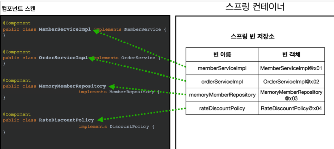

# 05_ComponentScan_Autowired


## @Autowired

> - 의존관계를 자동으로 주입해주는 어노테이션

```java
@Configuration // 얘는 싱글톤을 유지 시켜주기 위한 것
@ComponentScan // Component scan을 쓰기위한 것
public class AutoAppConfig {
 
}
```

- 기존의 AppConfig와는 다르게 @Bean으로 등록한 클래스가 하나도 없다

```java
//MemoryMemberRepository @Component 추가
@Component
public class MemoryMemberRepository implements MemberRepository {}


// RateDiscountPolicy @Component 추가
@Component
public class RateDiscountPolicy implements DiscountPolicy {}


// MemberServiceImpl @Component, @Autowired 추가
@Component
public class MemberServiceImpl implements MemberService {
    private final MemberRepository memberRepository;
    
     @Autowired // 의존관계 주입
     public MemberServiceImpl(MemberRepository memberRepository) {
     	this.memberRepository = memberRepository;
	}
}
```

- 이렇게 @Component를 붙이게 되면
   => **Component의 대상**이 되게 된다. => **자동으로 스프링 빈이 등록이 된다는 뜻**

  

- 그럼 의존관계 주입은 어떻게 해야지?

  - 기존의 코드 ( 밑 )를 보면  의존 관계를 직접적으로 주입시킬 수 있었다.
    ```java
    @Bean
    public OrderService orderService() {
    	return new OrderServiceImpl(
     				memberRepository(),
    				discountPolicy()); // 여기 확인
     }
    ```

- 따라서 @Autowired를 사용하는 것


1. @ComponentScan



- @Component가 붙은 class를 자동으로 등록
- 맨 앞글자 소문자 사용하면서 기본 이름 클래스명으로 사용된다.


2. @Autowired


- MemberRepository를 찾는다.
   => 스프링 컨테이너가 자동으로 해당 스프링 빈을 찾아서 주입한다.
- 기본 전략 => **타입이 같은 빈**을 찾아서 주입한다.
  - `getBean(MemberRepository.class)`와 동일하다고 보면 됨


## 탐색 위치와 기본 스캔 대상

**basePackages**

```java
package hello.core // 여기부터 다 찾기 시작

@ComponentScan(
 	basePackages = "hello.core.member", // 어디서 부터 찾을지 지정할 수 있음
}
```

- 디폴트 값은?
  - pacakage의 위치부터 다 스캔하기 시작

- **권장**
  - 패키지 위치를 지정하지 않음 => 설정 정보 클래스의 위치를 **프로젝트 최상단**에 둔다.
  - @SpringBootApplication안에 @ComponentScan이 붙어있음
    - 따라서 최상단에서 시작한다는 뜻


**ComponentScan의 기본대상**

- @Component

- @Configuration

  - 스프링 설정 정보로 인식 => **스프링 빈이 싱글톤을 유지**하도록 추가 처리

    

- @Controller    :

  - 스프링 **MVC로 인식**

    

- @Service  

  - 특별한 처리 없음 

    => 하지만 핵심 비즈니스 로직이 여기에 있겠구나 라고 인식하는데 도움을 주는 열할

    

- @Repository

  -  스프링 데이터 **접근 계층으로 인식** => 데이터 계층의 예외로 변환
  - DB를 교체했을 때 그 DB의 특정 예외가 터지면 안되기 떄문에 예외를 추상화해서 변환


## Filter

- includeFileter : 컴포넌트 스캔 대상을 추가로 지정
- excludeFilter  : 컴포넌트 스캔에서 제외할 대상을 지정

어노테이션 만들기

**includeFileter **

```java
@Target(ElementType.TYPE)
@Retention(RetentionPolicy.RUNTIME)
@Documented
public @interface MyIncludeComponent {
}
```


**excludeFilter  **

```java
@Target(ElementType.TYPE)
@Retention(RetentionPolicy.RUNTIME)
@Documented
public @interface MyExcludeComponent {
}
```


## 중복등록과 충돌

> 1. 자동 빈 등록 vs 자동 빈 등록
> 2. 수동 빈 등록 vs 자동 빈 등록

### 1. 자동 빈 등록 vs 자동 빈 등록

- ConflictingBeanDefinitionException 이라는 예외 발생
  - 스프링이 오류를 발생시킨다.


### 2. 수동 빈 등록 vs 자동 빈 등록

- 스프링은 수동 빈 등록이 우선권을 가짐
  - 수동 빈이 자동 빈을 오버라이딩 한다.
- 최근 **스프링 부트**에서는 **충돌이 나면 기본 값이 오류가 발생**하도록 바꿈

```
Consider renaming one of the beans or enabling overriding by setting 
spring.main.allow-bean-definition-overriding=true => 에러
```


