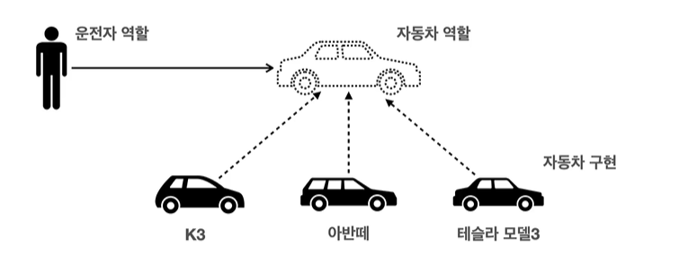

# Spring

**스프링 부트**

- 스프링을 사용할 수 있도록 지원
- Tomcat같은 웹 서버를 내장해서 별도의 웹 서버를 설치하지 않아도 된다.
- 스프링과 3rd parth라이브러리 자동구성
  - 호환성

## 스프링이란?

### 스프링

- **스프링 DI 컨테이너 기술**
- 스프링 프레임 워크
- 스프링 생태계

### 핵심컨셉

- **객체 지향 언어**가 가진 특징을 살려내는 프레임 워크
- **좋은 객체 지향 애플리케이션**을 개발할 수 있게 도와주는 프레임 워크

### 좋은 객체 지향 프로그래밍이란

> - 추상화
> - 캡슐화
> - 상속
> - 다형성

- **객체들의 모임** => 각각의 객체가 **메시지를 주고 받고 데이터 처리**
- 유연하고 변경이 용이하다
  - 레고 블럭 조립하듯
  - 컴포넌트를 쉽고 유연하게 변경하면서 개발할 수 있는 방법
  - **다형성** ==> 객체 지향의 핵심 특징

## **다형성이란?**

**예시**

- 운전자는 k3를 운전하다가 아반떼를 운전하더라도 운전할 수 있음
- **새로운 자동차를 계속 만들어 낼 수 있음**
- **역할과 구현을 나눴기 때문**
  - 클라이언트는 **내부 구조를 모르더라도** 사용할 수 있음
    - 내가 리팩토링을 했을때 그 코드를 직접 변경하지 않음
    - 새로운 함수를 만들어서 갈아끼우기만 했음
  - 클라이언트는 **내부 구조가 변경**되더라도 영향을 받지 않음
  - 클라이언트는 **대상 자체를 변경**해도 영향을 받지 않음

역할 = 인터페이스

구형 = 인터페이스를 구형한 클래스, 구현 객체

**자바 언어의 다형성**

- **오버라이딩**
- 다형성으로 인터페이스를 구현한 객체를 실행 시점에 유연하게 변경할 수 있다.

**다형성의 본질**

- **클라이언트를 변경하지 않고, 서버의 구현기능을 유연하게 변경 할 수 있음**

한계

- 역할(인터페이스) 자체가 변하면, 클라이언트, 서버 모두에 큰 변경이 발생한다.

## 스프링과 객체 지향

- 스프링은 **다형성을 극대화**해서 이용할 수 있다.
- IoC, DI은 **다형성을 활용해서 역할과 구현**을 편리하게 다룰 수 있도록 지원

## SOLID란?

> 좋은 객체 지향 설계의 5가지 원칙

### **SRP **

> single responsiblility principle
>
> 단일 응답 원칙

- 한 클래스는 하나의 책임만 가진다.
- 중요한 기준은 **변경**이다. 
  **변경이 있을 때 파급효과가 적으면** 단일 책임 원칙을 잘 따른 것

### OCP

> Open/closed principle
>
> 개방-패쇄 원칙

- 소프트웨어 요소는 **확장에는 열려**있으나 **변경에는 닫혀** 있어야 한다.
- 다형성을 활용
- **문제점**
  - 구현 객체를 변경하려면 **클라이언트 코드를 변경**해야한다.
  - 연관관계를 맺어주는 별도의 조립, 설정자가 필요하다.

### LSP

> Liskov substitution priciple

- 정확성을 깨뜨리지 않으면서 하위 타입의 인스턴스로 바꿀 수 있어야한다.
- ex) 자동차 엑셀은 앞으로 가라는 기능
  - 뒤로가게 구현 => LSP 위반
  - 느리더라도 앞으로 가야한다.

### ISP

> Interface segregation principle

- 특정 클라이언트를 위한 인터페이스 여러개가 범용 인터페이스 하나보다 낫다.
  - 자동차 인터페이스 => 운전 인터페이스, 정비 인터페이스로 분리
  - 사용자 인터페이스 => 운전자 클라이언트, 정비사 클라이언트로 분리

### DIP

> Dependency inversion principle
>
> 의존관계 연전 원칙

- 추상화에 의존해야지, 구체화에 의존하면 안된다.
- 구현 클래스에 의존하지 말고 인터페이스에 의존하라는 뜻
- 즉 **역할(Role)에 의존하게 해야한다**는 것과 같다

## 객체 지향 설계와 스프링

- DI(Dependency Injection) : 의존관계, 의존성 주입

- DI 컨테이너 제공
- 클라이언트 코드의 변경 없이 개발 가능

