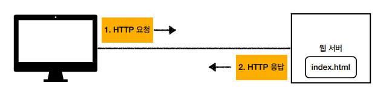
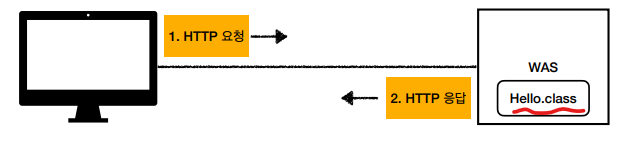
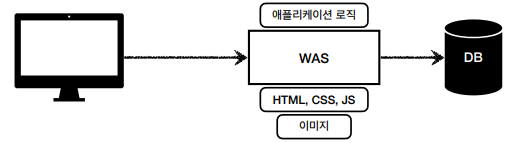
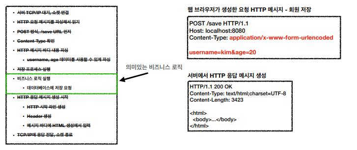
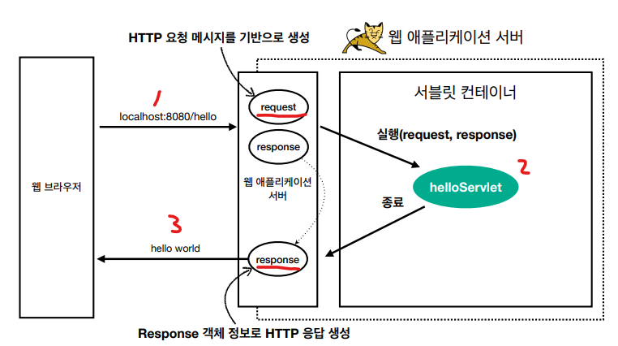
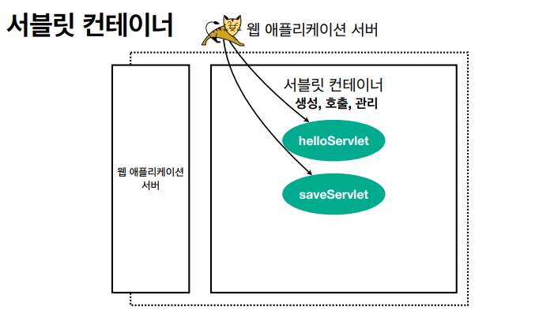
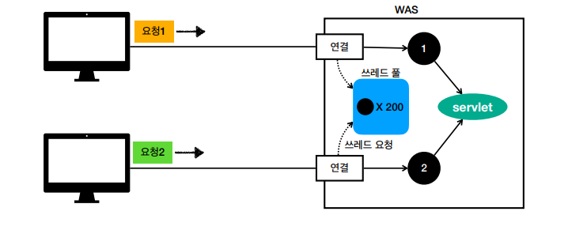
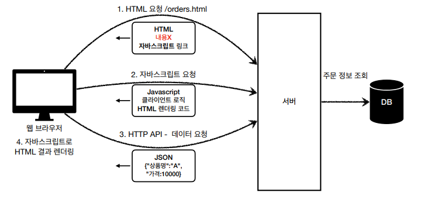

# 01_webApplication

## Web Server

- HTTP 기반으로 동작 
- 정적 리소스 제공, 기타 부가기능 
- 정적(파일) HTML, CSS, JS, 이미지, 영상 
- ex) NGINX, APACHE

## WAS

- HTTP기반으로 동작
- 웹 서버 기능 포합 + 정적 리소스 제공
- 프로그램 코드를 실행 => Application로직 수행
  - 동적 => HTML, HTTP API
  - 서블릿, JSP, 스프링 MVC
- **멀티스레드 지원**
  - 마치 싱글 쓰레드 프로그래밍을 하듯이 편리하게 소스 코드를 개발
- ex) 톰켓

## webServer vs WAS

- 웹 서버 => 정적 리소스
- was => 애플리케이션 로직
- 자바는 서블릿 컨테이너 기능을 제공하면 WAS
- WAS는 애플리케이션 코드를 실행하는데 특화

## 웹 시스템 구성

### 1) WAS, DB

- WAS는 정적 리소스, 애플리케이션 로직 모두 제공가능

- 하지만 WAS가 너무 많은 역할 담당
  - 서버 과부하
- **비싼 애플리케이션 로직이 정적 리소스(이미지) 때문에 수행이 어려울 수 있음**
  - 애플리케이션 로직 => COST가 비싸다
  - 단순 이미지를 보여주는 로직 => COST가 싸다
- WAS장애시 오류 화면도 노출 불가능

### 2)  WEB, WAS, DB

위 문제를 해결하기 위해서 이렇게 구성한다.

- **정적 리소스** => 웹 서버가 처리
- **애플리케이션** => WAS
  - 즉 WAS는 중요한 **애플리케이션 로직 처리 전담**

- 효율적인 리소스 관리 가능
  - 정적 리소스가 많음 => Web서버 증설
  - 애플리케이션 리소스 많음 => WAS증설
- 정적 리소스만 제공하는 웹 서버는 잘 죽지 않음
- 애플리케이션 로직이 동작하는 WAS서버는 잘 죽음
- WAS, DB장애시 WEB서버가 오류 화면 제공 가능

## 서블릿

- 서블릿은 초록색 box를 제외하고 모든 것을 다 지원해준다.
  - 즉 비즈니스 로직만 집중할 수 있음

### 서블릿의 특징

- urlPatterns = > URL이 호출되면 서블릿 코드가 실행
- HttpServletRequest => 초록색 box전
- HttpServletResponse => 초록색 box후

### 서블릿 컨테이너

- **톰캣**처럼 서블릿을 지원하는 WAS를 **서블릿 컨테이너**라고 한다.
- 서블릿 컨테이너는 서블릿 객체를 생성, 초기화, 호출, 종료하는 **생명주기 관리**
- **서블릿 객체**
  - **싱글톤으로 관리**
  - 최초 로딩 시점에서 서블릿 객체를 미리 만들어 둠
  - **공유 변수 사용 주의**
- JSP도 서블릿으로 변환 되어서 사용
- **동시 요청을 위한 멀티 쓰레드 처리 지원**

## 동시 요청 - 멀티 쓰레드

### Thread

- 애플리케이션 코드를 하나하나 순차적으로 실행하는 것은 쓰레드
  - 자바 메인 메서드를 처음 실행하면 main이라는 이름의 쓰레드가 실행
  - 쓰레드가 없다면 자바 애플리케이션 실행이 불가능
- **동시 처리가 필요하면 쓰레드를 추가로 생성**

**요청마다 쓰레드를 생성해줘야한다.**

- 장점
  - 동시 요청 처리가능
  - 리소스가 허용할 때 까지 처이가능
  - 하나의 쓰레드가 지연돼도 나머지 쓰레드는 정상 동작
- 단점
  - 쓰레드 생성 비용 비쌈
    - 고객의 요청이 올 때마다 생성? => 응답속도 늦어짐
  - 쓰레드 => Context Switching발생
  - 쓰레드 생성 제한 없음
    - 고객요청이 너무 많이 오면 ==> CPU, Memory  임계점 넘어 서버가 죽을 수 있음

### Thread Pool

- Thread Pool 안에 Thread를 미리 만들어 놓는다.
  - 다 사용후 => Thread반환
- 만약 Thread Pool이 말랐다면?
  - 대기하거나 거절한다.

- 특징
  - 톰캣은 최대 200개 기본 설정 ( 변경가능 )
- 장점
  - 미리 생성되어 있음 => 응답속도 빠름
  - 생성가능한 최대치가 있기 때문에 요청을 안전하게 처리

**실무 팁**

- **WAS의 주요 튜닝 포인트 => Max Thread의 수**

- **너무 낮게 설정?**

  - 서버 리소스는 여유
  - 클라이언트는 금방 응답 지연

- **너무 높게?**

  - 서버 다운

- 장애 발생?

  - 클라우드 => 일단 서버부터 늘림 => 이후 튜닝

  - 클라우드가 아니면? => 열심히 튜닝

    

**적정 수준을 찾는 방법**

- 성능 테스트를 꼮 해야한다.
- tool : Jmeter, nGrinder 등등

## 용어정리

**SSR- 서버 사이드 렌더링**

- 서버에서 최종 HTML을 생성해서 클라이언트에 전달

- JSP, 타임리프

- 화면이 정적이고, 복잡하지 않을 떄 사용

  

**CSR- 클라이언트 사이드 렌더링**

- React, Vue
- 복잡하고 동적인 UI사용
  - ex) 구글 지도, Gmail, 구글 캘린더

### 최신 Spring 기술

**Spring WebFlux**

- 특징

  - 비동기 Non-blocking처리

    - Non-blocking => 요청이 올때까지 기다리지 않고 다른 요청 먼저 처리
    - 최소 쓰레드로 최대 성능
    - 쓰레드 컨텍스트 스위칭 비용 효율화

  - 함수형 스타일로 개발 - 동시처리 코드 효율화

  - 서블릿 기술 사용x

    

- 단점

  - 기술적 난이도 매우 높음
  - RDB지원 부족
  - 일반 MVC의 쓰레드 모델도 충분
  - 아직 실무에서는 많이 사용하지 않음

