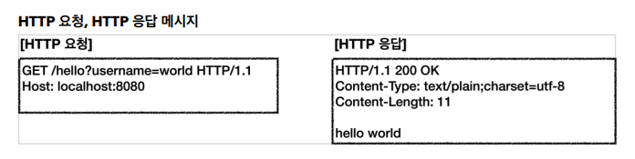
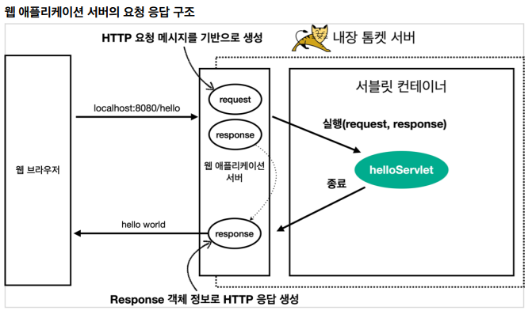

# 02_servlet

```
@WebServlet(name = "helloServlet", urlPatterns = "/hello")
```

## servlet 동작과정


- 스프링 부트 실행 => 스프링 부트가 **내장 톰켓서버 실행**
- 톰켓 서버는 내부에 서블릿 컨데이터를 가지고 있음
  - 서블릿을 생성





- HTTP 요청 메시지를 기반으로 request, response객체를 만든다
- singleton으로 떠있는 서블릿을 호출한다.
- response로 Http응답으로 만들어서 반환을 해준다.


## HTTPServletRequest

**역할**

- 개발자 대신에 HTTP 요청 메시지를 파싱한다. 
- 그 결과를 HttpServletRequest 객체에 담아서 제공한다.

```
HTTP 요청 메시지
POST /save HTTP/1.1
Host: localhost:8080
Content-Type: application/x-www-form-urlencoded

username=kim&age=20
```


**부가기능**

- **임시저장소 기능**
  - 해당 HTTP요청이 시작부터 끝날 떄까지 유지되는 임시 저장소 시능
    - 저장 : request.setAttribute(name, value)
    - 조회 : request.setAttrivute(name)

- **세션 관리 기능**
  - request.getSession(create: true)


## HTTP요청 데이터

> - GET
> - POST
> - HTTP message body

- **GET**
  - 쿼리 파라미터
  - /url?username=hello&age=20
  - URL의 쿼리 파라미터에 데이터를 포함해서 전달
  - 예) 검색, 필터, 페이징등에서 많이 사용하는 방식

- **POST**

  - `content-type: application/x-www-form-urlencoded`

    - HTML form을 통해서 전달된 방식이라는 뜻

  - 메시지 바디에 쿼리 파리미터 형식으로 전달

  - 예) 회원 가입, 상품 주문, HTML Form 사용

    

- **HTTP message body에 데이터를 직접 담아서 요청**

  - HTTP API에서 주로 사용, JSON, XML, TEXT

  - 데이터 형식은 주로 JSON 사용

  -  POST, PUT, PATCH


### HTTP요청 데이터 - GET

- ?로 시작, &로 구분

```java
@WebServlet(name = "requestParamServlet", urlPatterns = "/request-param")
public class RequestParamServlet extends HttpServlet {

    @Override
    protected void service(
        HttpServletRequest request, HttpServletResponse response) 
        								throws ServletException, IOException {
        
        // paramName과 Param꺼내기, 전페 파라미터
        request.getParameterNames().asIterator()
            .forEachRemaining(paramName -> System.out.println(
                paramName + '='+ request.getParameter(paramName)));

		// 단일 파라미터 조회
        String username = request.getParameter("username");
        String age = request.getParameter("age");

		// 이름이 같은 복수 파라이터 조회
        String[] usernames = request.getParameterValues("username");
        for (String name : usernames) {
            System.out.println("username = " + name);
        }
    }
}
```


### HTTP요청 데이터 - POST  HTML  Form

- 특징
  - `content-type: application/x-www-form-urlencoded`
  - 메시지 바디에 쿼리 파리미터 형식으로 데이터를 전달한다. username=hello&age=20

- GET방식으로 넘어가도 메세지를 만들어 준다.
- 이유 : 형식이 같기 때문이다.
  - 따라서 쿼리 파라미터 조회 메서드를 그대로 사용하면 된다.


content-type은 HTTP 메시지 바디의 데이터 형식을 지정한다

**GET URL 쿼리 파라미터 형식**으로 클라이언트에서 서버로 데이터를 전달할 때는 HTTP 메시지 바디를 사용하지 않기 때문에 content-type이 없다.

**POST HTML Form 형식**으로 데이터를 전달하면 **HTTP 메시지 바디에 해당 데이터를 포함해서 보내기 때문에** 바디에 포함된 데이터가 어떤 형식인지 **content-type을 꼭 지정해야 한다.**


### HTTP 요청 데이터 - API  Message Body

- HTTP message body에 데이터를 직접 담아서 요청
  - Restful API에서 주로 사용, JSON
  - POST, PUT, PATCH

```java
@Override
protected void service(HttpServletRequest request, HttpServletResponse response) throws ServletException, IOException {

    // json으로 가져오기
    ServletInputStream inputStream = request.getInputStream();
    String messageBody = StreamUtils.copyToString(
        								inputStream, StandardCharsets.UTF_8);
    System.out.println("messageBody = " + messageBody);

    // parsing
    HelloData helloData = objectMapper.readValue(messageBody, HelloData.class);
    System.out.println("helloData.username = " + helloData.getUsername());
    System.out.println("helloData.age = " + helloData.getAge());

}
```


## HTTP 응답 데이터 - 단순 텍스트, HTML

- HTTP 응답 메시지 생성 
  - HTTP 응답코드 지정 
  - 헤더 생성 
  - 바디 생성
  - 편의 기능 제공 
    - Content-Type, 쿠키, Redirect

```java
@Override
protected void service(HttpServletRequest request, HttpServletResponse response) throws ServletException, IOException {
    //[status-line]
    response.setStatus(HttpServletResponse.SC_OK); // 200

    //[response-headers]
    response.setHeader("Content-Type", "text/plain;charset=utf-8");
    response.setHeader("Cache-Control", "no-cache, no-store, must-revalidate");
    // 캐쉬를 완전히 무효화
    response.setHeader("Pragma", "no-cache"); // 캐시 무효화
    response.setHeader("my-header", "hello"); // 임의의 header만들기
}

private void content(HttpServletResponse response) {
    response.setContentType("text/plain");
    response.setCharacterEncoding("utf-8");
}

private void cookie(HttpServletResponse response) {
    Cookie cookie = new Cookie("myCookie", "good");
    cookie.setMaxAge(600); //600초
    response.addCookie(cookie);
}

private void redirect(HttpServletResponse response) throws IOException {
    response.sendRedirect("/basic/hello-form.html");
}
}
    
```


### HTTP 응답 데이터 - 단순 텍스트, HTML

- 단순 텍스트
- HTML응답
- HTTP API응답

**HTTP API 응답**

```java
@Override
protected void service(HttpServletRequest request, HttpServletResponse response) throws ServletException, IOException {
    //Content-Type: application/json
    response.setContentType("application/json");
    response.setCharacterEncoding("utf-8");

    HelloData helloData = new HelloData();
    helloData.setUsername("kim");
    helloData.setAge(20);

    //{"username":"kim", "age":20}
    // json으로 바꾸는 과정
    String result = objectMapper.writeValueAsString(helloData);
    response.getWriter().write(result);
}
```


