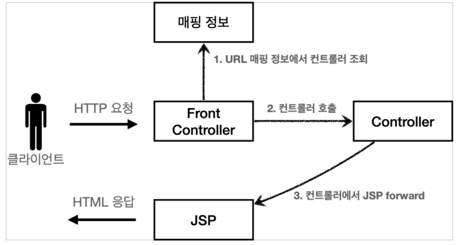
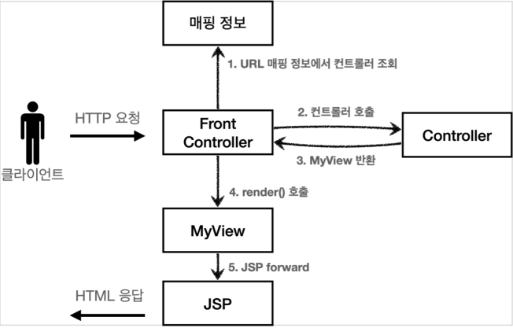
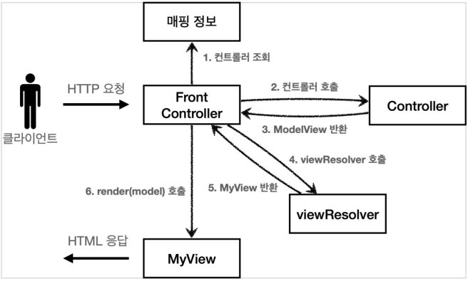
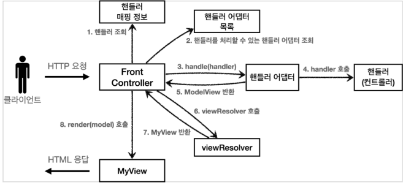

# 04_MVCFramework


## 프론트 컨트롤러


- **특징**
  - 입구가 하나
  - 공통 처리가능
  - 프론트 컨트롤러 **서블릿 하나로 클라이언트의 요청을 받음**
  - 프론트 컨트롤러가 **요청에 맞는 컨트롤러를 찾아서 호출**

- 스프링 웹 MVC와 프론트 컨트롤러
  - 스프링 웹 MVC의 **DispatcherServlet이 FrontController 패턴으로 구현**되어 있음


##  v1



1. mapping정보를 찾음
2. mapping에서 찾은 controller 호출
3. JSPforward사용

```java
@WebServlet(name = "frontControllerServletV1", urlPatterns = "/front-controller/v1/*")
public class FrontControllerServletV1 extends HttpServlet {

    private Map<String, ControllerV1> controllerMap = new HashMap<>();

    // mapping을 시키는 과정 (HashMap에 넣어 url과 객체를 넣어둔다.)
    public FrontControllerServletV1() {
        controllerMap.put( "/front-controller/v1/members/new-form"
                          , new MemberFormControllerV1()); 
        controllerMap.put("/front-controller/v1/members/save"
                          , new MemberSaveControllerV1());
        controllerMap.put("/front-controller/v1/members"
                          , new MemberListControllerV1());
    }

    @Override
    protected void service(HttpServletRequest request
                           , HttpServletResponse response) 
        							throws ServletException, IOException {

       	// 1) mapping한 정보에서 조회하는 과정
        String requestURI = request.getRequestURI();
        ControllerV1 controller = controllerMap.get(requestURI);
        if (controller == null) {
            response.setStatus(HttpServletResponse.SC_NOT_FOUND);
            return;
        }
		
        // 2) controller를 호출하는 과정
        // 다형성을 사용했기 때문에 가능하다.
        controller.process(request, response);
    }
}
```


## v2 - view 분리



1. mapping 조회
2. 컨트롤러 호출
3. MyView를 반환
   - Controller가 직접 forward하는 역할을 하지 않음
4. render() 호출
5. JSP forward

```java
public class MyView {

    private String viewPath;

    public MyView(String viewPath) {
        this.viewPath = viewPath;
    }

    public void render(HttpServletRequest request
                      ,HttpServletResponse response) {
        RequestDispatcher dispatcher = request.getRequestDispatcher(viewPath);
        dispatcher.forward(request, response);
    }
}
```

- 이렇게 진행하게 되면 MyView 객체의 render() 를 호출하는 부분을 모두 일관되게 처리할 수 있다.
- **dispatcher를 사용하는 부분을 따로 분리하는 작업**을 통해서 공통된 부분을 하나로 처리한 것


## v3 - model추가 



- 서블릿 종속성 제거
  - 컨트롤러가 서블릿 기술을 몰라도 동작할 수 있게 하는 것
- /WEB-INF/views/new-form.jsp => new-form 이런식으로 뷰이름 중복을 제거할 것

v2와 다른점

- **ModelView를 반환하게 된다.**
  - request.setAttribute()를 통해서 데이터를 저장시키게 되면 서블릿에 종속적이게 된다.
  - 따라서 종속성을 제거하기 위해서 Model을 직접 만드는 과정
  - 추가로 View이름까지 전달

```java
@Getter
@Setter
public class ModelView {
    private String viewName;
    private Map<String, Object> model = new HashMap<>();
    public ModelView(String viewName) {
        this.viewName = viewName;
    }
}
```


- Front Controller

```java
@WebServlet(name = "frontControllerServletV3", 
            urlPatterns = "/front-controller/v3/*")
public class FrontControllerServletV3 extends HttpServlet {

    private Map<String, ControllerV3> controllerMap = new HashMap<>();

    public FrontControllerServletV3() {
        controllerMap.put("/front-controller/v3/members/new-form", 
                          new MemberFormControllerV3());
        controllerMap.put("/front-controller/v3/members/save", 
                          new MemberSaveControllerV3());
        controllerMap.put("/front-controller/v3/members", 
                          new MemberListControllerV3());
    }

    @Override
    protected void service(HttpServletRequest request,
                           HttpServletResponse response) {

        // 클라이언트에서 uri를 가져옴
        String requestURI = request.getRequestURI();

        // URI를 mapping에 저장함
        ControllerV3 controller = controllerMap.get(requestURI);
        if (controller == null) {
            response.setStatus(HttpServletResponse.SC_NOT_FOUND);
            return;
        }

        // 1) Controller 생성
        Map<String, String> paramMap = createParamMap(request);
        
        // 2) controller호출한 뒤에 ModelView를 반환받음
        // 	  modelView는 데이터를 저장시켜놓은 곳
        ModelView mv = controller.process(paramMap);

        // 3) viewResolver를 호출 => view를 반환받는다.
        String viewName = mv.getViewName(); // new-form 이름만 받는다.
        MyView view = viewResolver(viewName);

        // 4) render
        view.render(mv.getModel(), request, response);
    }
	
    // /WEB-INF/views/줄이는 것
    private MyView viewResolver(String viewName) {
        return new MyView("/WEB-INF/views/" + viewName + ".jsp");
    }

    // 서블릿의 종속을 없애기 위해서 직접 구현
    private Map<String, String> createParamMap(HttpServletRequest request) {
        Map<String, String> paramMap = new HashMap<>();
        
        // 모든 파라미터를 다 가지고 온 뒤 paramMap에 다 저장시킬 것이다.
        // paramName => username/  request.getParameter => 김
        request.getParameterNames().asIterator()
            .forEachRemaining(
            paramName -> paramMap.put(paramName,request.getParameter(paramName)));
        return paramMap;
    }
}

```


- view resolver
  - 논리 뷰 이름: members
  - 물리 뷰 경로: /WEB-INF/views/members.jsp
  - 논리 뷰 이름을 물리 뷰 경로로 바꿔주는 역할


## v4 - 단순화

- 구조는 v3와 똑같다
- 컨트롤러가 ModelView 를 반환하지 않고, ViewName 만 반환한다.
- 인터페이스에 ModelView가 없다. 
  - model 객체는 파라미터로 전달되기 때문에 그냥 사용하면 되고, 결과로 뷰의 이름만 반환해주면 된다.
- 즉 FrontController가 다 model을 만들어서 보내준다는 뜻

```java
Map<String, String> paramMap = createParamMap(request);
Map<String, Object> model = new HashMap<>(); //추가
String viewName = controller.process(paramMap, model);
```

- 위 코드는 FrontController에서 추가된 코드이다.


## v5

- ControllerV3와 V4를 둘다 사용하고 싶을 수 있기 때문에 고치는 것이다.
- **어댑터 패턴**을 사용할 것



- **핸들러 어댑터**
  - 다양한 종류의 컨트롤러를 호출을 할 수 있게 도와주는 것
  - 어댑터는 결국 Front Controller와 Controller를 알맞춰주는 역할이다
    - 왜냐하면 Controller가 많아졌기 때문이다.
- **핸들러**
  - 컨트롤러의 개념 뿐만 아니라 어떠한 것이든 해당하는 종류의 어댑터만 있으면 다 처리할 수 있기 때문에 이름을 변경


**MyHandlerAdapter**

```java
public interface MyHandlerAdapter {
    boolean supports(Object handler);
    ModelView handle(HttpServletRequest request, HttpServletResponse response,
                     Object handler) throws ServletException, IOException;
}

```

- boolean supports(Object handler)
  - handler => 컨트롤러
  - 어댑터가 해당 컨트롤러를 처리할 수 있는지 판단

- ModelView handle
  - 어댑터는 실제 컨트롤러를 호출하고, 그 결과로 ModelView를 반환


```java
@Override
protected void service(HttpServletRequest request, HttpServletResponse response) throws ServletException, IOException {
	
    // 1) handler조회
    Object handler = getHandler(request);
    if (handler == null) {
        response.setStatus(HttpServletResponse.SC_NOT_FOUND);
        return;
    }

    // 2) adapter목록에서 handler adapter를 찾아온다.
    //    adapter => controller 모아둔 곳 / handler => controller
    MyHandlerAdapter adapter = getHandlerAdapter(handler);

    // 3) adapter에서 model view를 반환한다.
    ModelView mv = adapter.handle(request, response, handler);

    // 4) resolver
    String viewName = mv.getViewName();
    MyView view = viewResolver(viewName);

    // 5) MyView render
    view.render(mv.getModel(), request, response);

}
```


