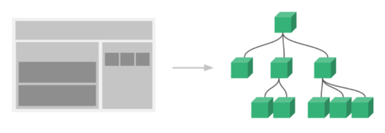
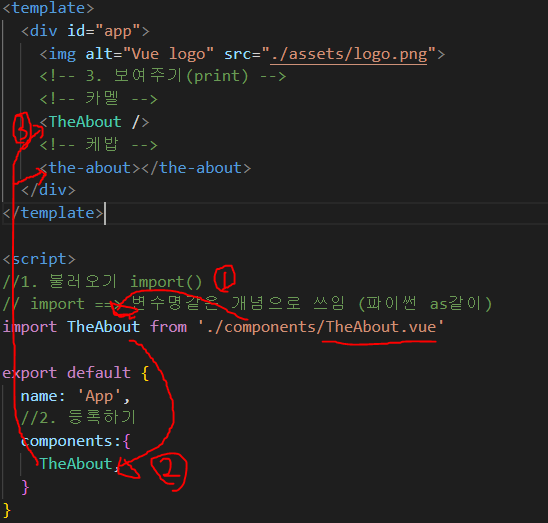
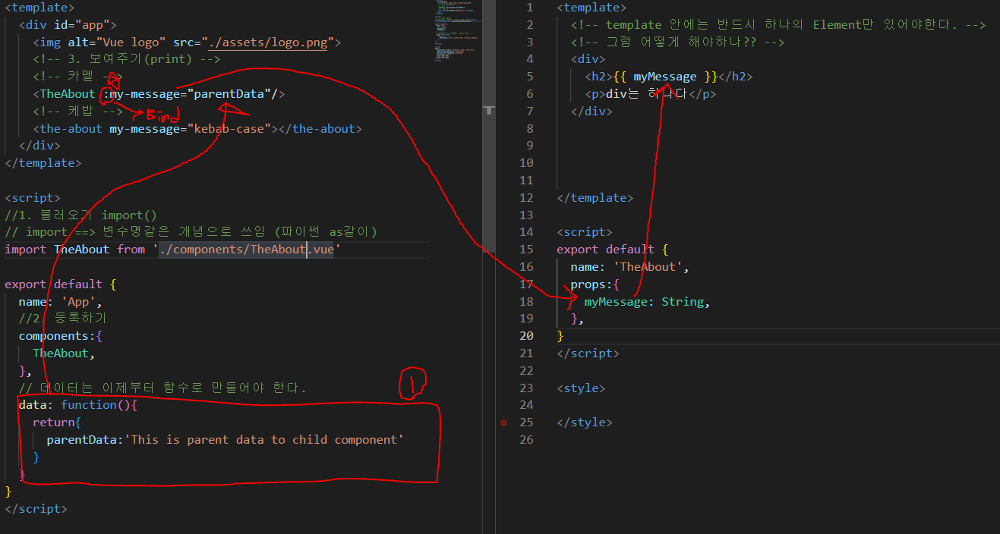

# Vue_Component

### SFC (Single File Component)

- 웹에서 각각의 기능별로 파일을 나눠서 개발!

## Pass Props & Emit Events

#### component 구조

- 탬플릿 (HTML) - 머리
- 스크립트 (JavaScript) - 가슴
- 스타일 (CSS) - 배

이 3가지가 합쳐져서 하나의 기능을 하는 APP이 되게 된다.

#### Component 등록 3단계

- 불러오기 (import) 
- 등록하기 (register)
- 보여주기 (print)

## Component작성

#### 등록한 것 props로 넘기기

props는 아래로

events는 위로

#### Emit하기

- 부장님 ! 서류
- 그래? 듣고
- 결제

#### Router

- 장고에서 url부분과 흡사하다
- view에서 값을 가져오고 router로 보냄

