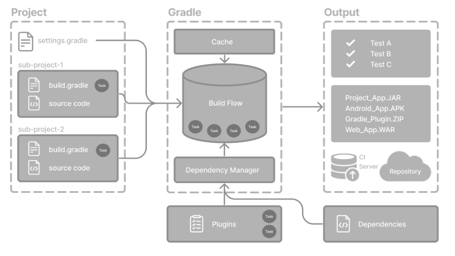
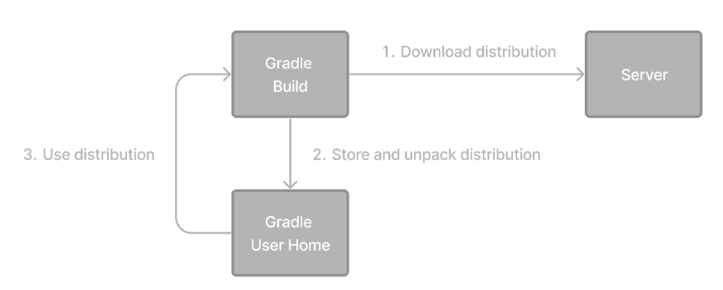
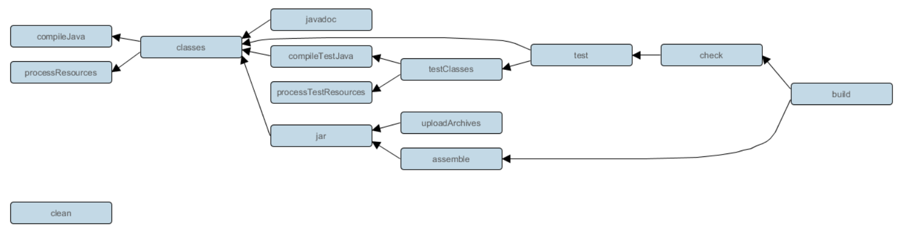

# Gradle

빌드 tool이며, 해당 종속성 등을 관리해주는 tool이다.


## Gradle 기본 개념




### Wrapper 

- 특정 Gradle 버전을 자동으로 다운로드 할 수 있도록 도와준다.




### Task

- 빌드가 수행하는 독립적인 작업 단위를 말한다.
  - Task는 모든 Gradle 빌드의 구성 요소이다.
  - 작업 유형
    - 소스 코드 컴파일
    - 테스트 실행
    - JAR, APK 등과 같은 결과물 패키징
    - 문서 생성
    - 빌드 산출물을 저장소에 배포 등


### plugin

- 기본적으로 Gradle은 의존성 해결, 작업 조율, 증분 빌드(incremental build)와 같은 핵심 인프라를 제공
- Java 컴파일, Android 앱 빌드, 산출물(artifacts) 배포와 같은 대부분의 기능은 플러그인을 통해 제공됩니다.

- Core Plugin (built in)

  - Gradle 배포판에 기본 포함된 필수 플러그인

  - Gradle 팀에서 유지관리한다.

  - version을 사용하지 않아도 된다.

    

- Community Plugin

  - 커뮤니티에서 개발한 플러그 인

  - Gradle plugin portal에 게시됨

  - 특정 기술이나 목적에 맞춘 기능을 제공한다.

    

- Local/ Custom Plugin

  - 사용자가 직접 만든 플러그인
  - 단일 프로젝트나 여러 프로젝트에서 사용 가능
  - 일반적으로 `buildSrc/` 디렉터리 또는 별도 `build-logic` 모듈에 작성
  - Kotlin 또는 Groovy로 작성


## Multi Module

- 멀티모듈을 사용하는 이유?
  - 각 모듈은 독립적으로 개발, 빌드, 테스트, 배포가 가능
  - **독립적으로 운영될 수 있는 의미를 가지는 구성요소 단위** 
  - 서비스에 대한 플로우나 흐름을 제어하면 애플리케이션 비즈니스
  - 도메인 단위에서 생성/변경/소멸의 라이프 사이클을 가지면 도메인 비즈니스
  - 하나의 모듈은 하나의 `인프라스트럭처`만 책임지도록 모듈을 작성하는 것을 추천

- 모듈의 특징?
  - 모듈은 독립적인 의미가 갖는다.
  - 모듈은 어떠한 추상화 정도에 대한 계층을 가지고 있다.
  - 계층 간 의존 관계에 대한 규칙이 있다.
  - 

- 그럼 어떻게 나누지?
  - 특징에 맞고, 성격 맞고, 사이클에 맞게끔 구성을 해야한다.
  - 서버, 인프라, 시스템, 도메인

```
buildSrc
data
server
  - user-server
  - admin-server
  - batch-server
```


## settings

- root dir에서 `settings.gradle` 파일을 찾는다.
- 파일이 발견되면 Gradle은 settings 객체를 인스턴스화 한다.
- 빌드에 포함될 모든 프로젝트들을 선언하는 것이다.
- Gradle 빌드 당 하나의 Settings 객체가 존재 한다.

### Settings 속성

| 속성 이름     | 설명                                |
| ------------- | ----------------------------------- |
| `buildCache`  | 빌드 캐시 구성                      |
| `plugins`     | 현재 설정에 적용된 플러그인 목록    |
| `rootDir`     | 빌드의 루트 디렉터리                |
| `rootProject` | 루트 프로젝트 객체                  |
| `settings`    | 현재 Settings 객체 (자기 자신) 반환 |


| 메서드 이름      | 설명                                        |
| ---------------- | ------------------------------------------- |
| `include()`      | 하위 프로젝트를 빌드에 추가                 |
| `includeBuild()` | 지정한 경로의 빌드를 Composite Build로 포함 |


## Build Script

> 1. Add plugins
> 2. Add dependencies
> 3. Use convention properties

### plugins

```gro
plugins {   
    id 'java'
}
```

- 코드를 컴파일하거나, 테스트를 실행하거나, 아티팩트를 패키징하는 작업 등을 위해 Gradle의 기능을 확장하는 도구이다.
- Gradle을 확장하기 위해서 사용된다.
- 구성을 모듈화하거나 재사용할 수 있도록 해준다.

**java plugins**



- https://docs.gradle.org/current/userguide/java_plugin.html#java_plugin
- 읽어 볼 것


### repositories

```groovy
repositories {
    mavenCentral()
}
```

- 의존성들(JUnit, Spring 등등)을 다운로드할 저장소를 지정하는 것
- 프로젝트는 여러개의 dependency(플러그인, 라이브러리, 컴포넌트 등)를 필요로 하는데 이는 빌드 Gradle에게 의존성 바이너리 파일을 어디에서 찾을지 알려주는 역할을 한다.
- dependency를 가져올 위치는 여러 개를 지정할 수 있다.


### dependencies 

```groovy
dependencies {
    testImplementation 'org.junit.jupiter:junit-jupiter-engine:5.9.3'
    testRuntimeOnly 'org.junit.platform:junit-platform-launcher'
    implementation 'com.google.guava:guava:32.1.1-jre'
}
```

- 프로젝트에서 사용하는 외부 라이브러리 및 도구이다.
- 의존성은 **configuration(구성)** 을 통해 관리되며, **repository(저장소)** 로부터 가져옵니다.


### Set properties

```groovy
plugins {
    id 'java'
}

java {
    toolchain {
        languageVersion = JavaLanguageVersion.of(21)
    }
}

```

- java {} 는 java의 메서드를 실행하는 것으로 보임
  - java 타입의 객체를 구성하고 있는 것
  - 그 안에 mainClass, applicationName 등의 속성이 존재


### Tasks

- class 컴파일, 단위 테스트 실행, war 파일 압축 등과 같은 기본적인 작업 단위를 수행
- Task는 일반적으로 plugin에 정의된다.
- 하지만 직접 Task를 등록하거나 구성해야 할 때도 있다.

```groovy
tasks.register('zip-reports', Zip) {
    from 'Reports/'                  // 압축할 디렉토리
    include '*'                      // 포함할 파일 패턴
    archiveFileName = 'Reports.zip' // 생성될 zip 파일 이름
    destinationDirectory = file('/dir') // 저장될 경로
}
```

- Task를 등록하면 해당 프로젝트에 추가 된다.
- create( ) 대신 register( ) 사용 권장함

```groovy
tasks.named('test', Test) {
    useJUnitPlatform()
}
```

- 등록된 작업을 구성하려면 `TaskCollection.named(java.lang.String)` 메서드를 사용할 수 있음
- useJUnitPlatform을 사용하도록 구성한 것

```groovy
tasks.named('javadoc', Javadoc).configure {
    exclude 'app/Internal*.java'
    exclude 'app/internal/*'
}
```

- Java 코드에서 **HTML 형식의 문서(JavaDoc)** 를 생성할 때 일부 파일을 **제외**하는 예제


## dependencies

- producer : 라이브러리를 빌드할 땐 producer가 된다. (제공자이기 때문)

- consumer : 다른 라이브러리를 의존할 땐 consumer가 된다. (사용자이기 때문)

  1. 다른 프로젝트에 의존하는 project

  2. 특정 아티팩트에 대한 의존성을 선언하는 configuration

- `dependencies` 블록 

  - 외부 라이브러리, 로컬 JAR 파일, 멀티 프로젝트 블드 내의 다른 프로젝트 등 다양한 종류의 의존성을 지정할 수 있게 해주는 것
  - `configuration('<group>:<name>:<version>')` 
    : 구성 이름 + 의존성 표기 방식 - 그룹ID : 아티팩트ID(이름) : 버전
  - Gradle은 의존성이 사용되는 범위 (comtile time, runtime, for test) 에 따라 다양한 구성 옵션을 제공
  - 의존성을 찾기 위해서 Gradle은 repositories를 build.gradle 파일에 지정할 수 있다.

### 의존성의 종류

**1. Module Dependencies**

- Maven Central, JCenter와 같은 저장소에 있는 특정 모듈(라이브러리)를 참조

```groovy
build.gradle
dependencies {
    implementation 'org.codehaus.groovy:groovy:3.0.5'
    implementation 'org.codehaus.groovy:groovy-json:3.0.5'
    implementation 'org.codehaus.groovy:groovy-nio:3.0.5'
}
```


**2. Project Dependencies**

- 동일한 빌드 내의 다른 프로젝트에 의존하는 경우

```groovy
build.gradle
dependencies {
    implementation project(':utils')
    implementation project(':api')
}
```


**3. File Dependencies**

- 공유 드라이브나 프로젝트 소스 코드와 함께 버전 관리 시스템에 직접 체크인된 외부 의존성 파일을 사용할 경우 사용
-  이런 경우에는 순수한 파일을 참조

```groovy
dependencies {
    runtimeOnly files('libs/a.jar', 'libs/b.jar')
    runtimeOnly fileTree('libs') { include '*.jar' }
}
```


### Dependency Configuration (scope)

- Configuration이라는 개념을 통해 의존성의 범위를 나타낸다.
- 많은 Gradle 플러그인은 프로젝트에 사전 정의된 여러 configuration을 자동으로 추가한다.

| 구성 이름             | 설명                                                         | 용도        |
| --------------------- | ------------------------------------------------------------ | ----------- |
| `api`                 | 컴파일 및 런타임 모두에 필요한 의존성. 퍼블리시된 API에 포함됨. | 의존성 선언 |
| `implementation`      | 컴파일 및 런타임 모두에 필요한 의존성.                       | 의존성 선언 |
| `compileOnly`         | 컴파일에만 필요한 의존성. 런타임이나 배포물에는 포함되지 않음. | 의존성 선언 |
| `compileOnlyApi`      | 컴파일에만 필요하지만 퍼블리시된 API에 포함되는 의존성.      | 의존성 선언 |
| `runtimeOnly`         | 런타임에만 필요한 의존성. 컴파일 클래스패스에는 포함되지 않음. | 의존성 선언 |
| `testImplementation`  | 테스트 코드의 컴파일 및 실행에 필요한 의존성.                | 의존성 선언 |
| `testCompileOnly`     | 테스트 코드의 컴파일에만 필요한 의존성.                      | 의존성 선언 |
| `testRuntimeOnly`     | 테스트 실행 시에만 필요한 의존성.                            | 의존성 선언 |
| `annotationProcessor` | 컴파일 시 어노테이션 기반 코드 생성할 때 사용(ex_lombok)     |             |


**custom 가능**

```groovy
build.gradle
configurations {
    customConfig
}

dependencies {
    customConfig("org.example:example-lib:1.0")
}
```


## Repository

```groovy
repositories {
    mavenCentral()  // 1
    maven {         // 2
        url = uri("https://company/com/maven2")
    }
    mavenLocal()    // 3
    flatDir {       // 4
        dirs "libs"
    }
}
```

1. Public repository
2. Private/Custom repository
3. Local repository
4. File repository

### 1. Public repository

```groovy
// build.gradle
repositories {
    mavenCentral()
    google()
    gradlePluginPortal()
}
```

- `RepositoryHandler` API를 통해 축약 표기법을 확인 할 수 있음
- public binary repository를 활용할 때 사용한다.


### 2. Private/Custom repository

```groovy
repositories {
    maven {
        url = uri("https://maven-central.storage.apis.com")
    }
    ivy {
        url = uri("https://github.com/ivy-rep/")
    }
}
```

- 사내 네트워크 내에서만 접근이 가능한 바이너리 저장소등을 설정할 때 사용


### 3. Local repository

```groovy
repositories {
    mavenLocal()
}
```

- 로컬 Maven 캐시(예: `~/.m2/repository`)를 저장소로 선언


#### ex

// build.gradle

repositories {

    // 커스텀 레이아웃을 사용하는 Ivy 저장소
    ivy {
        url = 'https://your.ivy.repo/url'
        layout 'pattern', {
            ivy '[organisation]/[module]/[revision]/[type]s/[artifact]-[revision].[ext]'
            artifact '[organisation]/[module]/[revision]/[type]s/[artifact]-[revision].[ext]'
        }
    }
    
    // 인증이 필요한 HTTPS 기반 Maven 저장소
    maven {
        url = 'https://your.secure.repo/url'
        credentials {
            username = 'your-username'
            password = 'your-password'
        }
    }
    
    // SFTP 기반 Maven 저장소
    maven {
        url = 'sftp://your.sftp.repo/url'
        credentials {
            username = 'your-username'
            password = 'your-password'
        }
    }
    
    // AWS S3 기반 Maven 저장소
    maven {
        url = "s3://your-bucket/repository-path"
        credentials(AwsCredentials) {
            accessKey = 'your-access-key'
            secretKey = 'your-secret-key'
        }
    }
    
    // Google Cloud Storage 기반 Maven 저장소
    maven {
        url = "gcs://your-bucket/repository-path"
    }


## 예제

```groovy

plugins {
    id 'java'
}

group = 'jayho'
version = '0.1.0'

repositories {
    mavenCentral()
}

java {
    toolchain {
        languageVersion = JavaLanguageVersion.of(21)
    }
}

dependencies {
    implementation 'ch.qos.logback:logback-classic'

    compileOnly 'org.projectlombok:lombok'
    annotationProcessor 'org.projectlombok:lombok'

    testRuntimeOnly 'org.junit.platform:junit-platform-launcher'
}

tasks.named('test', Test) {
    useJUnitPlatform()
}
```


Gradle 명령어 입력 시 실행 단계 진입:

#### 예: `./gradlew build` 실행 시

Gradle은 아래의 작업을 수행합니다:

1. `compileJava`
   - Java 21 toolchain으로 컴파일 수행
   - `compileOnly` 및 `implementation` 의존성 사용
2. `processResources`
   - 리소스 파일 복사
3. `classes`
   - `compileJava` + `processResources` 결과
4. `test`
   - `testImplementation`, `testRuntimeOnly` 기반 테스트 실행
   - `useJUnitPlatform()` 설정에 따라 JUnit 5 엔진 사용
5. `jar`
   - `.class` 파일과 리소스를 모아 `.jar` 생성
6. `build`
   - 위의 모든 과정 포함 (기본적으로 `check` + `assemble`)


