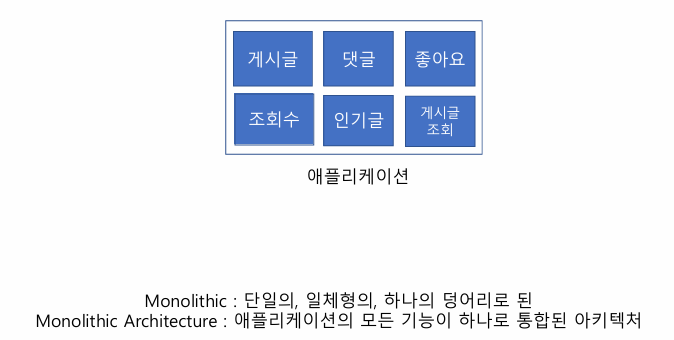
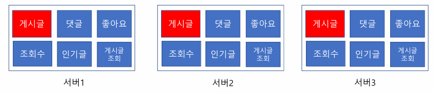
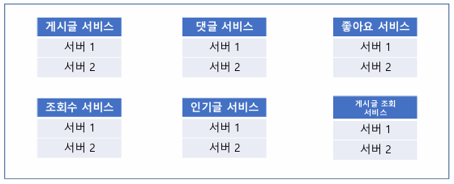
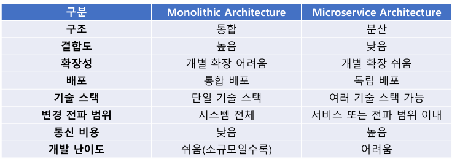

# 01_대규모 시스템

> - 복잡한 시스템을 다루는 방법
> - 병렬 처리
> - 병목 지점 최소화
> - 확장성 있는 구조

## Monolithic Architecture

- 영향
  - 확장성
  - 유지보수성
  - 성능

### 장/단점

- 장점
  - 쉽고 빠르게 개발 가능
- 단점
  - 트래픽이 급등했을 경우
    - Scale Up 가능 => 가격이 비싸진다.
    - Scale Out => 모놀리틱이기 때문에 resource 낭비가 이뤄진다.
  - 공통 코드가 있을 경우
    - 공통 코드를 고쳐 인기글을 고쳤는데 게시글과 댓글에도 문제가 있을 수 있음

## MSA

- 각각의 마이크로 서비스는 독립적으로 배포될 수 있음
- 장점
  - 각 서비스 별로 빠르게 배포될 수 있음
  - 장애가 발생했을 때 개별적으로 관리 될 수 있음 
- 단점
  - 통신 비용, 트랜잭션 관리
  - 서비스 분리 기준
  - 모니터링, 개발 비용
  - 테스트, 설계 등 고려해야할 부분이 굉장히 많아진다.

## 비교

## 

