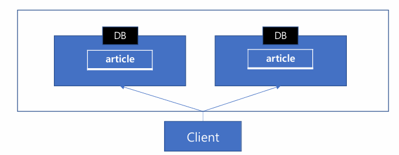
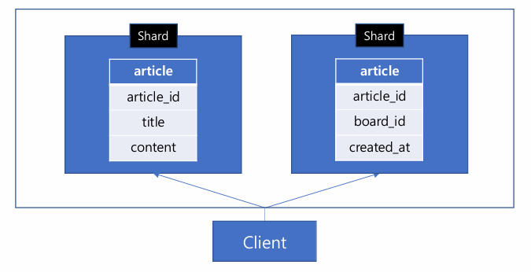
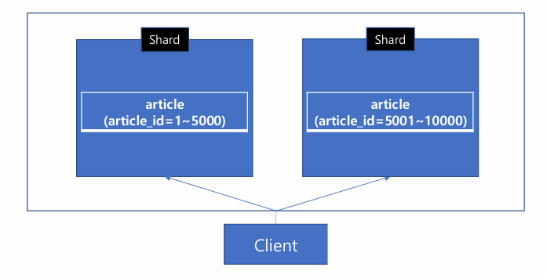
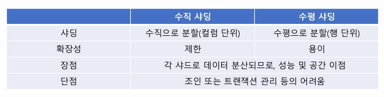
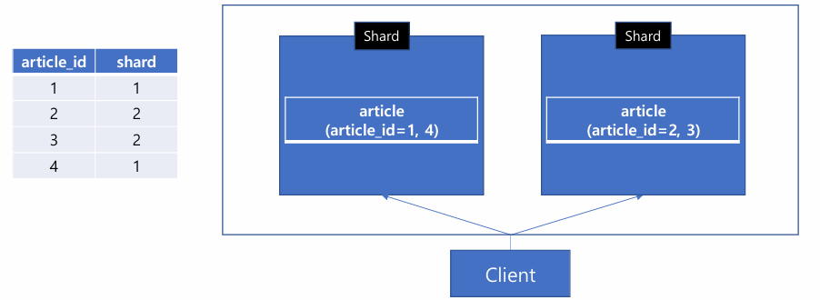
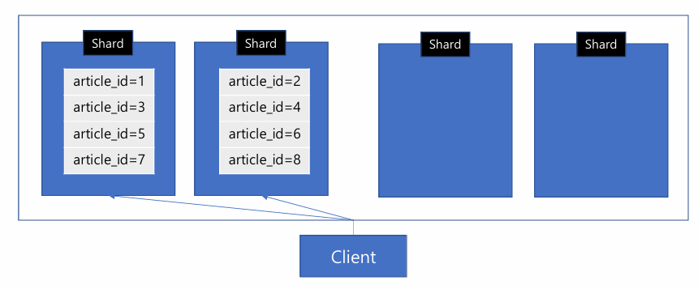
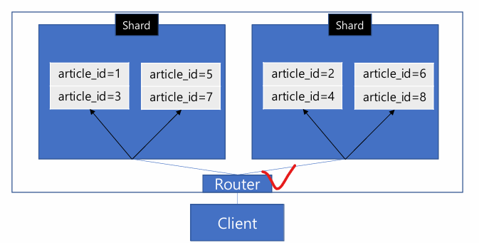
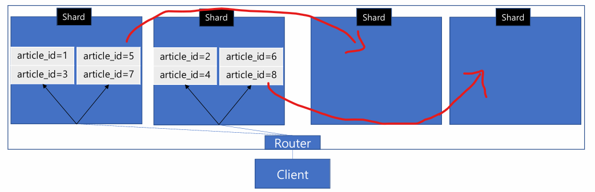

# 02_DistributedRDB

> - 

##  DistributedRDB이란



-  데이터 베이스에 대한 하나의 분산 시스템이 구성된 것

- sharding 이라고 한다.

  

## Sharding

> - 데이터를 여러 데이터 베스이스에 분산하여 저장한다.
> - shard : 샤딩된 각각의 데이터 단위
> - Vertical Sharding (수직 샤딩)
> - Horizontal Sharding (수평 샤딩)

### Vertical Sharding 



- 데이터를 수직(컬럼)으로 분할하는 방식
- article_id 식별자를 이용
  - 좌측 title, content / 우측 board_id, created_at

- 단점
  - 수평적 확장에 제한이 있다.
  - 컬럼 수 만큼만 확장이 가능하다.


### Horizontal Sharding 



- 데이터를 수평(id 등)으로 분할하는 방식


### sharding compare




## 샤딩 기법

> - Range-Based Sharding
> - Hash-Based Sarding
> - Directory-Based Sharding

### Range-Based Sharding

- 데이터의 특정 값(Sharding Key)의 특정 범위로 나누는 것
  - 좌측 article_id = 1 ~ 5000
  - 우측 article_id = 5001 ~ 10000

- 단점
  - 데이터 쏠림 현사잉 발생할 수 있음
    - ex_ article 1~1000번이 인기글일 경우 DB 1번에만 부하가 가해진다.
    - ex_ 데이터가 DB 1번에만 몰릴 수 있음


### Hash-Based Sarding

- Sharding key를 해시 함수로 나누는 방법
  - hash_func : article id % 2

- 단점
  - 한 Shard Key와 해시 함수가 필요하다.
  - 균등하게 분산되지 않으면, 데이터 쏠림 현상 발생 가능
  - 범위 데이터 조회시 불리함


### Directory-Based Sharding



- 디렉토리를 이용해서 저장된 샤드를 관리하는 기법

- 장점

  - 데이터 규모에 따라 유연한 관리가 가능

  - 샤드를 동적으로 추가하는 것도 비교적 쉬움

  - 샤딩에 사요오디는 시스템이나 알고리즘을 사용할 수 있다

    

- 단점
  - 디렉토리 관리 비용이 필요


## 물리적 샤드와 논리적 샤드

> - Pysical Shard
> - Logical Shard 

### Pysical Shard



- 물리적 샤드 2 => 4개로 늘려야하는 상황
- artical_id % 4로 데이터 분할 => 균등하게 분할되었다고 가정
- **문제점**
  - Client 단에서도 Shard의 정보를 알아야하고 값에 따라 코드 수정이 이뤄질 수 있음


### Logical Shard



- 물리적 샤드 : 2개
- Client는 4개의 샤드가 있다고 가정하고 분리하는 것
  - 미리....나눠놓는건가 그럼?
  - Client가 요청한 논리적 샤드가 어떤 물리적 샤드에 속해있는지 알아야한다.
    - 그래야 직접적으로 데이터에 접근할 수 있기 때문
  - **Shard Router**
    - 중간에서 계속 라우팅 해주는 것



- 이렇게 확장이 되었다고 하더라도 Router가 알아서 나누기 때문에 Client에서 뭔가를 추가할 필요가 없음


```
create table article (
 article_id bigint not null primary key,
 title varchar(100) not null,
 content varchar(3000) not null,
 board_id bigint not null,
 writer_id bigint not null,
 created_at datetime not null,
 modified_at datetime not null
 );
```


