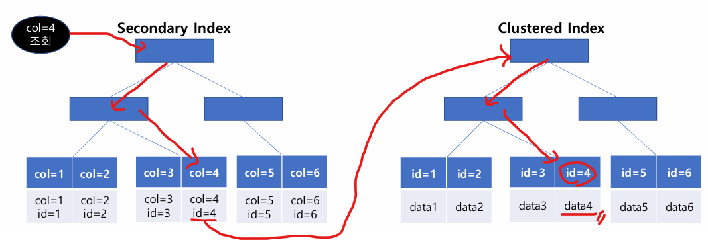

# 03_ArticleAPI


## 알지 못하는 내용 모음

### stream.map 사용


### @NoArgsConstructor(access = AccessLevel.PROTECTED) 

> - https://erjuer.tistory.com/106

- protected : 다른 패키지에 소속된 클래스는 접근할 수 없음
- private : 모든 외부 클래스는 접근할 수 없음


**Entity에는 `AccessLevel.PROTECTED`를 사용한다.**

- `private`을 사용 못하는 이유

  - Proxy 때문이다.

  - JPA에선 성능을 위해서 lazy-loading을 사용하게 된다.

  - 이때 lazy loading은 proxy를 사용해서 loading을 늦추게 되는데 private을 사용하게 되면 proxy 객체는 같은 패키지에 소속된 클래스가 아니라서 접근할 수 없게 된다. 

  - 따라서 PROTECTED로 최소한의 접근 제한자를 사용하는 것

    

- `public`을 지양하는 이유

  - 캡술화 때문이다. 즉 언제 debug의 범위를 최소화 하기 위해서 이다.
  - 평소에 public을 사용하기 않고 private으로 막아두는 이유와 동일하다고 볼 수 있다.


- // factory method란

- 잘 사용할 수 있을 방법

  ```java
      // factory method
      public static Article create(Long articleId, String title, String content, Long boardId, Long writerId, LocalDateTime createAt, LocalDateTime modifiedAt){
          Article article = new Article();
          article.articleId = articleId;
          article.title = title;
          article.content = content;
          article.boardId = boardId;
          article.writerId = writerId;
          article.createAt = createAt;
          article.modifiedAt = modifiedAt;
          return article;
      }
  
      public void update(String title, String content){
          this.title = title;
          this.content = content;
          modifiedAt = LocalDateTime.now();
      }
  
  ```

- @SpringBootTest : 공부


```java
package kube.board.article.data;

import jakarta.persistence.EntityManager;
import jakarta.persistence.PersistenceContext;
import kube.board.article.entity.Article;
import kube.board.common.snowflake.Snowflake;
import org.junit.jupiter.api.Test;
import org.springframework.beans.factory.annotation.Autowired;
import org.springframework.boot.test.context.SpringBootTest;
import org.springframework.transaction.annotation.Transactional;
import org.springframework.transaction.support.TransactionTemplate;

import java.util.concurrent.CountDownLatch;
import java.util.concurrent.ExecutorService;
import java.util.concurrent.Executors;

@SpringBootTest
public class DataInitializer {
    @PersistenceContext
    EntityManager entityManager;
    @Autowired
    TransactionTemplate transactionTemplate;
    Snowflake snowflake = new Snowflake();
    CountDownLatch latch = new CountDownLatch(6000);

    static final int BULK_INSERT_SIZE = 2000;
    static final int EXECUTE_COUNT = 6000;

    @Test
    void initialize() throws InterruptedException {
        ExecutorService executorService = Executors.newFixedThreadPool(10);
        for (int i = 0; i< EXECUTE_COUNT; i++){
            executorService.submit(() -> {
                insert();
                latch.countDown();
                System.out.println("latch.getCount() = " + latch.getCount());
            });
        }
        latch.await();
        executorService.shutdown();
    }

    void insert(){
        transactionTemplate.executeWithoutResult(status -> {
            for(int i=0; i< BULK_INSERT_SIZE; i++){
                Article article = Article.create(
                        snowflake.nextId(),
                        "title" + i,
                        "content" + i,
                        1L,
                        1L
                );
                entityManager.persist(article);
            }
        });
    }

}

```

- 


### @PersistenceContext 이란?

- EntityManager가 Thread-Safe하지 않는다. 
- 따라서 PersistenceContext을 통해 Spring으로 EntityManager를 관리하는 역할을 한다.
- @PersistenceContext를 사용해서 EntityManager를 주입 받으면 Spring에서 EntityManager를 Proxy로 감싼 EntityManager를 사용해서 Thread-Safe를 보장한다.
- Proxy로 생성하고 호출 시 마다 새로운 객체를 생성해주기 때문에 Thread safe 한 것


### CountDownLatch 이란?

- 하나 이상의 스레드가 다른 스레드에서 수행 중인 작업이 완료될 때까지 대기할 수 있는 동기화 보조 기능이라고 생각하시면 됩니다.

```java
CountDownLatch latch = new CountDownLatch(6000);

latch.countDown(); // 이 함수 1번 실행 하면 1씩 감소한다.

latch.await(); // CountDownLatch 가 0이 될때까지 대기한다. 즉 6000번 호출될 때 까지 대기

```

- ex
  - 1개의 카운트로 초기화된 CountDownLatch는 on/off latch 또는 게이트 역할을 해준다.
  - 호출되는 모든 스레드는 countDown()을 스레드에 의해 열릴떄 까지 대기한다.


### transactionTemplate.executeWithoutResult(status -> {})

- Transaction을 관리해주는 class이다.

- 하기 2가지 단점을 가지고 있어 이럴 때 사용하면 좋음

- @Transaction을 사용하면 되지만 단점을 가지고 있음

  - 메서드 레벨에 AOP 가 적용되기 때문에 트랜잭션 단위도 메서드 레벨로 적용
    (메서드 내에서 지정 불가능)

  - self invocation 에서 트랜잭션 적용 불가

  - ```java
    public Proxy {
    	public void externalMethod(){
        	internalMethod(); // 자기 호출(Self Invocation) 발생
        }
        public void internalMethod(){
        }
    }
    ```

  - 이렇게 생성된 프록시 객체에서 내부(Internal) 호출을 할 경우, 다시 말해 같은 클래스 내 메소드 호출인 **자기 호출**(Self-Invocation)을 이용하면 AOP 기능이 수행되지 않아 여러 블로그 글들에서 **트랜잭션 기능이 동작하지 않는다**고 설명하고 있습니다.


## 페이징 조회 [1200만 개 Data]

> - N번 페이지에서 M개의 게시글 조회
> - 게시글의 개수

### 페이징을 처리하는 방법은?

- DB에서 특정 페이지의 데이터만 바로 추출하는 방법이 필요

### 1 - 페이지 번호 방식 [index x]

- N번 페이지에서 M개의 게시글
- 게시글의 개수
  - 즉 페이지당 30개의 게시글을 보여주고, 총 94개의 게시글이 있다면 4번 페이지까지 이동할 수 있다는 것을 알 수 있어야한다. 

```sql
# 게시판 별 게시글 목록
# shard key = board id : 단일 샤드에서 조회 가능

select * from article
	where board_id = {baord_id}
		order by created_at desc
        limit {limit} offset {offset}; # N번 페이지에서 M개
```

- **4초 걸린다 : 굉장히 느림!!!**
- 이유 : full scan


## 2. + index [B+ tree]

- 트리 구조 + leaf node간 연결 = 범위 검색에 효율적

```sql
create index idx_board_id_article_id on article (board_id asc, article_id desc);
```

- ???? : 최신순을 위한 인덱스인데 create_at이 아니라 article_id가 사용된 이유가 무엇일까?
  - **분산 환경 = 동시에 처리된 값이 많을 수 있음**
  - 즉 생성 시간이 동일하여 충돌이 될 수 있고, 순서가 명확하지 않을 수 있다. 이렇게 N번째에 자르게 되면 데이터의 중복 또는 누락이 될 가능성이 있게 된다.
  - **이로 인해 고안된 알고르즘 : Snowflake**
  - 오름 차순이기 때문에 생성 시간에 의해 정렬된 상태를 가지고 있음

```sql
select *
from article
where board_id = 1
order by article_id desc # snowflake 알고리즘
limit 30 offset 90;
```

- 30 rows in set (0.02 sec)
  - 이전 보다 빠른 속도를 가지게 된다.

#### 원리

- 어떻게 빨라진걸까?


- board_id = 2, offset =1, limit = 1 쿼리를 날릴 경우
- board_id = 2를 찾고(log 시간) 그 기준점 부터 offset = 1까지 skip한다.
- 최신순으로 정렬되어있을 것이기 때문에 limit = 1 (데이터 1개)를 조회할 수 있음
  - full scan을 가지지 않음

- **50000 page를 조회한다면?**
  - 다시 4초대로 느려기게 된다.


### 3. + Clustered Index 와 Secondary Index [5만 page 조회]

**InnoDB**

- Storage Engin : DB에서 데이터 저장 및 관리 장치
- **데이블 마다 Clustered Index를 자동 생성한다.**
  - 일반적으로 PK에 생성된다.

#### Clustered Index


- leaf node의 값으로 행(row) 데이터를 가진다.
  - 즉 article의 대한 정보인 (board_id, writer_id, created_at, modified_at 등등) row data를 가지고 있을 것임


#### Secondary Index


- leaf node의 값
  - 인덱스 컬럼 데이터 [board_id]
  - 데이터에 접근하기 위한 포인터 [article_id]
    (clusterd  index = clustered index의 데이터에 접근하기 위한 포인터)
  - **즉 row data를 따로 가지고 있지 않음**
  - 그럼? => article id로 찾아서 data를 가져와야 함

#### Secondafy Index로 값을 찾아올 경우

- 결국 tree travel을 2번 시행해야한다.




**이전 Paging Query 가 왜 늦었을까?**

```sql
select * from article
where board_id = 1
order by article
limit 30 offset 1499970;
```


1. (board_id, article_id)에 생성된 Secondary Index에서 article_id 를 찾음 
2. cluster Index에서 article 데이터를 찾는다.
3. 위 1,2번 과정을 offset 1499970을 만날 때 까지 반복하며 skip한다.
4. limit 30개를 추출한다. 

- 그림
  - cluster Index에서 article data 까지 굳이 먼저 가져와서 확인해야하나??
  - 그냥 Secondary Index에서 offset 1499970찾고 그다음에 article data 가져오게끔 못하나?


#### 어떻게 하면 1499970부터 30개를 가져올 수 있을까?


- **Secondary Index에는 지금 board_id, article_id 만 있네?**
- **그럼 이거 두개로 먼저 offset값 찾고 article_id 값 모아두자!**

```sql
select *
from (
	select article_id
    from board_id = 1
    	order by article_id desc
    	limit 30 offset 1499970
)
```

- 0.21 sec


#### 만약 위 방법도 늦어질 경우?

- Table 분리 (partition?)
- 정책 변경
- 무한 스크롤


### 게시글 개수


- 사용자가 1~10번에 있으면 **다음**버튼을 활성화 할지 안할지 확인만 하면 된다.
  - 다음 버튼을 누를수 있을지 없을지에 대한 것으로 전체 페이지 count를 할 필요는 없다. 

```
공식 : (((n-1)/k)+1)*m*k+1
n = 현재 page
m = 게시글 개수
k = 이동 가능한 페이지 수
(((n-1)/k)+1) : 현재 바 (1번째 바 : 1~10, 2번째 바 : 11~20 ...)
(((n-1)/k)+1) * m : 이전 바까지 게시글 개수
(((n-1)/k)+1) *m*k+1 : 다음바 시작 게시글

ex
현재 7 page, 게시글 30개씩, 이동가능한 페이지 10 [다음 버튼 기준]
((7-1)/10)+1)*30*10+1 = 301
```

```sql
select count(*)
from (
	select article_id
    from article
    where board_id = 1
    limit 30
)
```

- sub 쿼리를 한 이유
  - count query에서는 limit이 동작하지 않음
  - 따라서 Convering Index로 limit  만큼 조회하고 count하는 방식


1. 무한 스크롤


