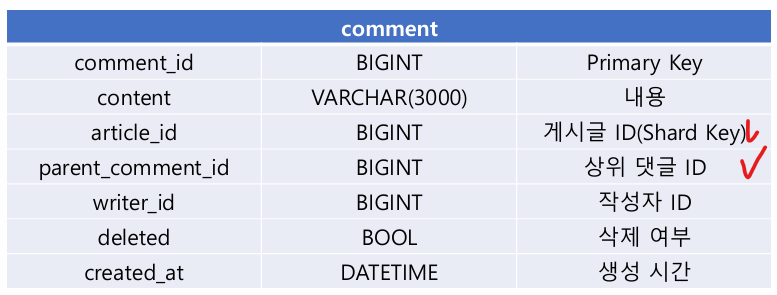

# 04_Comment

> - 알지 못했던 부분


## 알지 못했던 부분

### test code

- @ExtendWith(MockitoExtension.class)
- @InjectMocks
- @Mock

```java
import static org.mockito.BDDMockito.given;
import static org.mockito.Mockito.*;

@ExtendWith(MockitoExtension.class)
class CommentServiceTest {

    @InjectMocks
    CommentService commentService;
    @Mock
    CommentRepository commentRepository;
}
```


### filter 사용

```java
private void delete(Comment comment) {
    // 삭제
    commentRepository.delete(comment);

    // 자신이 root 가 아니라면 부모 comment 들 delete
    if (!comment.isRoot()){
        commentRepository.findById(comment.getParentCommentId())
                .filter(Comment::getDeleted) // 삭제가 되어있으면 안되고,
                .filter(not(this::hasChildren)) // 자식을 가지고 있으면 안되고,
                .ifPresent(this::delete); // 상위 댓글 삭제
    }
}
```


## 설계



- parent_comment_id = 상위 comment  확인
  - root 면 자기 자신


## 2 depth 조회시 고려할 점


- 규칙

  - 하위 댓글은 상위 댓글보다 항상 나중에 생성됨

  - 하위 댓글 안에선 생성시간 순

  - 상위 댓글 끼리는 생성시간 순

    

- 즉 상위 댓글 기준으로 데이터를 가져오면 된다.

### index

```sql
create index idx_article_id_parent_comment_id_comment_id on comment(
	article_id asc,
    parent_comment_id asc,
    comment_id asc
);
```

- `article_id asc, parent_comment_id acs, comment_id acs`
- shard key = article_id (snowflake)


## 댓글 무한 depth  - table 설계

### Path Enumeration  방식


- 위와 같이 각 depth 별로 5개의 문자열로 경로 정보를 저장
- N depth = (N * 5) 
  - 1 depth = 5개 / 2 depth = 10개 / 3 depth = 15개 등등
- 문자열로 모든 상위 댓글에서 각 댓글까지의 경로를 저장하는 것

- **제한**
  - 각 depth 별로 5개의 문자로 나타남
  - 즉 10개의 숫자를 0 ~ 10로 나타낸다면
  - 표현할 수 있는 경로의 범위 = 10^5 = 100.000개로 제한된다.
  - 각 자릿수 하나는 숫자 + 대문자 + 소문자 = 62개로 표현 가능
  - **62^5 = 916,132,832 개로 제한**


### Collation

- 문자열을 정렬하고 비교하는 방법으로 정의하는 설정
- default 설정은?
  - mysql : utf8mb4_0900_ai_ci

```sql
select table_name, table_collation from information_schema.tables;
```

- inormation_schema에서 확인 가능

**utf8mb4_0900_ai_ci**

- utf8mb4 : 각 문자 최대 4바이트 utf8 지원
- 0900 : 정렬 방식 버전
- ai : 악센트 비구분
- ci : 대소문자 비구분
- 즉 대소문자를 비구분하는 것

**==> utf8mb4_bin 을 사용해서 순서를 구분하도록 해야함**


## Comment V2


- path 컬럼이 추가
- parent comment id는 제거
- depth 가 무한할 수 있지만 5 depth로 제한
- 5 depth * 5 개 문자 = VARCHAR(25)의 데이터 타입을 가진다.
  - 즉 depth를 늘리고 싶으면 크기를 적절히 조절하면 된다.

```sql
create table comment_v2 (
     comment_id bigint not null primary key,
     content varchar(3000) not null,
     article_id bigint not null,
     writer_id bigint not null,
     path varchar(25) character set utf8mb4 collate utf8mb4_bin not null,
     deleted bool not null,
     created_at datetime not null
);
```

```sql
create unique index idx_article_id_path on comment_v2(
	article_id asc, path asc
);
```

- path를 인덱스에 넣는 이유
  - 페이징에 사용될 수 있다.
- path는 독립적인 경로를 가진다. unique index로 생성할 수 있다.
  - Application 에서 동시성 문제를 막아줄 수 있다.


- 상황 : 00a0z 댓글의 하위로 신규 댓글 작성 요청이 온 경우
- **parentPath ** : 00a0z 

- **childrenTopPath**

  - parentPath의 하위 댓글 중에서 가장 큰 path

  - 여기에 + 1을 더한 문자열이 신규 댓글의 path가 된다.

  - childrenTopPath는 어떻게 빠르게 찾을 수 있을까?

    - prefix가 상위 댓글의 path(parentPath)로 시작한다는 특성을 이용할 수 있음
    - 00a0z의 모든 자손 댓글은 prefix가 00a0z로 시작

    

- **descendantsTopPath**

  - 00a0z의 prefix(parentPath) 를 가지는 모든 자손 댓글(child)에서 가장 큰 path
  - 신규 댓글의 depth와 다를 수 있음. 하지만 childrenTopPath를 포함한다.
    - **descendantsTopPath는 3depth일 수 있으나 신규 댓글을 2depth일 수 있음**
    - 그냥 자르면 됨
    - depth * 5 로 자르면 childTopPath를 찾을 수 있음

```sql
select path
from comment_v2
	where article = {article_id} 
		and path > {parentPath} # parent 본인은 미 포함 [00a0z]
		and path like {parentPath}% # parentPath를 prefix로 하는 모든 자손 검색
	order by path desc limit 1; # 조회 결과에서 가장 큰 path
```

- 


