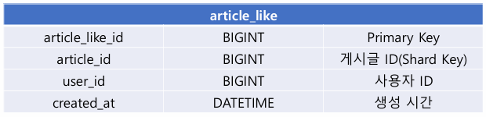
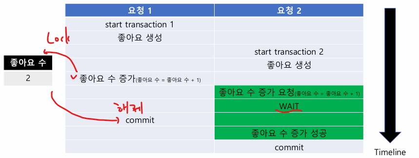
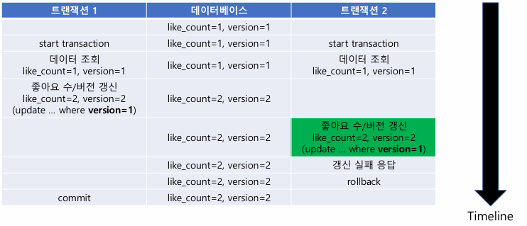

# 05_Like

> - 모르는 개념들

## 모르는 개념들

### @Lock ()

```java
@Lock(LockModeType.PESSIMISTIC_WRITE) // select .... for update
Optional<ArticleLikeCount> findLockedByArticleId(Long articleId);
```

```java
    /**
     *  Synonymous with <code>OPTIMISTIC</code>.
     *  <code>OPTIMISTIC</code> is to be preferred for new
     *  applications.
     *
     */
    READ,

    /**
     *  Synonymous with <code>OPTIMISTIC_FORCE_INCREMENT</code>.
     *  <code>OPTIMISTIC_FORCE_IMCREMENT</code> is to be preferred for new
     *  applications.
     *
     */
    WRITE,

    /**
     * Optimistic lock.
     */
    OPTIMISTIC,

    /**
     * Optimistic lock, with version update.
     */
    OPTIMISTIC_FORCE_INCREMENT,

    /**
     * Pessimistic read lock.
     */
    PESSIMISTIC_READ,

    /**
     * Pessimistic write lock.
     */
    PESSIMISTIC_WRITE,

    /**
     * Pessimistic write lock, with version update.
     */
    PESSIMISTIC_FORCE_INCREMENT,

    /**
     * No lock.
     */
    NONE
```


### @Modifying

```java
@Query(
value = "update article_like_count set like_count = like_count + 1 where article_id = :articleId",
nativeQuery = true
)
@Modifying // update 하기 위해선 Modifying 있어야함
int increase(@Param("articleId") Long articleId);

```


## 테이블 설계

### 좋아요 테이블



- (게시글 id, 사용자 id) 로 유니크 인덱스를 만들면 좋아요 기능이 가능하다.


## 좋아요 수 설계

- 좋아요 수에서는 전체 개수를 실시간으로 빠르게 보여줘야한다.
- 하지만 count 쿼리는 성능 이슈가 있음
  - 따라서 좋아요가 생성/ 삭제될 때마다 미리 좋아요 수를 갱신해 두는 방법 존재
  - **좋아요 테이블의 게시글 별 데이터 개수를 미리 하나의 데이터로 비정규화 해두는 것**

**좋아요 특성 **

- 쓰기 트래픽이 비교적 크지 않음
  - 사용자는 게시글을 조회하고, 마음에 드는 게시글을 찾는다.
  - 사용자는 좋아요 액션을 직접 수행한다.
  
- 데이터의 일관성이 중요
  - 15명 좋아요 눌렀는데 10명으로 나오면 안된다.

**해결 방안 1 **

- 관계형 테이터 베이스의 트랜잭션을 활용해 볼 수 있음

- 좋아요 [생성 / 삭제]를 하나의 트랜잭션으로 묶는다 ?

- **게시글 테이블에 좋아요 수 컬럼을 비정규화 한다면?** 

  - 문제가 생길 수 있음 (Record Lock 때문)
  - ex
    - user 1 (작성자) : 게시글 수정 중
    - user 2 (좋아요)
    - user 3 (좋아요)
    - user 4 (좋아요)
      - 게시글 row에 락이 계속 걸리는 상태
    - **중간에 update 진행 => row lock 떄문에 수정 에러 발생**
  - 위와 같은 현상이 발생할 수 있기 때문에 분리해야함

  

**해결방안 2**

- 트랜잭션은 보통 단일 데이터베이스 내에서 안정적이고 빠르게 지원한다.
- 분산된 시스템에선 **분산 트랜잭션** 개념이 필요
  - 느림 (이유는 인기글)
- **좋아요 서비스 DB에 좋아요 수 테이블을 관리**
  - shard key : article id
  - 좋아요 수 테이블과 좋아요 테이블이 물리적으로 다른 샤드에 있다면?
    - 분산 트랜잭션 필요
    - 따라서 좋아요 수 테이블의 shard key(article_id) 와 동일하게 가져간다. 


### Record Lock

- Record(row)에 락을 거는 것
- 동일한 레코드를 동시에 조회 또는 수정할 때 데이터의 무결성 보장, 경쟁 상태 방지

```
1. user 1 : transaction start => update
2. user 2 : transaction start => update => user1로 인해 대기
3. user 1 : 10초 뒤 commit;
4. user 2 : commit; (user 1로 인해 10초 이상 소모)
```

- 위와 같이 user1 이 commit; 을 할 때 까지 대기를 하게 된다.


### 동시성 문제

> - 비관적 락 (Pessimistic Lock)
> - 낙관적 락 (Optimistic Lock)
> - 비동기 순차 처리

#### 비관적 락

**비관적 락이란**



- 데이터 접근 시에 항상 충돌이 발생할 가능성이 있다고 가정
- 다른 트랜잭션은 락이 해제될 때까지 대기
  - lock 을 오래 점유하고 있으면, 성능 저하 또는 deadlock 등으로 인한 장애 가능


**비관적 락 구현 방법**

**방법 1** : DB로 직접 락을 거는 방법

```sql
#1
transaction start;

#2 : 좋아요 데이터 insert
insert into article_like 
values({article_like_id},{article_id},{user_id}, {created_at});

#3 : 좋아요 수 데이터 갱신
update article_like_count
	set like_count = like_count + 1 # 여기서 row lock을 잡게 된다.
	where article_id = {article_id};

#4
commit;
```


**방법 2** : 조회를 통해 AP 단에서 update하는 방법

```sql
#1
transaction start;

#2 : 좋아요 데이터 insert
insert into article_like 
values({article_like_id},{article_id},{user_id}, {created_at});

#3 for update 구문으로 데이터 조회
#  조회된 데이터에 대해서 Lock 점유 / JPA를 사용하면 객체로 조회 가능
select * from article_like_count
where article_id = {article_id} for update # 이 부분

#4 데이터 갱신
update article_like_count
set like_count = {update_like_count} #3 에서 값을 가져올 수 있음
where article_id = {article_id};

#5 
commit;
```


**비교**

- 방법 1
  - 락 점유하는 시간이 상대적으로 짧다.
  - DB의 현재 저장 된 데이터 기준으로 증감 처리하기 떄문에 SQL문을 직접 전송한다.
- 방법 2
  - 락 점유하는 시간이 상대적으로 길다. 
  - 데이터를 조회한 뒤 중간 과정을 수행해야하기 때문에, 락 해제가 지연될 수 있음
  - 객체지향 적으로 개발할 수 있다.


#### 낙관적 락 (Optimistic Lock)

**낙관적 락이란?**



- 데이터 접근 시에 항상 충돌이 발생할 가능성은 없다고 가정

  - 위와 같이 명시적인 락 없이 수행하는 것이라고 볼 수 있다.

- 왼쪽이 먼저 verison update를 쳤기 때문에 오른쪽이 rollback 된 현상

  - 즉 충돌이 났을 경우 rollback으로 진행한 뒤 추가적인 처리를 해주는 것이라고 볼 수 있다.

  - 충돌 확인

    1. **version을 함께 조회해서 진행**

    2. **레코드를 업데이트**
       이 때 where 조건에 조회된 version을 넣고, version은 증가시킨다.

    3. **충돌 확인**
       - 데이터 변경 성공? 충돌 X
       - 데이터 변경 실패? 충돌 O => 다른 트랜잭션이 이미 version을 올린 상태


#### 비동기 순차 처리

**비동기 순차 처리란?**

- 모든 상황을 실기간으로 처리할 필요 없다.

- 요청을 대기열에 저장 => 비동기로 순차적으로 처리

  

**장점**

- 게시글 마다 1개의 스레드에서 순차적으로 처리하면 된다. => 동시성 문제 사라짐
- 락으로 인한 지연 x, 실패 케이스 최소.

**단점**

- 큰 비용 발생
- 즉시 처리가 아니기 때문에 사용자 입장에서 지연될 수 있음
  - 따라서 클라이언트에서 추가 처리 필요 (이미 처리된 것 처럼 보여주는 방법 등)
- 서비스 정책으로 납득이 되어야 함
- 데이터 일관성 관리가 필요 (비용 발생)
  - 대기열에서 중복 / 누락이 없이 반드시 1회 보장 등 (메시지 큐 ...)


```
pessimistic-lock-1start
lockType = pessimistic-lock-1, time = 13118ms
count = 3001

pessimistic-lock-2start
lockType = pessimistic-lock-2, time = 14968ms
count = 3001

optimistic-lockstart
lockType = optimistic-lock, time = 9748ms
count = 3001
```


