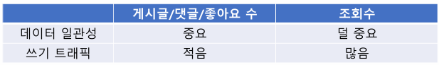

# 06_ViewCount

## 조회수 요구사항 및 설계

> - 조회수
> - 조회수 어뷰징 방지 정책

### 조회 수 어뷰징 방지정책

- 사전에 어뷰징(Abusing) 이 될 가능성을 방지하기 위한 정책
- 각 사용자는 게시글 1개당 10분에 1번 조회수 집계
  - 10분 동안 100번 조회하더라도, 1번만 집계된다는 뜻

### 조회 수 설계

- **조회수는 조회된 횟수만 저장하면 된다.**
  - 즉 좋아요 수, 게시글 수 등등 과 같이 데이터의 개수로 패생되는 것이 아니다.
  - 사용자는 내역을 확인하지 못하기 때문에 조회수만 보여주면 된다.

#### 조회수의 특성

- **데이터 일관성** : 좋아요 수에 비해 덜 중요하다고 볼 수 있다.
- **쓰기 트래픽** : 좋아요 수에 비해 비교적 많다. 왜냐하면 조회만 해도 쓰기 작업이 필요하기 떄문

- **즉 일관성이 덜 중요하고 쓰기 트래픽이 많음 : Memory 사용하면 어떨까?**

  

#### In Memory DB : Redis

- In Memory DB
- No SQL : 정해진 스키마 없음
- key value 저장소
- TTL(Time To Live) : 일정시간 지나면 삭제
- Single Thread : 명령어가 순차적으로 처리 (동시성 문제 해결하는데 유리)
- 데이터 백업 지원 : Append Only File / SnapShot
- Redis Cluster : 확장성, 부하 분산 고가용성

#### Redis Cluster : Distributed In Memory DB

##### 샤딩 지원

- **Logical Shard :** 
  - 16,384개의 Slot

- **Physical Shard** 
  - Physical Shard 의 선택 방식 
  - key의 hash 값으로 slot (Logical Shard)을 구하고, slot으로 shard(Physical Shard) 선택
    1. slot = hash_func (key)
    2. shard = select_shard(slot)

- **서버가 추가 되면 자동으로 데이터가 분산된다.**

### 백업 방법

#### 시간 단위 백업

- N분 단위로 Redis의 데이터를 MySQL로 백업하는 방법
- 배치 or 스케줄링 시스템 구축이 필요
- **백업 전 장애 시에 유실될 수 있음**

#### 개수 단위 백업

- N개 단위로 Redis의 데이터를 MySQL로 백업
- 조회 시점에 간단히 처리할 수 있음
- **개수 단위 안채워지고 장애 시 데이터 유실**

- **두방식을 적절히 섞어서 사용 가능** : [인기 글 : 개수 / 일반 : 시간] 이런식으로 가능하지 않을까?

