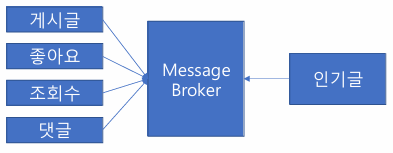

# 07_PopularArticle

> - Kafka Cluster 

## 용어 정리

### Producer

- Kafka로 데이터를 보내는 클라이언트
- 데이터를 생산 및 전송
- Topic 단위로 데이터 전송\

### Consumer 

- Kafka에서 데이터를 읽는 클라이언트
- 데이터를 소비 및 처리
- Topic 단위로 구독하여 데이터를 처리한다.

### Broker

- Kafka에서 데이터를 중개 및 처리해주는 애플리케이션 실행 단위
- Producer와 Concumer 사이에엇 데이터를 주고 받는 역할

### Kafka Cluster

- 여러 개의 Broker가 모여서 하나의 분산형 시스템을 구성한 것
- 데이터의 복제, 분산 처리, 장애 복구 등 여러 대규모 데이터에 대한 기능을 지원한다.
  - 고성능, 안전성, 고가용성 등

### Topic

- 데이터가 구분되는 논리적 단위
  - article-topic, comment-topic, like-topic 등등

### Partition

- Topic이 분산되는 단위
- 각 Topic은 여러개의 Partition으로 분산 저장 및 병렬 처리된다.
- 각 Partition 내에서 데이터가 순차적으로 기록되고 순서가 보장된다.
- 각 Partition 끼리는 순서가 보장 되지 않는다.
- Partition은 여러 Broker에 분산되어 Cluster의 확장성을 높인다.

### Offset

- 각 데이터에 대해 고유한 위치
  - 데이터는 각 Topic의 Partition 단위로 순차적으로 기록, 기록된 데이터는 offset을 가진다.

### Consumer Group

- 각 Topic의 Partition 단위로 Offset을 관리한다.
  - 인기글을 위한 Consumer Group
  - 조회 최적화 서비스를 위한 Consumer Group
- Consumer Group 내의 Consumer 들은 데이터를 중복해서 읽지 않을 수 있다.
- Consumer Group 별로 데이터를 병렬로 처리할 수 있다.

## 인기글 설계

> - 요구사항
> - 배치 처리 방법
> - 스트림 처리 방법

### 요구사항

- 일 단위로 상위 10건 인기글 성정
- 매일 오전 1시 업데이트
- 최근 7일 인기글 내역 조회

### 배치 처리 방법

- 처리해야 할 게시글의 개수 = 대규모

- **배치 처리는 시간이 오래걸릴 수 있음**

  - 병렬 처리가 가능하나 구현 복잡도가 올라가게 된다.

    

- **인기글 작업으로 인해 타 서비스에 영향이 갈 수 있음**

  - 1시간 동안에 무수히 많은 Query가 필요하다.
  - 1시간 동안 인기글 서비스에 의해 타 서비스의 부하가 폭발적으로 증가할 수 있다.

### 스트림 처리 방법

> - **스트림 (Stream)**
>
>   - 연속적인 데이터 흐름
>
>   - 실시간으로 발생하는 로그, 센서 감지, 주식 거래 데이터 등과 같이 연속적으로 들어오는 데이터
>
>     
>
> - **스트림 처리 (Stream Processing)**
>
>   - 스트림을 처리하는 것
>   - 연속적으로 들어오는 실시간 데이터를 처리하는 방식

#### 설계

1. **인기글 선정에 필요한 이벤트(ex_게시글 CRUD, 댓글 생성, 좋아요 등)를 스트림으로 받는다.**
   - 조회수 이벤트의 경우 트래픽이 많을 수 있으므로 백업 시점 (100개 단위)에만 생산해본다.
     
2. **실시간으로 각 게시글의 점수를 계산한다.**
   - 이벤트를 받을 때마다 점수를 계산한다.
     
3. **실시간으로 상위 10건의 인기글 목록을 만든다.**
   - 이러한 처리결과를 Redis에 TTL 기능을 활용하여 저장한다.
   - Sorted Set 자료 구조를 활용하여 정렬된 집합 데이터로 관리한다.
     즉, 상위 점수 10건의 게시글을 정렬 상태로 유지할 수 있다.
4. **Client는 인기글 목록을 조회한다.**

#### API vs Message Broker

##### API

- 데이터 변경이 생기면 인기글 서비스로 API를 이용한 이벤트 전송
- **장점**
  - 구현이 간단하다.
    
- **단점** 
  - 타 서비스에 직접적 의존, 시스템 간 결합도 증가
  - 서버 부하가 전파 될 수 있음 => 장애 전파, 유실등의 위험이 높음
    - 데이터를 실시간으로 push를 받는 것

##### Message Broker

- 동작
  - 게시글/ 좋아요 등 서비스의 데이터 변경되면 메시지 브로커로 이벤트 전송
  - 인기글 서비스는 이벤트를 가져와서 처리한다.

- 장점
  - 메시지 브로커에서 적절하게 이벤트를 가져와서 작업이 가능하다.
  - 게시글/ 좋아요/ 조회수/ 댓글 은 메시지 브로커로 이벤트만 전송하면 된다.
    즉 인기글에 대해서 신경쓰지 않아도 된다.
  - 장애 전파, 유실 등의 위험이 낮다.
    
- 단점
  - 구현이 복잡한다.

### Stream Processing을 활용한 인기글 설계

- Redis => Sorted Set에 저장된 인기글의 key를 날짜로 지정한다.
- 하루가 지나면 새로운 Key를 생성한다.
- 오전 1시가 될 때 (약속된 시간) Client는 해당 Key만 바라본다.
- 그렇게 반복되며, 데이터는 7일간 보존한다.

#### 점수 계산

- 게시글, 댓글 등의 이벤트는 개별적으로 받는다.
  즉 댓글 이벤트를 수신했을 때 좋아요 수, 조회수 같은 이벤트는 포함되어있디 않다.

- 점수 계산에 댓글의 유니크 작성자 수가 필요하다면?

  - 이러한 데이터는 댓글 서비스에서 가지고 제공할 이유도 없다.

  - 즉 인기글 서비스에서 관리해야하는 데이터들이 존재

    

- **인기글 서비그가 자체적인 데이터를 가지도록 해야하는 것이 포인트다**

## Producer

