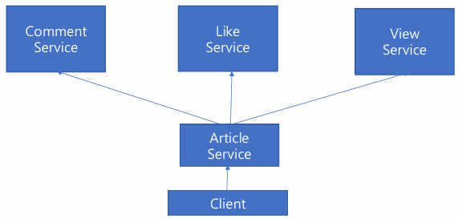
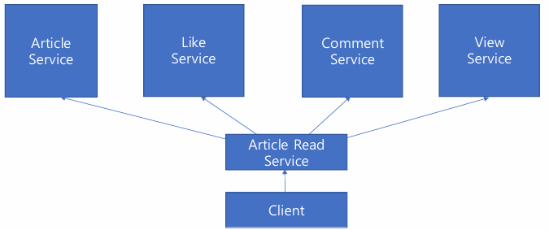
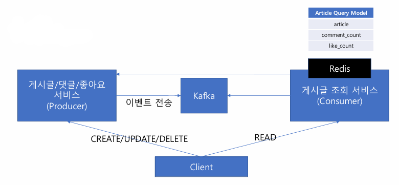
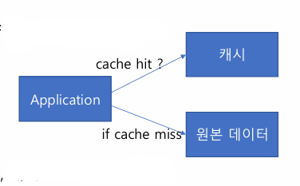
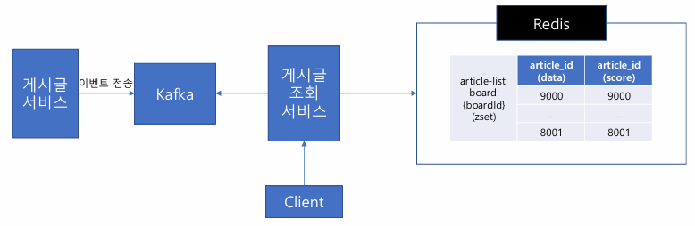

# 08_CQRS

> - Command Query Responsibility Segregation

### CQRS 가 필요한 이유

**BAD CASE**

- 위 구조의 문제점
  - Article Service가 Comment, Like, View Service의 종속된 관계다
  - 그럼 Comment, Like, View Service가 Article에게는 종속적이지 않을까?
    - 데이터 무결성을 검증하려면 게시글에 종속된 데이터이기 때문에 Article Service로 게시글 데이터 요청이 필요
  - **즉 양방향 순환 참고를 하게 된다.**

**GOOD CASE**

- Article Read Service를 만들어서 Read하는 계층을 따로 분리하는 역할을 한다면 순환 참조의 고리를 끊을 수 있다. 
- 따라서 다시 각 서비스가 독립적으로 관리 될 수 있다.
- 또한 게시글 조회를 위한 서비스이기 때문에 읽기 트래필에 대해서만 독립적으로 확장될 수 있다.

- **낭비 되는 지점** 존재
  - 각 데이터가 여러 서비스 또는 DB에 분산되어 있다.
  - 데이터를 요청하기 위한 네트워크 비용, 각 서비스에 부하 전파, 데이터 조합 및 질의 비용이 증가하게 된다.

## Command Query Responsibility Segregation

- 게시글 조회 서비스는 Command(CUD)로 부터 어떻게 데이터를 가져올 수 있을까?
  - **데이터 저장소 레벨에서 분리한다.** 
    => Command 서버에서 데이터를 실시간으로 가져오지 않게 하기 위해
- Command에서 어떻게 Query DB로 실시간 변경 사항을 가져올 수 있을까?
  - polling? : API는 장애 확장에 대한 문제점이 있을 수 있다. 즉 종속될 수 있음
  - **Message Broker 사용을 하자** : Kafka
  - 이벤트는 Producer에서 이미 Kafka로 전송되고 있다.
  - 따라서 게시글 조회 서비스는 Consumer Group만 달리해서 그대로 활용할 수 있음

- 굳이 조인을 해서 동일한 데이터로 관리를 해야할까?
  - 분산된 데이터를 어차피 조합해서 쿼리를 날려야한다.
  - **따라서 비정규화된 Query 모델을 사용해서 진행**

- 어떤 DB를 사용해야할까?
  - In-memory DB 활용
  - 빠른 성능
  - 시스템 특성 상 최신글이 조회되는 경우가 많음
  - 따라서  TTL(1일)을 설정
    - 만료된 데이터는 직접 가져온다. 하지만 트래픽은 크지 않을 것

## 캐시 최적화

### @Cacheable

1. 캐시에서 key를 기반으로 데이터 조회
2. 캐시 데이터 유무에 따라
   1. 데이터가 있으면, 캐시의 데이터를 응답
   2. 데이터가 없으면, 원본 데이터를 가져오고, 캐시에 저장한 뒤 응답

**문제점**

- 게시글 작성/ 삭제가 되면, 해당 키로 만들어진 게시글 목록은 과거의 데이터가 된다.
- 게시글 목록이 변경되어 있는데 목록 데이터는 key/value 고정 값으로 반영되어 있기 때문

### 해결

- 캐시 데이터를 실시간으로 미리 만들어둔다.
- 인기글 데이터를 미리 생성해두는 것 처럼 게시글이 생성 삭제 되면, 캐시에 미리 목록 데이터를 생성한다.

#### 게시글 패턴 특징

- 최신 게시글이 가장 많이 조회되게 된다.
- 뒷 페이지로 명시적으로 이동하지 않는 이상 과거 데이터는 비교적 조회 횟수가 적다.
- hot data : 자주 조회되는 데이터 (최신의 글)
- cold data : 자주 조회되지 않는 데이터 (과거의 글)

- Article Read Service는 Kafka로 부터 전달 받은 Article 생성, 삭제 이벤트로 Redis에 게시판별 게시글 목록을 저장한다.
  - sorted set 사용
  - data = article_id, socre = article_id(생성시간)
- Client가 게시글 요청
  - 최신글 1000건 이내의 목록 데이터는 게시글 조회 서비스의 Redis에서 가져온다.
- 

## 캐시 최적화

> - 짧은 캐시의 TTL로 인해 캐시가 만료될 때마다 원본 데이터 서버에 여러 번  요청되는 경우를 최적화 하는 방법

