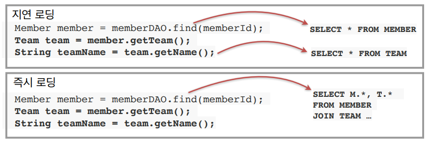

# 01_JPA

https://www.inflearn.com/course/ORM-JPA-Basic/unit/21683


## JPA와 패러다임의 불일치 해결

> - JPA와 상속
> - JPA와 연관관계
> - JPA와 객체 그래프 탐색
> - JPA와 비교


#### 1) 비교

```java
String memberId = '100'
Member member1 = jpa.find(Member.class, memberId)
Member member2 = jpa.find(Member.class, memberId)

member1 == member2; // 같음

```

- 동일한 트랜잭션에서 조회한 엔티티는 같음을 보장


## JPA 성능 최적화 기능

> 1차 캐시와 동일성(identity) 보장
>
> 트랜잭션을 지원하는 쓰기 지연(transactional write-behind)
>
> 지연로딩(Lazy Loading)


#### 1) 1차 캐시와 동일성(identity) 보장

- **같은 트랜잭션 안에서**는 같은 엔티티를 반환 - 약간의 조회 성능 향상
- DB Isolation Level이 Read Commit이어도 애플리케이션에서 Repeatable Read 보장
  - 이유 : 모아서 보낼 수 있기 때문에 가능하다

```java
String memberId = '100'
Member member1 = jpa.find(Member.class, memberId) //SQL
Member member2 = jpa.find(Member.class, memberId) //캐시

member1 == member2; // 같음
```


#### 2) 트랜잭션을 지원하는 쓰기 지연(transactional write-behind)

**Insert**

- 트랜잭션을 **커밋할 때까지 INSERT SQL**을 모음
- JDBC BATCH SQL기능을 사용해서 **한번에 SQL전송**
- **네트워크 통신비용이 줄게 된다.**

```java
transaction.begin // 트랜잭션 시작

em.persist(memberA);
em.persist(memberA);
em.persist(memberA);
// 여기까지 INSERT  SQL을 데이터 베이스에 보내지 않는다

//커밋하는 순간 데이터 베이스에 INSERT SQL을 모아서 보낸다
transaction.commit();
```


**update**

- update, delete로 인한 row락 시간 최소화
- 트랜잭션 커밋 시 UPDATE, DLELETE SQL 실행하고, 바로 커밋

```java
transaction.begin // 트랜잭션 시작

changeMember(memberA)
deleteMember(memberB)
비지니스_로직수행();

//커밋하는 순가 데이터베이스에 UPDATE, DLETE SQL을 보낸가
transaction.commit();
```


#### 3) 지연로딩(Lazy Loading)

- **지연로딩** **: 객체가 실제 사용될 때** 로딩
- **즉시로딩** : JOIN SQL로 **한번에 연관된 객체까지 미리 조회**



- 예시1) 멤버를 사용할 때 항상 팀이 사용되게 된다. => **지연로딩**
  - 그렇다면 멤버를 조회할 떄 팀을 쿼리로 한번에 같이 조인해서 가져오는 것이 좋음
- 예시2) 멤버를 사용할 때 팀을 사용하지 않음 => **즉시로딩**
  - 그렇다면 멤버만 조인하는 것이 좋을 것이다.
- 개발 팁
  - JPA로 개발할 때 보통 **지연로딩으로 먼저 셋팅**을 해놓고 나중에 즉시로딩이 **필요한 부분에서 즉시로딩**을 써준다.


