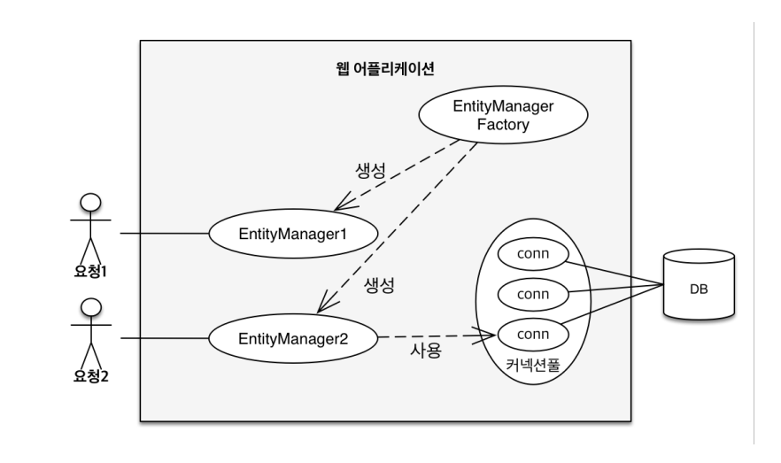
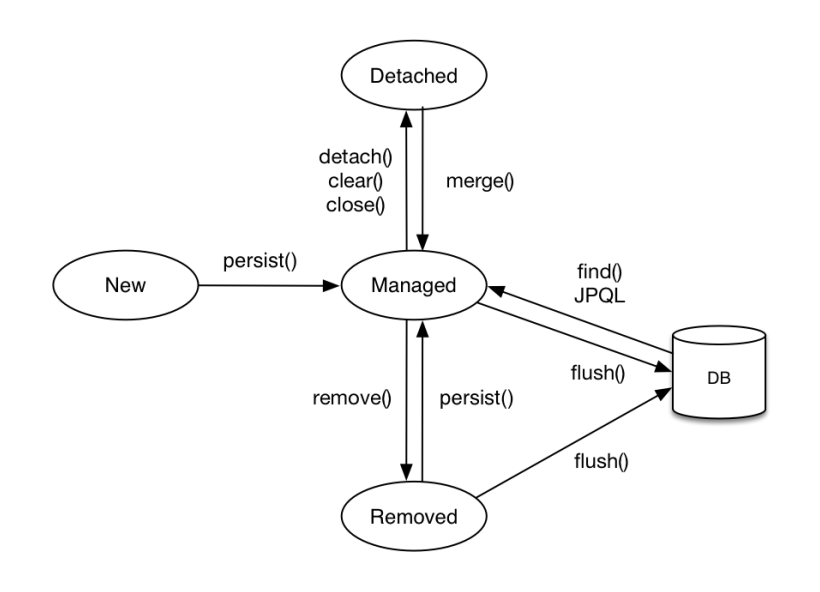
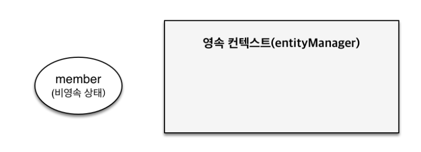
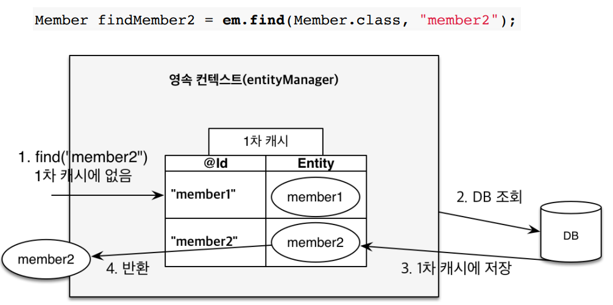
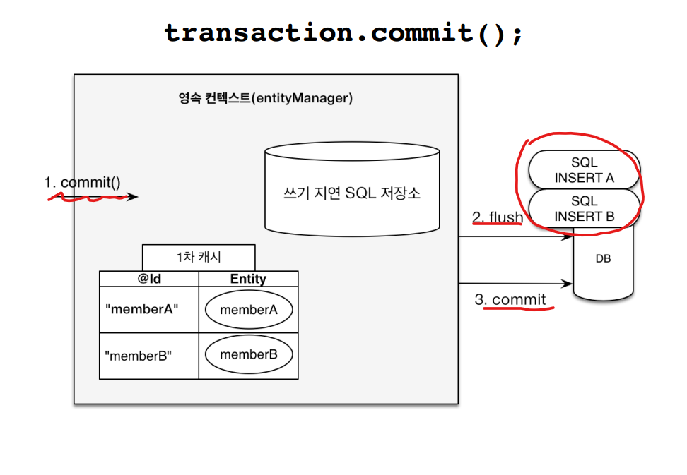

# 04_PersisenceContext


## 영속성 컨텍스트

> jpa는 실제 내부에서 어떻게 동작하지?

#### Entity Manager Factory와 Entity Manager



- Entity Manager Factory에서 요청이 올때마다 Entity Manager를 생성해서 사용하게 된다.


#### 영속성 컨텍스트

> '엔티티를 영구 저장하는 환경'이라는 뜻이다


**EntityManager.persist(entity)**

- 왜 save가 아니라 persist라는 용어를 사용할까?
- DB에 저장한다는 것이 아니라 영속성 컨텍스트라는 곳에 영속화한다는 뜻이다
  - 즉 DB에 저장 X => 영속성 컨텍스트 저장 O


EntityManager를 통해서 영속성 컨텍스트에 접근한다. 


#### J2SE환경


## Entity의 생명주기



**비영속성(new/transient)**

- PersistenceContext와 전혀 관계가 없는 새로운 상태


**영속(managed)**

- PersistenceContext에 관리 되는 상태


**준영속(detached)**

- PersistenceContext에 저장되었다가 분리된 상태


**삭제(removed)**

- 삭제된 상태


#### 비영속성(new/transient)



- EntityManager에 아무것도 하지 않은 상태

```java
// 객체를 생성한 상태(비영속)
Member member = new Member();
member.setId("member1");
member.setUserName("회원1");
```


#### 영속(managed)


- EntityManager에 member가 영속된 상태
- 이때는 DB에 저장이 되지는 않는다.
- 그럼 언제 DB에 저장되지?
  - 그것은 transaction이 commit되는 시점에 저장이 되게 된다.
- **영속상태로 만들기**
  - 조회(find)
  - persist


```java
// 객체를 생성한 상태(비영속)
Member member = new Member();
member.setId("member1");
member.setUserName("회원1");

EntityManager em = emf.createEntityManager();

// 객체를 저장한 상태(영속)
System.out.println("=====Before=====");
em.persist(member);
System.out.println("=====After=====");
```


- 위 그림과 같이 DB에 나중에 저장되는 모습을 볼 수 있다.


#### 준영속(detached), 삭제(remove)

```java
// 회원 엔티티를 영속성 컨텍스트에서 분리, 준영속 상태
em.detach(member)

//객체를 삭제한 상태(삭제) => db삭제를 요청한 상태
em.remove(member)
```


## PersistenceContext의 장점

> - 1차 캐시
> - 동일성(identity) 보장
> - 트랜잭션을 지원하는 쓰기 지연
>   (Transactional write-behind)
> - 변경 감지(Dirty Checking)
> - 지연로딩 (Lazy Loading)
>

#### 01) 1차 캐시


```java
Member member = new Member();
member.setMemberId("member1");
member.setUserName("회원1");

//엔티티를 영속
//1차 캐시에 저장됨
member.persist(member)

//1차 캐시에서 조회
Member findMember = em.find(Member.class, "member1")
```

- db pk로 설정한 것이 key값
- 값 : Entity자체가 값이 된다.
  - Key : member1
  - Val : member자체

**장점**

- 1차캐시에서 조회를 하게 된다.
  - DB를 먼저 보지 않고 1차캐시를 보게 된다.
- 사실 그렇게 크게 도움이 되지는 않는다.


**1차 캐시에서 값이 존재하지 않을 때?**

- DB에서 조회하게 된다.
- 조회한 값을 1차캐시에 저장하게 된다.
- member2를 반환




#### 02) Identity 보장

```java
Memeber a = em.find(member.class, "member1")
Memeber b = em.find(member.class, "member1")

System.out.println(a==b) //true
```

- 1차 캐시로 **REPEATABLE READ등급**의 트랜잭션 격리 수준을 DB가 아닌 **APP차원에서 제공**


#### 03) Entity 등록/ 트랜잭션을 지원하는 쓰기 지연

```java
em.persist("memberA") // memberA
em.persist("memberB") // memberB
tx.commit() // commit
```




- 즉 SQL을 모아뒀다가 한번에 쿼리를 날리게 된다.

- 최적화 할 수 있는 여지를 주기 위해서 이런 매커니즘을 사용한다.
- 네트워크 면에서 좋게 된다.


- 배치사이즈를 정할 수 있음
  - batch size = 얼마만큼 쌓아뒀다가 SQL에 한번에 보낼지


#### Entity 수정

```java
Memeber ember = em.find(Member.class, 150L);
member.setName("updateName")
```

- persist를 사용하지 않고 업데이트가 가능하다
- 왜냐하면 저장소에 쌓아뒀다가 변경된 값이 있으면 변경하고 쿼리를 날리기 때문

**변경 감지(Dirty Checking)**


- commit을 날리게 되면
- Entity와 snap shot(최초 상태를 복사해둔 것)을 서로 비교하게 된다.
- 이후에 변경 된 것이 있으면 updata sql를 생성하여 쿼리를 날리게 된다.


## flush

> 영속성 컨텍스트의 **변경내용을 DB에 반영**하는 것


#### flush는?

- 영속성 컨텍스트를 비우지 않음

- 영속성 컨텍스트의 변경내용을 DB에 동기화

- **트랜잭션으라는 작업 단위가 중요**

  - 커밋 직전에만 동기화 하면 됨
  - 즉 설계시 **PersistanceContext와 Transaction의 주기를 맞춰서 설계**를 해야한다.

  

#### flush 발생

- Dirty checking : 변경 감지
- 수정된 Entity를 쓰기 지연 SQL 저장소에 등록
- 쓰지 지연 SQL저장소의 쿼리를 DB에 전송
  (등록, 수정, 삭제 쿼리)
- flush를 중간에 발생하더라도 1차캐쉬는 남아있다
  - 즉 1차캐쉬는 commit할때 날아가게 된다.


#### PersistenceContext를 flush하는 방법

- em.flush() : 직접 호출
- transaction commit : flush자동 호출
- JPQL쿼리 실행 : flush자동 호출 


**JPQL쿼리 실행 : flush자동 호출 이유**

```java
em.persist("memberA")
em.persist("memberA")
em.persist("memberA")

// 이렇게 중간에 JPQL을 실행하게 될 경우
query = em.createQuery("select m from Member as m", Member.class);
List<Member> members = query.getResultList();
```

- 쿼리문을 쳤을 때 저장소에 넣고 있으면 진행이 안되기 때문


## 준영속 상태

> - 영속 => 준영속
> - 영속 상태의 엔티티가 영속성 컨텍스트에서 분리(detached)
> - 영속성 컨텍스트가 제공하는 기능을 사용 못함


**준영속 상태로 만드는 방법**

- em.detach() : 특정 엔티티만 준영속 상태로 전환
- em.clear()    : 영속성 컨텍스트를 완전히 초기화/ test code작성할 때 도움이 될떄가 있음
- em.close()    : 영속성 컨텍스트 종료


