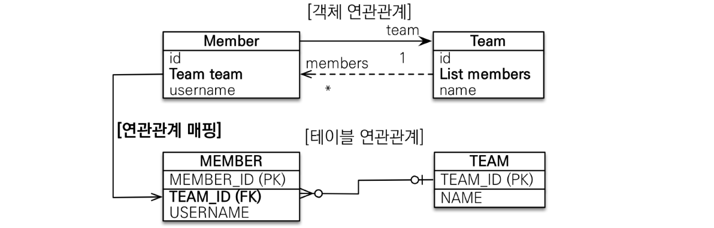
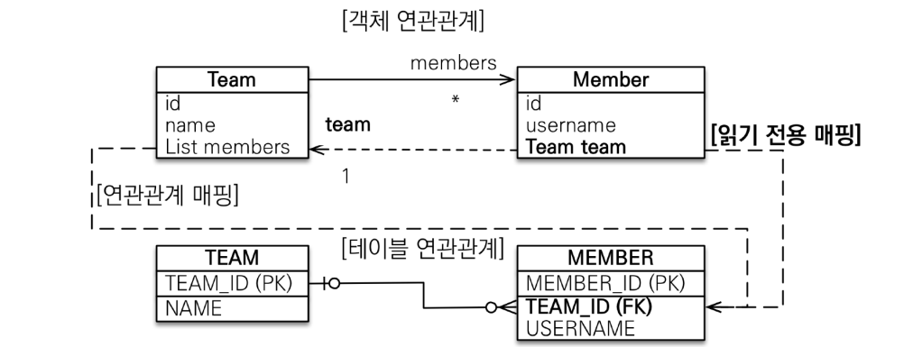
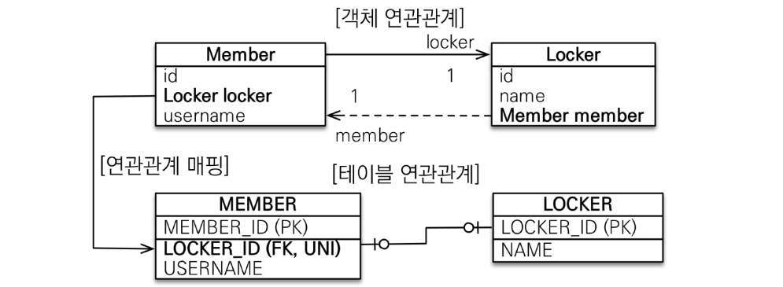

# 08_Association_Mapping_2

> 1. 다대일 [N:1]
> 2. 일대다 [1:N]
> 3. 일대일 [1:1]
> 4. 다대다 [N:N]

#### 연관관계 매핑시 고려사항 3가지

- 다중성
- 단반향, 양방향
- 연관관계의 주인

## 다대일 단방향

## 다대일 양방향

- 양방향으로 간다고 해서 Table에 전혀 영향을 주지 않는다.
- Team에서는 읽기만 가능하다.
- 양쪽을 서로 참조할 때 필요

## 일대다[1:N] 단방향

- 이런 경우도 가능하다. => **권장하지 않음**
  - 이유 : 엔티티가 관리하는 **외래 키가 다른 테이블**에 있음
- N쪽에 외래키가 들어간다.
- members의 값을 바꾸면 다른 테이블에 있는 값을 update처리 해주어야한다.
- 1이 연관관계의 주인이다
- @JoinColumn을 꼭 사용해야한다.
  - 사용하지 않을 시 중간테이블이 자동으로 생성된다.

## 일대다 양방향

- 공식적으로 존재하지 않음
- **`@JoinColumn(insertable=false, Updatable=false)`**
- **읽기 전용 필드**를 사용해서 양방향처럼 사용하는 방법
  - 가끔 읽기 전용필드로 사용해야할 때가 존재하긴 함

## 1:1 관계

- 1:1관계는 반대도 1:1이다.
- 주 테이블이나 대상 테이블 중에 외래키 선택 가능
  - 주 테이블에 외래키
  - 대상 테이블에 외래키

- **외래키에 DB 유니크 제약조건 추가**

#### 일대일 : 주 테이블에 외래 키 단방향/ 양방향

**단방향**

**양방향**

- **외래 키가 있는 곳이 연관관계의 주인**
- 반대편은 mappedBy 적용

**일대일 : 대상 테이블에 외래키 단방향?**

- 지원도 안되고 사용할 수 없음

#### 그럼 Member를 주로 할 것인가? 아니면 Locker를 주로 할 것인가??

- **DB입장**
  
  - 조건 변경 : 한 Member가 여러개의 Locker를 사용할 수 있게 변경됨
  - 그렇게 되면 Locker의 Member객체를 가지는(외래키가 Locker에 존재) 것이 좋음
  - 왜냐하면 유니크관련된 것만 빼고 annotation을 `@ManyToOne`으로 바꾸면 되기 때문에
  
  
- **개발자 입장**
  
  - 성능적으로 봤을 때 Member에 Locker외래 키가 있는 것이 좋을 수 있음
  - Member Table에서 select해서 봤을 때 볼 것이기 때문
  - 그럼 Member만 불러와서 Locker객체를 꺼내면 됨

#### 일대일 정리

- **주 테이블에 외래 키**
  
  - 주 객체가 대상 객체의 참조를 가지는 것 처럼 주 테이블에 외래 키를 두고 대상 테이블을 찾음 
  - **객체지향 개발자 선호** 
  - JPA 매핑 편리  
  - 장점
    -  주 테이블만 조회해도 **대상 테이블에 데이터가 있는지 확인 가능** 
  - 단점 
    - 값이 없으면 외래 키에 null 허용
  
  
  
- **대상 테이블에 외래 키**
  
  - 대상 테이블에 외래 키가 존재 
  - **전통적인 데이터베이스 개발자 선호** 
  - 장점: 
    - 주 테이블과 대상 테이블을 일대일에서 **일대다 관계로 변경할 때 테이블 구조 유지** 
  - **단점**
    - 프록시 기능의 한계로 **지연 로딩으로 설정해도 항상 즉시 로딩됨**(프록시는 뒤에서 설명)

## 다대다

- 잘 사용하지 않음
- RDB는 정규화된 테이블 2개로 다대다 관계를 표현할 수 없음
- 연결 테이블을 추가해서 일대다, 다대일 관계로 풀어내야함
- 연결 테이블이 **단순히 연결만 하고 끝나지 않음**
- **주문시간, 수량 같은 데이터가 들어올 수 있음**
  - 하지만 다대다는 추가 데이터를 할 수 없음

