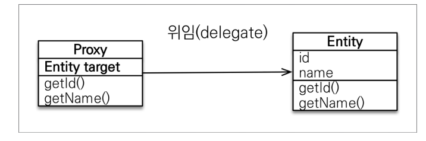
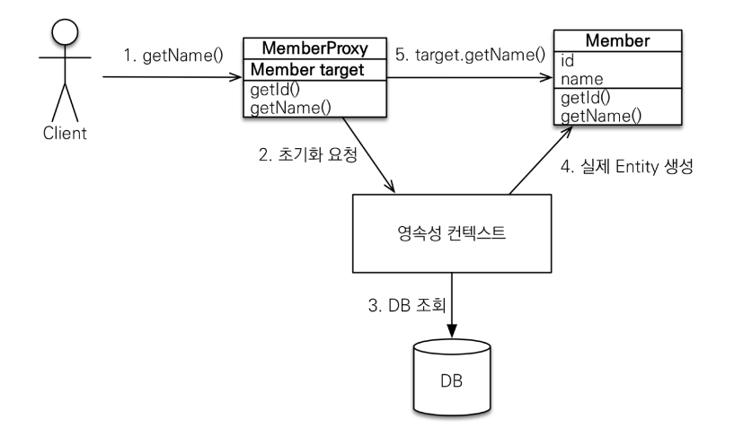
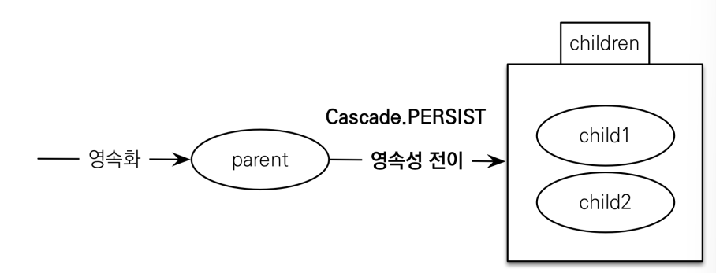

# 10_proxy

어느 경우에는 Member만 가져오고 싶고 어느 경우에는 Member와 Team을 둘다 효율적으로 가져오게 할 수는 없을까??


## Proxy기초

#### em.find() vs em.getReference()

- em.find()
  - DB를 통해서 실제 엔티티 객체 조회
- **em.getReference()**
  - DB**조회를 미루는** 가짜(프록시)엔티티 객체 조회
  - 즉 DB에 쿼리가 안나갔는데 조회가 되는 것
  - 그럼 쿼리는 언제 날리나?
    - **실제 그 값이 사용하는 시점에 쿼리가 날아가게 된다.**

```java
Member member = em.getReference(Member.class, member.getId());
// 결과 => findMember = class hellojpa.Member$HibernateProxy$ 이런식으로 가짜가 만들어진다.
```


- 껍데기는 똑같다
- 하지만 안은 텅 비어있는 상태이다.


## Proxy특징


- 실제 클래스를 상속받아서 만들어진다.
- 그렇기 때문에 실제 클래스와 겉 모양이 똑같을 수 있다.



- 프록시 객체는 실제 객체의 target을 보관한다.
- 프록시 객체를 호출 => 프록시 객체는 **실제 객체의 메소드를 호출**한다.
  - 만약 proxy에 getName을 호출한다.
  - 그렇다면 target(Entity)에 있는 getName()을 호출해준다.

#### 프록시 객체의 초기화

```java
Member member = em.getReference(Member.class, "id1");
member.getName();
```



1. getName()을 프록시에 요청
2. 프록시에서 Member target이 뭔지 모르기 때문에 PersistanceContext에 초기화 요청
3. PersistanceContext는 DB를 조회
4. PersistanceContext가 Member의 실제 Entity를 생성해줌
5. getName을 Member로부터 얻을 수 있음


#### Proxy의 특징

1. 프록시 객체는 **처음 사용할 때 한번만 초기화**
   - 즉 한번 초기화되면 계속 그것을  사용하게 된다.

2. 프록시 객체가 **실제 엔티티로 바뀌는 것이 아님**
   - 초기화 되면 프록시 객체를 통해서 **실제 엔티티에 접근 가능한 것**임

3. 따라서 타입 체크시 주의해야한다. (실제 엔티티로 바뀌는 것이 아니기 때문)

   - == 비교 대신에 **instance of 를 사용**해야한다.

   - 언제 프록시를 사용할지 모르기 때문에 JPA에서 ==비교할땐 되도록 **instance of 를 사용**를 사용하자

4. PersistanceContext에 찾는 엔티티가 이미 있으면 em.getReference()를 호출해도 실제 엔티티를 반환한다.

   - 이유

   -  한 영속성 컨텍스트안에서 가져온 객체는 무조건 같아야하기 때문

   - **JPA는 한 트랜잭션 안에서 같은 것에 대해 보장을 해준다.**
     - JPA는 어떻게든 a==a를 맞춘다.

5. PersistanceContext의 도움을 받을 수 없는 **준영속 상태일 때, 프록시를 초기화 하면 문제**가 발생
   - 실무에서 정말 많이 만나게 되는 에러다
   - org.hibernate.LazyInitializationException 예뢰를 터트린다.

```java
// 3번 : instance of 사용
Member member1 = new Member();
member1.setUserName("member1");
em.persist(member1);

Member member2 = new Member();
member2.setUserName("member2");
em.persist(member2);

m1 = em.find(Member.class, member1.getId());
m2 = em.find(Member.class, member2.getId());
sout(m1.getClass()==m2.getClass()); // true

m1 = em.find(Member.class, member1.getId());
m2 = em.getReference(Member.class, member2.getId());
sout(m1.getClass()==m2.getClass()); // false
// 이건 당연히 아는 것 아닌가?? => 실제 비지니스에선

private static void logic(Member m1, Member m2){
    sout(m1.getClass()==m2.getClass()); // 이런식으로 나온다.
    // 즉 이것이 프록시인지 아닌지 모른다는 뜻
    // 따라서 instanceof를 사용하자
    sout(m1 instanceof Member);
    sout(m2 instanceof Member); // 이런식
}
```

```java
//4번
m1 = em.find(Member.class, member1.getId());
ref = em.getReference(Member.class, member1.getId());

sout(m1.getClass()); // Member
sout(ref.getClass()); // Member
// 즉 둘다 같은 클래스가 나오게 된다. => 이유 위에 설명
```


#### 프록시 확인

- 프록시 인스턴스의 초기화 여부확인
  - emf.getPersistenceUnitUtil.isLoaded(Object entity)
- 프록시 클래스 확인
  - entity.getClass().getName() 출력(..javasist.. or  HibernateProxy…)
- 프록시 강제 초기화
  - org.hibernate.Hibernate.initialize(entity);


## 즉시로딩과 지연로딩

> member를 조회할때 team도 조회 해야하냐??

#### 지연 로딩


#### 지연 로딩 LAZY를 사용해서 프록시 조회


```java
@Entity
public class Member {
	@Id
 	@GeneratedValue
 	private Long id;
    
 	@Column(name = "USERNAME")
    private String name;
    
    @ManyToOne(fetch = FetchType.LAZY) //team을 프록시로 사용한다는 뜻 (지연로딩)
    @JoinColumn(name = "TEAM_ID")
    private Team team;
 }
```

```java
Member m = em.find(Member.class, member1.getId());
// =================
// 이렇게 하면 쿼리에 Team과 같이 가져오지 않고 Member만 가져온다.

// ================
// 이후에 Team객체를 사용하게 되면 Team의 무언가를 가져오는 쿼리를 생성할 것이다.
m.getTeam().getName(); // 이때 초기화가 일어난다.
```

- 위 같이 사용하면 **Team을 프록시 객체로 조회**를 하는 것


#### 즉시로딩


- Member조회시 항상 Team도 조회
- 실제 team1 엔티티을 가져온다.

#### 즉시로딩 EAGER를 사용해서 함께 조회

```java
 @Entity
 public class Member {
     
     @Id
     @GeneratedValue
     private Long id;
     
     @Column(name = "USERNAME")
     private String name;
     
     @ManyToOne(fetch = FetchType.EAGER) // eager
     @JoinColumn(name = "TEAM_ID")
     private Team team;
 }
```


### 프록시와 즉시로딩 주의

- **가급적 지연로딩만 사용(특히 실무에서)**
  - 예상하지 못한 SQL이 발생한다.
  - 한번에 조인되는 테이블이 엄청 많아지게 된다.
  - 바로 망함
- **즉시로딩을 JPQL에서 N+1문제를 일으킨다.**
  - JPQL사용 시 Member를 조회 한다고 가정 (member 안에 team이 있음)
  - 그럼 JPQL은 Member만 조회함
  - 그리고 어? team이 있네?
  - team을 또 조회함
  - 즉 쿼리를 2번 날리게 됨 => 네트워크 부하
  - **만약 Lazy면? => 그냥 프록시만 가져오면 된다.**
- **@ManyToOne, @OneToMany**은 기본이 즉시로딩이다
  - 따라서 직접 LAZY로 설정해주어야한다.


#### 지연로딩 활용

- member와 team은 자주 함께사용 => 즉시로딩
- member와 order는 가끔 사용 => 지연로딩
- order와 product는 자주 함께 사용 => 즉시로딩
- **사실 실무에서는 다 지연로딩으로 바른다.**
  - **모든 연관관계에 지연로딩을 사용해라!!!!**


## 영속성 전이 : CASCADE

- 특정 엔티티를 영속 상태로 만들 때 **연관된 엔티티도 함께 영속상태로 만들고 싶을 때** 사용
- EX)
  - 부모 엔티티를 저장할 때 자식 엔티티도 함께 저장

**영속성 전이 : 저장**

```JAVA
@OneToMany(mappedBy="parent", cascade=CascadeType.PERSIST)
```



**주의**

- 영속성 전이는 **연관관계를 매핑하는 것과 아무 관련이 없음** 
- 엔티티를 영속화할 때 **연관된 엔티티도 함께 영속화하는 편리함 을 제공할 뿐** 

**언제 사용하나?**

- 하나의 부모가 전체를 관리할 떄 => 소유자가 하나일 때
- 게시판이나 그럴때 => 라이프사이클이 똑같을 때

**종류**

- **ALL: 모두 적용** 
- **PERSIST: 영속**
- REMOVE: 삭제
- MERGE: 병합 
- REFRESH: REFRESH
- DETACH: DETACH


## 고아 객체

- 고아객체 제거
  - 부모 엔티티와 연관관계가 끊어진 자식 엔티티를 자동으로 삭제
- orphanRemoval = true 

```java
@Entity
public class Parent{
	
    /// ...
    @OneToMany(mappedBy="parent", orphanRemoval=true)
    private List<Child> childList = new ArrayList<>();

    /// ...
}

// List에서 뺐더니 DB에서도 삭제된다.
Parent findParent = em.find(Parent.class, parent.getId());
findParent.getChildList().remove(0);
```

- 이 컬렉션에서 빠진 아이는 삭제가 되어버린다

**주의**

- 참조하는 곳이 하나일 때 사용해야함
- **특정 엔티티가 개인 소유할 때 사용**
- 참고: 개념적으로 부모를 제거하면 자식은 고아가 된다. 따라서 고아 객체 제거 기능을 활성화 하면, **부모를 제거할 때 자식도 함께 제거된다**. 이것은 CascadeType.REMOVE처럼 동작한다.


## 영속성 전이 + 고아 객체, 생명주기

- **CascadeType.ALL + orphanRemoval=true**
- 스스로 생명주기를 관리하는 엔티티는 em.persist()로 영속화,  em.remove()로 제거
- 두 옵션을 모두 활성화 하면 **부모 엔티티를 통해서 자식의 생명 주기를 관리할 수 있음**
- 도메인 주도 설계(DDD)의 Aggregate Root개념을 구현할 때 유용


