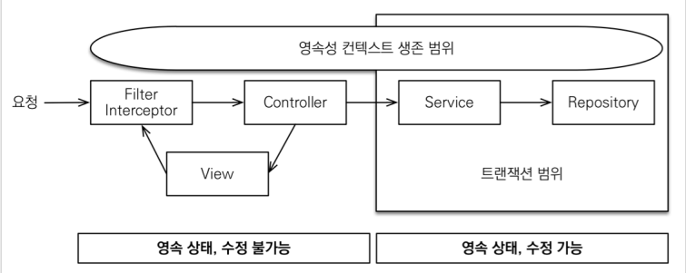

# 04_OSIV

> - Open Session In View  : 하이버네이트
> - Open EntityManager In View  : JPA => 관례상 OSIV라고 한다.

### OSIV ON

- 언제 JPA가 DB connection을 가지고 오고 언제 DB에 Conntection을 반환할까?
  - 가져올때 : DB transaction시작할 때 PersistanceContext가 DB connection을 가지고 온다.
  - 돌려줄때 : 
    - **spring.jpa.open-in-view: true**
      - api가 유저에 반환이 될 때까지 영속성 컨텍스트와 DB connection을 끝까지 살려둔다.
      - 왜냐하면 중간 중간에 지연 객체가 존재할때 프록시 초기화를 그때마다 시켜야하기 때문
    - 이 전략의 단점
      - 너무 오랜시간동안 DB connection resource를 사용하고 있다.
      - 따라서 실시간 트랙픽이 중요한 application에서는 connection이 말라버릴수 있다.
      - ex_ Controller에서 외부 API를 호출하면 외부 API대기 시간 만큼 connection resource를 반환하지 못하고, 유지해야한다는 뜻이다.

### OSIV OFF

- **spring.jpa.open-in-view: false**
- 사용안할시에 트랜잭션의 범위
  - 트랜잭션 시작 => 영속성 컨텍스트 시작
  - 트랜잭션 종료 => 영속성 컨텍스트 종료
- 장점
  - connection resource를 낭비하지 않는다.
- 단점
  - 모든 지연로딩을 트랜잭션 안에서 처리해야한다.
  - 즉 많은 지연로딩 코드를 트랜잭션 안으로 넣어야하는 단점이 존재한다.
  - 어떻게 해결?
    - fetch join을 사용해서 한번에 값을 가지고 온다.
    - 로직을 모두 service에 집어 넣는다.

해결하는 방법

- 커멘드와 쿼리를 분리한다
  - 즉 OrderQueryService라는  것을 만들어버린다.
  - **OSIV를 끈 상태**로 복잡성을 관리하는 좋은 방법이다.
- 크고 복잡한 Application을 개발한다면, 이 둘의 관심사를 명확하게 분리하는 선택은 유지보수 관점에서 의미가 있다.
- **OrderService**
  - **OrderService : 핵심 비즈니스 로직**
  - **OrderQueryService : 화면이나 API에 맞춘 서비스 (주로 읽기 전용 트랜잭션 사용)**

- 실시간 API => OSIV를 끄고
- ADMIN처럼 커넥션을 많이 사용하지 않는 곳에서는 OSIV를 킨다고 한다.

