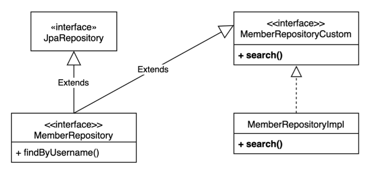

# 04_SpringData_QueryDsl


## 01) Querydsl 사용하기

1. Query Factory을 **bean으로 등록**하기
   - **main**에 쿼리 factory를 bean으로 등록한 뒤 그것을 불러와서 사용한다.

```java
@Bean
JPAQueryFactory jpaQueryFactory(EntityManager em) {
	return new JPAQueryFactory(em);
}
```

2. **따로 정의** 해서 사용하기
   - em 과 factory를 둘다 정의를 해준 뒤 생성자에서 factory안에 em을 넣어준다.

```java
@Repository
public class MemberJpaRepository {

    private final EntityManager em;
    private final JPAQueryFactory queryFactory;

    public MemberJpaRepository(EntityManager em) {
        this.em = em;
        this.queryFactory = new JPAQueryFactory(em);
        // 이렇게 넣어줘야하기때문에 => 생성자에서 이런식으로 넣어주게 된다.
        // 동시성 => transaction 단위로 움직인다. (프록시를 사용해서)
    }
```

동시성 문제?

- 걱정하지 않아도 됨
- 스프링이 주입해주는 엔티티 매니저는 실제 동작 시점에 진짜 엔티티 매니저를 찾아주는
  **프록시용 가짜 엔티티 매니저**
- 이 가짜 엔티티 매니저는 **실제 사용 시점에 트랜잭션 단위로 실제 엔티티 매니저(영속성 컨텍스트)를 할당**해준다.


## 동적 쿼리 + 성능 최적화 조회

**회원 검색 조건**

```java
@Data
public class MemberSearchCondition {
    // 회원명, 팀명, 나이(ageGoe, ageLoe)
    private String username;
    private String teamName;
    private Integer ageGoe;
    private Integer ageLoe;
}
```


### Builder 사용

```sql
public List<MemberTeamDto> searchByBuilder(MemberSearchCondition condition){
    BooleanBuilder builder = new BooleanBuilder();
   
   	# 이렇게 먼저 조건을 넣으면서 진행해 준 뒤
    if (StringUtils.hasText(condition.getUsername())){
        builder.and(memberQuery.username.eq(condition.getUsername()));
    }
    if (StringUtils.hasText(condition.getTeamName())) {
        builder.and(teamQuery.name.eq(condition.getTeamName()));
    }
    if (condition.getAgeGoe() != null) {
        builder.and(memberQuery.age.goe(condition.getAgeGoe()));
    }
    if (condition.getAgeLoe() != null) {
        builder.and(memberQuery.age.loe(condition.getAgeLoe()));
    }
    # 마지막에 쿼리문을 작성해주면 된다.
    return queryFactory
        .select(new QMemberTeamDto(
            memberQuery.id.as("memberId"),
            memberQuery.username,
            memberQuery.age,
            teamQuery.id.as("teamId"),
            teamQuery.name.as("teamName")
        ))
        .from(memberQuery)
        .leftJoin(memberQuery.teamQuery, teamQuery)
        .where(builder)
        .fetch();
}
```


### Where절 활용

```sql
public List<MemberTeamDto> search(MemberSearchCondition condition){
    return queryFactory
        .select(new QMemberTeamDto(
            memberQuery.id.as("memberId"),
            memberQuery.username,
            memberQuery.age,
            teamQuery.id.as("teamId"),
            teamQuery.name.as("teamName")
        ))
        .from(memberQuery)
        .leftJoin(memberQuery.teamQuery, teamQuery)
        .where(
        usernameEq(condition.getUsername()),
        teamNameEq(condition.getTeamName()),
        ageGoe(condition.getAgeGoe()),
        ageLoe(condition.getAgeLoe())
    )
        .fetch();
}

private BooleanExpression usernameEq(String username) {
    return StringUtils.hasText(username) ? memberQuery.username.eq(username) : null;
}

private BooleanExpression teamNameEq(String teamName) {
    return StringUtils.hasText(teamName) ? teamQuery.name.eq(teamName) : null;
}

private BooleanExpression ageGoe(Integer ageGoe) {
    return ageGoe!=null ? memberQuery.age.goe(ageGoe) : null;
}

private BooleanExpression ageLoe(Integer ageLoe) {
    return ageLoe!=null ? memberQuery.age.loe(ageLoe) : null;
}
```

- Predicate 보다 **BooleanExpression**를 사용하는 것을 권장
  - 왜냐하면 나중에 **여러메소드를 조합**하기 위해서
- where절을 사용하게되면 메소드를 재사용할 수 있는 장점을 가지게 된다.


## 프로파일 설정 나누기


- 샘플 데이터 추가가 테스트 케이스 실행에 영향을 주지 않게 하기 위해서 사용

**방법**

1. test에 `resources` 폴더를 만든다
2. `resources` 안에 `application.yml`을 만들어 준다.
3. main의 `application.yml` active : local을 추가
4. test의 `application.yml`에 active : test추가
5. 샘플 데이터 코드 있는 곳(영향이 가지 않게 하고 싶은 곳) @Profile("local") 을 추가

main

```yaml
spring:
 	profiles:
 		active: local
```

test

```yaml
spring:
 	profiles:
 		active: test
```


## Spring Data JPA + Querydsl

**Member Repository**

```java
public interface MemberRepository extends JpaRepository<Member, Long> {
 		List<Member> findByUsername(String username);
}
```

- interface로 설정
- MemberRepositoryImpl 와 같이 구현체를 만들어서 사용
  - 조건 : MemberRepository이 부분이 interface와 일치해야한다.


### 사용자 정의 리포지토리



- 조건
  - 구현체 : MemebrRepository 이름을 맞춘 뒤 Impl을 써주어야 한다.

- 모든 것을 다 Custom에 넣으려 하지 않아도 된다.
  - 특화된 기능이나 또는 너무 복잡한 쿼리는 Repository를 따로 만들어줘서 사용하는 것이 설계에서 좋다고 할 수 있다.
  - 즉 재사용이 안되고 여기서만 사용할 것 같은 경우
  
  

**사용법**

1. 사용자 정의 인터페이스 **작성**
2. 사용자 정의 인터페이스 **구현**
3. Spring data Repository에 자용자 정의 **인터페이스 상속**

**1. 작성 + 상속** => ``

- `MemberRepositoryCustom`

```java
public interface MemberRepositoryCustom {
    List<MemberTeamDto> search(MemberSearchCondition condition);
    Page<MemberTeamDto> searchPageSimple(
        			MemberSearchCondition condition, Pageable pageable); 
    				// spring.data.domain꺼로 해야함
    Page<MemberTeamDto> searchPageComplex(
        			MemberSearchCondition condition, Pageable pageable);
}
```

- `MemberRepositorySpringJpa`
  - MemberRepositoryCustom을 extends로 상속해준다.

```java
public interface MemberRepositorySpringJpa 
    			extends JpaRepository<MemberQuery, Long>,MemberRepositoryCustom {
    // extends에 member type과 member id를 넣어주면 된다.
    List<MemberQuery> findByUsername(String username);
    // select m from Member m where m.name = ?
}
```


**2. 구현** => `MemberRepositorySpringJpaImpl`

```java
public class MemberRepositorySpringJpaImpl implements MemberRepositoryCustom{
    // 조심 => Impl앞의 이름이 interface와 같아야한다.

    // em, queryFactory생성
    private final EntityManager em;
    private final JPAQueryFactory queryFactory;
    public MemberRepositorySpringJpaImpl(EntityManager em){
        this.em = em;
        this.queryFactory = new JPAQueryFactory(em);
    }

    // serach 구형
    @Override
    public List<MemberTeamDto> search(MemberSearchCondition condition){
        return queryFactory
                .select(new QMemberTeamDto(
                        memberQuery.id.as("memberId"),
                        memberQuery.username,
                        memberQuery.age,
                        teamQuery.id.as("teamId"),
                        teamQuery.name.as("teamName")
                ))
                .from(memberQuery)
                .leftJoin(memberQuery.teamQuery, teamQuery)
                .where(
                        usernameEq(condition.getUsername()),
                        teamNameEq(condition.getTeamName()),
                        ageGoe(condition.getAgeGoe()),
                        ageLoe(condition.getAgeLoe())
                )
                .fetch();
    }
```


## Paging Query

> - Spring Data + QueryDsl
> - 전체 Count 조회
> - 데이터 내용과 전체 카운트를 별도로 조회

### Spring Data JPA + QueryDSL

**사용자 인터페이스에 페이징 추가**

```java
public interface MemberRepositoryCustom {
    List<MemberTeamDto> search(MemberSearchCondition condition);
    Page<MemberTeamDto> searchPageSimple(
        			MemberSearchCondition condition, Pageable pageable); 
    				// spring.data.domain꺼로 해야함 ==> 이부분을 추가해줘야한다.
    Page<MemberTeamDto> searchPageComplex(
        					MemberSearchCondition condition, Pageable pageable);

}
```

-  Page<MemberTeamDto>를 추가 해준다.
  - 확인 할 점은 Type이 Page라는 점이다.
- 그리고 condition과 Pageable을 넣어준다.

**구현하기** => `searchPageSimple`

```sql
@Override
public Page<MemberTeamDto> searchPageSimple( # 타입이 Page다
    						MemberSearchCondition condition, Pageable pageable) {
        QueryResults<MemberTeamDto> results = queryFactory
                .select(new QMemberTeamDto(
                        memberQuery.id.as("memberId"),
                        memberQuery.username,
                        memberQuery.age,
                        teamQuery.id.as("teamId"),
                        teamQuery.name.as("teamName")
                ))
                .from(memberQuery)
                .leftJoin(memberQuery.teamQuery, teamQuery)
                .where(
                        usernameEq(condition.getUsername()),
                        teamNameEq(condition.getTeamName()),
                        ageGoe(condition.getAgeGoe()),
                        ageLoe(condition.getAgeLoe())
                )
                # 이부분을 확인해야함
                .offset(pageable.getOffset())
                .limit(pageable.getPageSize())
                .fetchResults();              
        List<MemberTeamDto> content = results.getResults(); 
        # 확인 Page타입이라는 것도 확인
        long total = results.getTotal();

        return new PageImpl<>(content, pageable, total);  # 확인

    }
```

- 순서
  1. 조회 하는 쿼리 작성
  2. .offset(pageable.getOffset()
  3. .limit(pageable.getPageSize())
  4. .fetchResults();
  5. new PageImpl<>(content, pageable, total); 작성


**구현하기** = `searchPageComplex`

```sql
@Override
public Page<MemberTeamDto> searchPageComplex(
    						MemberSearchCondition condition, Pageable pageable) {
        List<MemberTeamDto> content = queryFactory
                .select(new QMemberTeamDto(
                        memberQuery.id.as("memberId"),
                        memberQuery.username,
                        memberQuery.age,
                        teamQuery.id.as("teamId"),
                        teamQuery.name.as("teamName")
                ))
      
          .from(memberQuery)
                .leftJoin(memberQuery.teamQuery, teamQuery)
                .where(
                        usernameEq(condition.getUsername()),
                        teamNameEq(condition.getTeamName()),
                        ageGoe(condition.getAgeGoe()),
                        ageLoe(condition.getAgeLoe())
                )
                .offset(pageable.getOffset())
                .limit(pageable.getPageSize()) // 확인
                .fetch(); # 다름

        JPAQuery<MemberQuery> countQuery = queryFactory
                .selectFrom(memberQuery)
                .leftJoin(memberQuery.teamQuery, teamQuery)
                .where(
                        usernameEq(condition.getUsername()),
                        teamNameEq(condition.getTeamName()),
                        ageGoe(condition.getAgeGoe()),
                        ageLoe(condition.getAgeLoe())
                );
                
        # count쿼리를 생략 가능한 경우가 있다.
        # 페이지 시작이면서 컨텐츠 사이즈가 페이지 사이즈 보다 작을때
        # 마지막 페이지 일때( offset + 컨텐츠 사이즈를 더해서 전테 사이즈 구함 )
        # 이렇게 작성하게 하면 count 쿼리를 호출하지 않는다.
        return PageableExecutionUtils.getPage(content, pageable, 
										() -> countQuery.fetchCount());

		# count쿼리 최적화 안하는 경우
		return new PageImpl<>(content, pageable, total); 

    }

```

- Content search는 굉장히 복잡한데 count query는 단순하게 만들 수 있을 때가 있다.
- 이럴때  위와 같이 나눠서 사용한다. => 최적화 하기 위해서
  - 보면 fetch 부분에서 result fetch를 사용하지 않고 **그냥 fetch**를 사용하는 것을 볼 수 있다.


### Spring Data Sort

- spring data sort를 Query dsl에서 맞춰서 사용하기가 힘들다

```sql
JPAQuery<Member> query = queryFactory
 		.selectFrom(member);

for (Sort.Order o : pageable.getSort()) {
 	PathBuilder pathBuilder = new PathBuilder(member.getType(),member.getMetadata());

query.orderBy(new OrderSpecifier(o.isAscending() ? Order.ASC : Order.DESC,
 pathBuilder.get(o.getProperty())));
}

List<Member> result = query.fetch();
```

- 간단한 것은 이렇게 사용해도 되지만 조금만 복잡해져도 sort기능을 사용하기 힘들다
- **루트 엔티티 번위를 넘어가는 동적 정렬 기능**( 조인이 들어가면서 동적 정렬기능이 필요하면 )이 필요할 시 파라미터를 받아서 **직접 처리**하는 것이 좋다.


## Spring Data Jpa가 제공하는 Querydsl기능

- 대부분 제약이 커서 실무에서 사용하기에는 부족함

### 인터페이스 지원

> QuerydslPredicateExecutor

**한계**

- 조인x
- 클라이언트가 Querydsl에 의존해야한다.


### Querydsl 지원 클래스 직접 만들기

**장점**

- 페이징을 편리하게 변환
- 페이징과 카운트 쿼리 분리가능
- 스프링 데이터 Sort지원
- select로 시작 가능
- EntityManager, QueryFactory 제공
