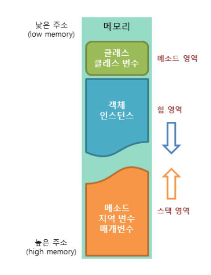

# 99_static_final

https://guccin.tistory.com/155

## Static

- static : 고정된 이라는 뜻
- **메모리를 공유**하여 사용하기 때문에 필요할 때 **바로바로 호출**하거나 데이터를 가져올 수 있게 된다.

- **객체 생성없이** 사용할 수 있는 필드와 메소드를 생성하고자 할 때 활용

- **공용데이터**에 해당하거나 **인스턴스 필드를 포함하지 않는 메소드**를 선언하고자 할 때 이용

> 인스턴스 필드 ?4

## Final

- final : 최종적인 이라는 뜻

- 해당 변수는 값이 저장되면 **최종적인 값**이 되므로 **수정이 불가능**하다.
- 오버라이딩을 막기 위해 사용한다.
- 만약 클래스에 final을 사용하면 상속을 막아준다.
-  변수, 함수, 클래스의 명시적 제한을 나타내기 위해 사용하며, 이를 통해 다양한 팀 협업시 코드의 가독성을 높여주는 효과를 얻을 수 있다.

## Static Final

- **고정되어 최종적**으로 사용된다.
- **클래스 자체에 존재하는 단 하나의 상수**이다.
  - 클래스 자체로 존재하여 **접근 가능하고 불변**하다
- **클래스의 선언과 동시에 반드시 초기화가 필요한 클래스 상수이다.**

## 메모리상에서의  이슈

**메소드 영역**

- 클래스에 대한 정보와 함께 클래스 변수가 저장
- 메소드나 변수에 static키워드를 붙이면 메소드 영역에 해당 데이터가 저장
- static영역에서는 GC가 작동하지 않아서 시스템 종료시까지 계속 메모리에 남게 되어 악영향을 미칠 수 있음

**힙영역**

- 자바 프로그램에서 생성된 모든 인스턴스 변수가 저장된다.
- new키워드를 사용하여 인스턴스가 생성되고 힙영역에 저장한다

**스택영역**

- 메소드가 실행될 때 호출과 관계되는 지역변수나 매개변수를 저장
- 메모리에는 한계가 있기 때문에 계속해서 재귀를 수행하면 스택에 함수 정보가 계속 저장되어 문제가 발생할 수 있음

