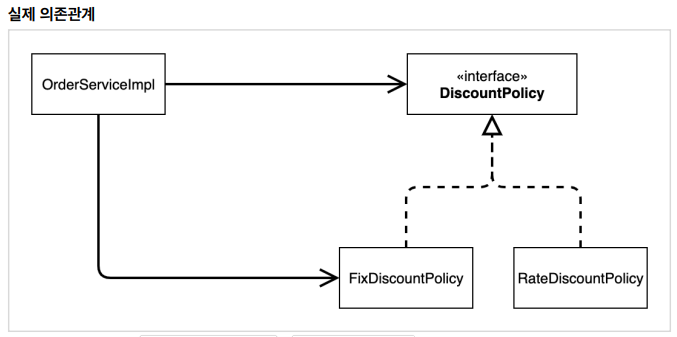
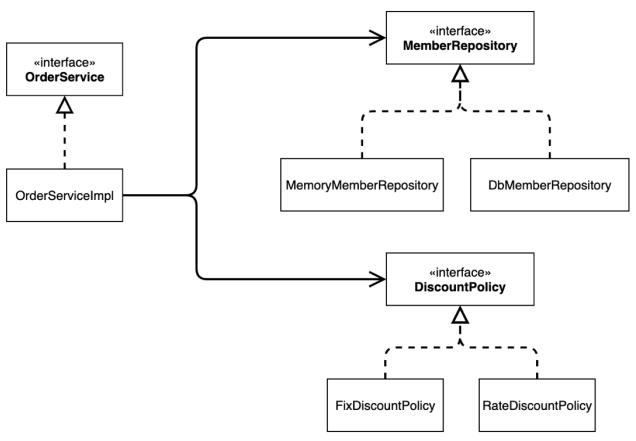
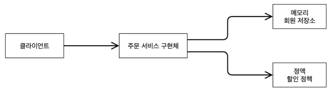

## 02_Spring원리

> - 순수 자바 코드

- 미래에 확장가능성이 있다면 interface를 도입
- 만약 아니라면 구체 글래스를 직접사용하는 것도 괜찮다.


## **순수 자바 코드**

```java
public class MemberServiceImpl implements MemberService {
    // interface
     private final MemberRepository memberRepository 
         										// impl
									         	= new MemoryMemberRepository();

}
```

- 위와 같이 설계한 것의 문제점
  - 오른쪽은 인터페이스가 아닌 impl을 의존한다.
  - **즉 OCP원칙을 준수하지 않음**
  - **DIP를 지키진않음**

 

```java
//eum일 경우에는 == 을 사용하는 것이 맞음
// string일 경우에는 .equal사용
discountFixAmout = 1000
public int discount(Member member, int price){
    if (member.getGrade() == Grade.VIP){
        return discountFixAmout;
    }
    else{
        return 0;
    }
}
```


### Single responsibility

```java
public class OrderServiceImpl implements OrderService {
     private final MemberRepository memberRepository =
         									new MemoryMemberRepository();
     private final DiscountPolicy discountPolicy = new FixDiscountPolicy();
    
    // 이렇게 된 것이 잘 된 설계
     @Override
     public Order createOrder(Long memberId, String itemName, int itemPrice) {
     	Member member = memberRepository.findById(memberId);
         
         // 확인할 부분
     	int discountPrice = discountPolicy.discount(member, itemPrice);
     return new Order(memberId, itemName, itemPrice, discountPrice);
     }
}
```

- 위와 같이 discount를 따로 계산하지 않고 역할을 잘 나눈 것이 잘 된 설계이다
  - 즉 discount 관련해서 여기서 로직을 사용하지 않는다.
  - **discount에게 던져주고 알아서 계산해 오라고 하는 것** => 이것이 잘 된 설계
  - **Single responsibility**(단일 체계 정책) 가 잘 된 것 

- 기본형인 경우 null 값이 안된다.
  - Long => null이 가능 / long => null이 불가능


### 할인 정책 변경시 문제점?

```java
public class OrderServiceImpl implements OrderService {
    // private final DiscountPolicy discountPolicy = new FixDiscountPolicy();
     private final DiscountPolicy discountPolicy = new RateDiscountPolicy();
}
```

- 할인 전책을 변경하기 위해선 OrderServiceImpl의 코드를 고쳐야한다.



OCP( 확장에는 열림, 변경에는 닫힘 )와 DIP ( 의존은 interface한테 ) ?

- **OCP와 DIP를 준수하지 않음**
  - 클라이언트 코드를 고쳐햐 함
  - 추상 => DiscountPolicy
  - 구현 => RateDiscountPolicy
- **DIP를 위반하고 있다.**

```java
public class OrderServiceImpl implements OrderService {
    // private final DiscountPolicy discountPolicy = new FixDiscountPolicy();
     private final DiscountPolicy discountPolicy;
    // 이런식으로 new값을 없애주면 해결 ==> 하지만 Error가 발생한다

}
```

- 위 코드는 null point Error를 발생시킨다.
- 이유는 discountPolicy에 어떠한 것도 할당되어있지 않기 때문이다.
- 따라서 누군가가 클라이언트인 OrderServiceImpl에 DiscountPolicy의 구현객체를 대신 생성하고 주입해주어야 함


## AppConfig

- 로미오 역할을 누가 할지 줄리엣 역할을 누가 할지 정하는 것은 누가하는가?
  - 배우가 직접하는 것이 아니라 **기획팀에서 하는 것**이다.
  - 

- App의 전체 동작 방식을 구성(config)하기 위해, 구현 객체를 생성, 연결하는 책임을 가지는 별도의 설정 클래스를 만들 것임


```java
// AppConfig
public class AppConfig {
     public MemberService memberService() {
         // 1) MemoryMemberRepository를 만들어서 주입해줌
         return new MemberServiceImpl(new MemoryMemberRepository());
     }
    
     public OrderService orderService() {
		// 2) MemoryMemberRepository, FixDiscountPolicy를 만들어서 주입해준다.
         return new OrderServiceImpl(
             new MemoryMemberRepository(),
             new FixDiscountPolicy() //비율할인으로 바꿀시 RateDisCount로 바꾸면 된다.
         );
     }
}


// MemberService - 생성자 주입
public class MemberServiceImpl implements MemberService {
     private final MemberRepository memberRepository;
    
    // 생성자 주입
     public MemberServiceImpl(MemberRepository memberRepository) {
         //위에 있는 memberRepository에 상단에 있는 1) 이 주입된다.
    	 this.memberRepository = memberRepository;
     }
    
	// ....
    
    // ....
}


// OrderService - 생성자 주입
public class OrderServiceImpl implements OrderService {
     private final MemberRepository memberRepository;
     private final DiscountPolicy discountPolicy;
    
    // 생성자 주입
     public OrderServiceImpl(MemberRepository memberRepository,
                            	DiscountPolicy discountPolicy) {
         // 위에 있는 MemberRepository, DiscountPolicy에
         // 상단에 있는 2)가 주입된다.
         this.memberRepository = memberRepository;
         this.discountPolicy = discountPolicy;
         
	// ...
         
    // ...
     }
}
```

- final을 사용하게 되면 생성자를 통해서라도 무조건 값이 들어와야한다.
- 이렇게 설계하게 되면
  - Service쪽에서 **어떤 Repository가 사용이 되는지 모른다.**
  - 또한 **interface만 의존하고 있다!!**
  - 즉 => **DIP**가 철저하게 지켜지고 있음

### DI

> - Dependency Injection
> - 의존관계 주입


- 이렇게 DIP를 지키기 위해서 의존관계를 주입 시키는 것을 DI라고 부른다.
- 할인 정책 변경
  - **사용 영역에서 코드는 건들이지 않아도 된다.**
  - 단지 구성 영역만 바꾸면 됨


## IoC, DI, Container

### IoC

> - Inversion of Control
> - 제어의 역전

- 기존
  - **구현 객체가 스스로** 필요한 서버 구현 객체를 생성하고, 연결하고, 실행

- 변경
  - 제어의 권한이 **구현 객체 X** => **AppConfig에 존재**한다.
  - **제어권이 역전**
    - 직접 관리하는 것이 아닌 외부에서 관리하는 것

프레임 워크 vs 라이브러리

- 프레임 워크가 내가 작성한 코드를 제어 => Frame work
- 내가 작성한 코드 => 직접 제어 흐름 담당 => Library


### DI

> - Dependency Injection
> - 정적인 클래스 의존 관계
> - 동적인 객체(instance) 의존 관계

**정적인 클래스 의존관계**

- 애플리케이션을 실행하지 않아도 분석 가능
- import 만 보고 의존관계를 판단할 수 있음
- OrderServiceImpl은 Member Repository, DiscountPolicy에 의존한다.
- 하지만 어떤 객체가 OrderserviceImpl에 주입될지 알 수 없음
  - 즉 FixDiscount가 올리 RateDiscount가 올지 알 수 없음 ==> 이것이 동적




**동적인 객체 인스턴스 의존관계**

- 애플리케이션 실행 시점에서 실제 생성된 객체(인스턴스)의 참조가 연결괸 의존 관계



- 런타임에 외부에서 실제 구현 객체를 생성
  => 클라이언트에 전달
  => 클라이언트와 서버의 실제 의존 관계가 연결되는 것 ==> **DI** (의존관계)

- 의존관계 주입을 사용하면 **클라이언트 코드를 변경하지 않고,**
   클라이언트가 **호출하는 대상의 타입 인스턴스를 변경**할 수 있다.

- **정적인 클래스 의존관계 변경 X** => **동적인 객체의 의존관계를 쉽게 변경** 할 수 있다.


### Container

- IoC Contaner or DI Container
  - AppConfig처럼 객체를 생성하고 관리하면서 의존관계를 연결하주는 것
  - 최근에는 DI Container라고 한다.  