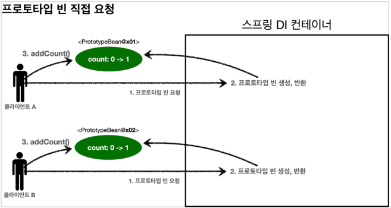
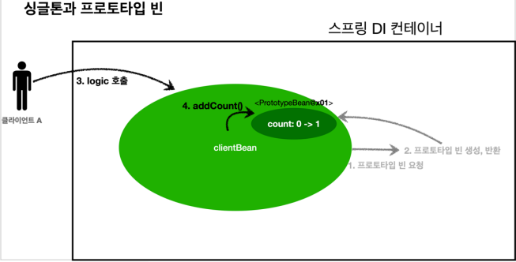

# 08_bean_scope


## 빈 스코프란?

- 빈이 존재할 수 있는 범위

- **싱글톤**
  - 기본 스코프, 스프링 컨테이너의 시작과 종료까지 유지되는 가장 넓은 범위의 스코프

- **프로토 타입**
  - 프로토 타입 빈의 생성과 의존관계 주입까지만 관여

- **웹 관련 스코프**
  - request : 웹 요청이 들어오고 나갈때 까지 유지되는 스코프
  - sesssion : 웹 세션이 생성되고 종료될때까지 유지
  - application : 웹 서블릿 컨텍스트와 같은 범위로 유지

**등록 방법**

- 컴포넌트 스캔 자동 등록

```java
@Scope("prototype")
@Component
public class HelloBean {}
```


- 수동 등록

```java
@Scope("prototype")
@Bean
PrototypeBean HelloBean() {
    return new HelloBean();
}
```


## 프로토 타입 스코프

- 스프링 컨테이너가 **항상 새로운 인스턴스를 생성**해서 반환


1. 프로토타입 스코프의 빈을 스프링 컨테이너에 요청한다.
2. 스프링 컨테이너는 요청을 받을 때 프로토타입 빈을 생성 => 필요한 의존관계를 주입
   - 즉 요청을 받을때마다 그때그때 빈을 생성하고 의존관계 주입


3. 클라이언트에 반환
4. 이후에 스프링 컨테이너에 같은 요청이 오면 항상 새로운 빈 생성

- 확인할 점
  - **스프링 컨테이너 => 프로토 타입 빈 생성, 의존관계 주입, 초기화까지만 처리**
    - 즉 빈을 관리할 책임은 클라이언트한테 있음
  - 즉 스프링 컨테이너가 하는 @PreDestory같은 종료메서드가 호출하지 않는다.


```java
public class PrototypeTest {
    @Test
    public void prototypeBeanFind() {
        AnnotationConfigApplicationContext ac = new
            AnnotationConfigApplicationContext(PrototypeBean.class);
        
        System.out.println("find prototypeBean1");
        PrototypeBean prototypeBean1 = ac.getBean(PrototypeBean.class);
        
        System.out.println("find prototypeBean2");
        PrototypeBean prototypeBean2 = ac.getBean(PrototypeBean.class);
        
        System.out.println("prototypeBean1 = " + prototypeBean1);
        System.out.println("prototypeBean2 = " + prototypeBean2);
        
        assertThat(prototypeBean1).isNotSameAs(prototypeBean2);
        ac.close(); //종료
    }
    
    @Scope("prototype") // 이때 프로토 타입이라고 적으면 prototype으로 인식
    static class PrototypeBean {
        
        @PostConstruct
        public void init() {
            System.out.println("PrototypeBean.init");
        }
        
        @PreDestroy
        public void destroy() {
            System.out.println("PrototypeBean.destroy");
        }
    }
}

```

- 실행 결과

```java
find prototypeBean1 
PrototypeBean.init // 프로토 타입은 조회하기 직전에 생성
    
find prototypeBean2 
PrototypeBean.init // 프로토 타입은 조회하기 직전에 생성
    
prototypeBean1 = hello.core.scope.PrototypeTest$PrototypeBean@13d4992d // 주소가
prototypeBean2 = hello.core.scope.PrototypeTest$PrototypeBean@302f7971 // 다르다
org.springframework.context.annotation.AnnotationConfigApplicationContext - 
Closing

// destory가 호출이 되지 않음
```


프로토 타입 특징

- 요청할때마다 새로 생성
- 빈 생성, DI, 초기화까지만 관여
- 종료 메서드 호출 안됨
- 프로토타입 빈은 프로토타입 빈을 조회한 클라이언트가 관리해야 한다.


## 싱글통 빈과 프로토타입  함께 사용시 문제점

### 

### 프로토 타입 사용



1. clinent A 가 prototype을 요청
2. 스프링 컨테이너 빈 새로 생성, 반환(x01). => count 핑드 값은 0이다
3. 조회한 프로토타입 빈에 addCount() 를 호출하면서 count+=1을 한다
   - 결과 => 빈(x01)의 count는 1이 된다.
4. clinet B도 똑같이 생성 요청
   - 결과 => 빈(x02)의 count 는 1이 된다.


### 싱글톤에서 프로토 타입 사용



1. clientBean생성 후 DI요청 => 주입 시점에 스프링 컨테이너에 프로토타입 빈을 요청
2. 프로토 타입 빈의 count필드 값은 0이다
   - clentBean은 프로토타입 빈을 내부 필드에 보관한다( 참조값을 보관 )
3. 클라이언트 A가 clientBean.logic()을 호출
4. clientBean은 prototypeBean의 addCount()를 호출 => prototypeBean의 count증가
   - count값이 1이 된다.


- 클라이언트 B가 clinentBean을 스프링 컨테이너에 요청해서 받는다.
  - 싱글톤이기 때문에 같은 clientBean이 반환
  - clinetBean이 내부에 가지고 있는 프로토타입 = 주입이 끝난 빈
  - clientBean이 생성될때 생성된 것을 계속해서 사용한다는 뜻
    - 즉! 사용 할 때마다 새로 생성되지가 않는다.

5. 클라이언트 B가 clientBean.logic()을 호출한다.
6. clientBean은 prototypeBean의 addCount()를 호출해서 프로토타입 빈의 count를 증사한다.
   - 원래 count값이 1이었기 때문에 2가 됨


```java
void singletonClientUsePrototype() {
    AnnotationConfigApplicationContext ac = new
        AnnotationConfigApplicationContext(ClientBean.class, PrototypeBean.class);
    
    // client 1 => logic => 1인지 확인
    ClientBean clientBean1 = ac.getBean(ClientBean.class);
    int count1 = clientBean1.logic(); 
    assertThat(count1).isEqualTo(1);
    
    // client 2 => logic => 2인지 확인
    ClientBean clientBean2 = ac.getBean(ClientBean.class);
    int count2 = clientBean2.logic();
    assertThat(count2).isEqualTo(2);
}

@Scope("singleton")
static class ClientBean {
    
    // ClientBean생성 =>(생성자 주입) prototypeBean생성 => 주입
    private final PrototypeBean prototypeBean;
    
    @Autowired // 생성자 주입
    public ClientBean(PrototypeBean prototypeBean) {
        this.prototypeBean = prototypeBean;
    }
    
    public int logic() {
        prototypeBean.addCount(); // clientBean로직 안에 prototype존재
        int count = prototypeBean.getCount();
        return count;
    }
}

@Scope("prototype")
static class PrototypeBean {
    private int count = 0;
    public void addCount() {
        count++;
    }
    public int getCount() {
        return count;
    }
    @PostConstruct
    public void init() {
        System.out.println("PrototypeBean.init " + this);
    }
    @PreDestroy
    public void destroy() {
        System.out.println("PrototypeBean.destroy");
    }
}
}
```

- 프로토 타입을 쓰는 이유
  - 요청마다 새로운 빈을 생성하주고 싶어서다
  - 즉 위와같이 사용하기 위해서가 아니다
  - 다음 챕터에서 설명


### 싱글톤 빈과 함께 사용시 문제해결 => Provide

- 지금 필요한 기능은 지정한 프로토타입 빈을 컨테이너에서 대신 찾아주는 딱! DL 정도의 기능만 제공하는 무언가가 있으면 된다. 


**ObjectFactory, ObjectProvider**

- ObjectProvider : 지정한 빈을 컨테이너에서 대신 찾아주는 **DL 서비스를 제공**하는 것
- ObjectFactory => 옛날 것

```java

@Autowired // 생성자 주입으로 바꿔야함
private ObjectProvider<PrototypeBean> prototypeBeanProvider; // 이렇게 만든다.

public int logic() {    
    PrototypeBean prototypeBean = prototypeBeanProvider.getObject(); // 대신 찾아줌
    prototypeBean.addCount();
    int count = prototypeBean.getCount();
    return count;
}
```

- `prototypeBeanProvider.getObject();`
  - getObject 호출하면 그때 스프링 컨테이너에서 prototypeBean을 찾아서 반환해주는 것
- 특징
  - 스프링에 의존적이다.


**JSR-330 Provider**

- 자바 표준을 사용하는 방법

  ```
  스프링 부트 3.0은 jakarta.inject.Provider 사용한다.
  이 방법을 사용하려면 다음 라이브러리를 gradle에 추가해야 한다.
  
  스프링부트 3.0 미만
  javax.inject:javax.inject:1 라이브러리를 gradle에 추가해야 한다.
  
  스프링부트 3.0 이상
  jakarta.inject:jakarta.inject-api:2.0.1 라이브러리를 gradle에 추가해야 한다.
  ```

```java
// javax.inject.Provider 참고용 코드 - 스프링부트 3.0 미만
package javax.inject;
public interface Provider<T> {
    T get();
}

// 스프링 부트 3.0은 jakarta.inject.Provider 사용
@Autowired
private Provider<PrototypeBean> provider;

public int logic() {
    PrototypeBean prototypeBean = provider.get();
    prototypeBean.addCount();
    int count = prototypeBean.getCount();
    return count;
}

```

- 자바 표준이므로 스프링이 아닌 다른 컨테이너에서도 사용할 수 있음
- get()매서드 하나로 기능이 매우 단순하다.
- 라이브러리가 필요


**프로토 타입 빈을 언제사용할까?**

- 매우 드물다 왜냐하며 new로 싱글톤으로 해결가능할 때가 많기 때문이다.
- 순환참조가 필요할때  등에서 사용할 수 있다.


## 웹 스코프

- 웹 스코프는 웹 환경에서만 동작
- 프로토타입과 다르게 스프링이 해당 스코프의 종료시점까지 관리한다.
  - 따라서 종료메서드가 호출된다.


**웹스코프 종류**

- request ; 

  - HTTP요청 하나가 들어오고 나갈 때 까지 유지되는 스코프, 각각의 HTTP요청마다 별도의 빈 인턴스가 생성되고, 관리된다.

    

- session :  HTTP Session과 동일한 생명주기를 가지는 스코프

- application : 서블릿 컨텍스트( ServletContext )와 동일한 생명주기를 가지는 스코프

- websocket : 웹 소켓과 동일한 생명주기를 가지는 스코프


- 동시에 요청
  - A전용 request scope, B전용 request scope가 각각 생성


### request스코프 예제 개발

build.gradle에 추가

```java
//web 라이브러리 추가
implementation 'org.springframework.boot:spring-boot-starter-web'
```

- 내장 톰켓 사용


**request스코프 예제 개발 + provider** 

- 동시에 여러 HTTP요청이 오면 정확히 어떤 요청이 남긴 로그인지 구분하기 힘듦
- 이럴때 request 스코프를 사용하기 좋음

```
이런식으로 만들꺼다.
[d06b992f...] request scope bean create
[d06b992f...][http://localhost:8080/log-demo] controller test
[d06b992f...][http://localhost:8080/log-demo] service id = testId
[d06b992f...] request scope bean close
```


**My Logger**

```java
@Component
@Scope(value = "request")
public class MyLogger {
    
    private String uuid;
    private String requestURL;
    
    public void setRequestURL(String requestURL) {
        this.requestURL = requestURL;
    }

    public void log(String message) {
        System.out.println("[" + uuid + "]" + "[" + requestURL + "] " + message);
    }
    
    @PostConstruct
    public void init() {
        uuid = UUID.randomUUID().toString(); // 유니크 아이디 생성
        System.out.println("[" + uuid + "] request scope bean create:" + this);
    }
    
    @PreDestroy // request 스코프는 호출이 된다.
    public void close() {
        System.out.println("[" + uuid + "] request scope bean close:" + this);
    }
}
```


**LogDemoController**

```java
@Controller
@RequiredArgsConstructor
public class LogDemoController {
    
    private final LogDemoService logDemoService;
    private final ObjectProvider<MyLogger> myLoggerProvider; 
    // provider사용
    // 이유 : request는 요청이 들어왔을 때 스코프가 시작이다
    // 즉 spring을 시작할때는 요청이 들어온 상태가 아니기 때문에 DI가 되지 않는다.
    // provider를 사용해서 필요할 때 찾아주는 역할을 해야한다.
    
    @RequestMapping("log-demo")
    @ResponseBody // 화면이 없기 때문에 문자를 그대로 반환해서 보낼 수 있음
    public String logDemo(HttpServletRequest request) { // 요청 정보를 받을 수 있음
        String requestURL = request.getRequestURL().toString();
        MyLogger myLogger = myLoggerProvider.getObject(); // 이렇게 받는다
        
        myLogger.setRequestURL(requestURL);
        myLogger.log("controller test");
        logDemoService.logic("testId");
        return "OK";
    }
}
```


**LogDemoService**

```java
@Service
@RequiredArgsConstructor
public class LogDemoService {
    private final ObjectProvider<MyLogger> myLoggerProvider;
    public void logic(String id) {
        // 웹과 관련없는 service계층까지 내려와서 로직을 만드는 것은
        // 구분이 잘 안된 느낌이다 
        // => 따라서 web관련된 부분은 controller에서 처리하는 것이 바람직하다
        MyLogger myLogger = myLoggerProvider.getObject();
        myLogger.log("service id = " + id);
    }
}
```


## 스코프와 프록시

- 가짜 프록시 미리 등록
- get할때 실제 값 넣는다
  - 즉 진짜 객체 조회를 꼭 필요한 시점까지 지연처리를 한다는 점이다.

```java
@Component
@Scope(value = "request", proxyMode = ScopedProxyMode.TARGET_CLASS)
public class MyLogger {
}
```

-  proxyMode = ScopedProxyMode.TARGET_CLASS를 추가
  - 적용 대상이
  - 클래스면 **TARGET_CLASS** 
  - 인터페이스면 **INTERFACES** 를 선택
- 이렇게 하면 MyLogger의 가짜 프록시 클래스를 만들어둔다.

**Controller**

```java
@Controller
@RequiredArgsConstructor
public class LogDemoController {
    private final LogDemoService logDemoService;
    private final MyLogger myLogger;
    
    @RequestMapping("log-demo")
    @ResponseBody
    public String logDemo(HttpServletRequest request) {
        String requestURL = request.getRequestURL().toString();
        myLogger.setRequestURL(requestURL);
        myLogger.log("controller test");
        logDemoService.logic("testId");
        return "OK";
    }
}
```


**Service**

```java
@Service
@RequiredArgsConstructor
public class LogDemoService {
    private final MyLogger myLogger;
    public void logic(String id) {
        myLogger.log("service id = " + id);
    }
}
```


**주의**

- 특별한 scope는 꼭 필요한 곳에서만 사용
  - 유지보수가 힘들어지기 때문


