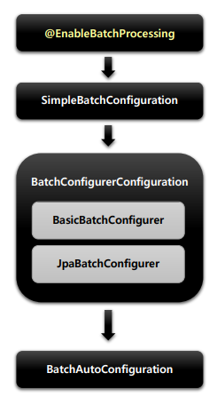
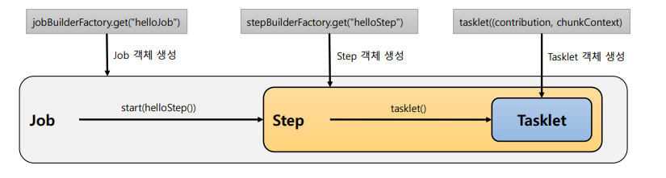
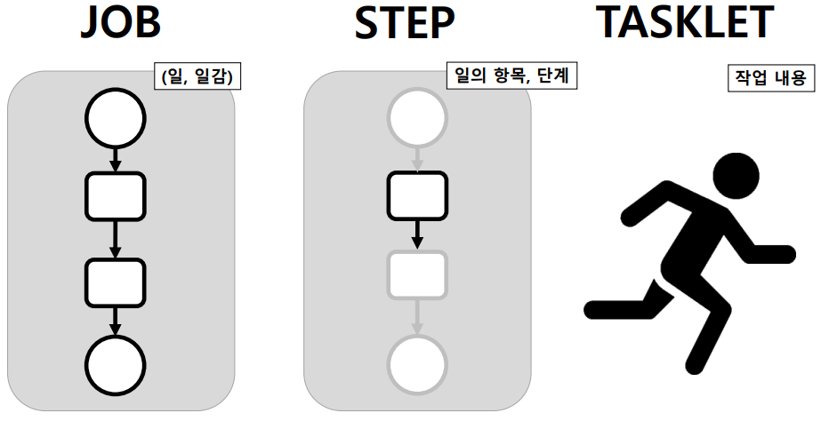
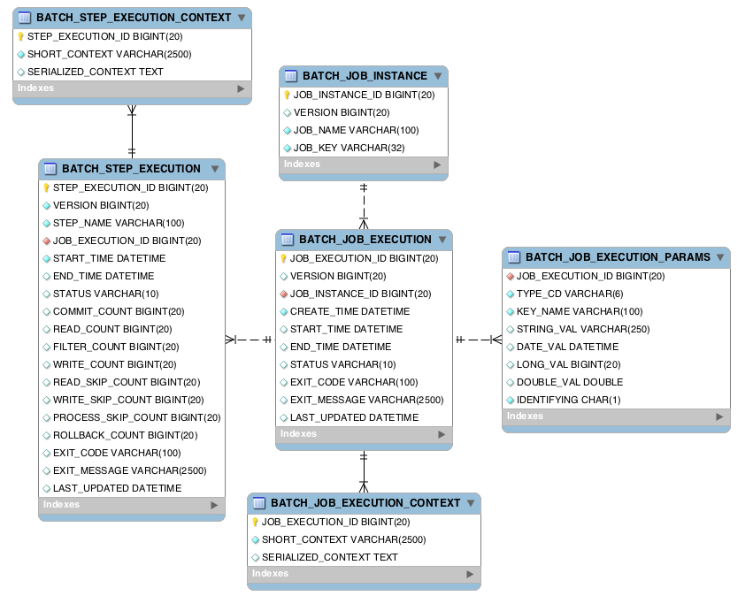

# 01_Spring Batch

> - spring 4.xx 기준이다. 즉 5버전부터는 다르니 확인이 필요

## 핵심 패턴

- Read : 데이터베이스, 파일, 큐에서 다량의 데이터를 조회한다.
- Process : 특정 방법으로 데이터를 가공한다.
- Write : 데이터를 수정된 양식으로 다시 저장한다.

- ETL 과 동일하다고 보면 된다.
  - Extract, Transform, Load => read, process, write


## 배치 시나리오

- 배치 프로세스를 주기적으로 커밋
  - commit 전략이 중요하다. 여러 데이터를 한번에 commit을 시도하게 되면 부하가 걸리기 떄문이다.
- 동시 다발적인 Job의 배치 처리, **대용량 병렬 처리 필요**
- 수동 or 스케줄링에 의한 재시작 필요
- 반복, 재시도, Skip 처리 필요
  - 잠깐에 네트워크 발생했을 경우 그부분만 재시도 가능하도록 하도록 진행


## 스프링 배치 아키텍처


- **Application**
  - 업무로직의 구현에만 집중하고 공통적인 기반 기술 담당!
- **Batch Core**
  - Job을 실행, 모니터링, 관리하는 API로 구성되어있다.
  - JobLauncher, Job, Stop, Flow 등이 여기 속함
- **Batch Infrasturecture**
  - Application, Core 모두 공통 Infra위에서 빌드한다.
  - Job 실행의 흐름과 처리를 위한 틀을 제공한다.
  - Reader, Processor, Writer, Skip, Retry 등이 속한다.


## Spring Batch 시작

### @EnableBatchProcessing

- **총 4개의 설정 클래스**를 실행시키며 **스프링 배치의 모든 초기화 및 실행 구성**이 이루어진다.

- 자동 설정 클래스가 실행됨

  - 빈으로 등록된 모든 Job을 검색 => 초기화와 동시에 Job을 수행하도록 구성

  

### 4개의 초기화 설정 클래스



1. **BatchAutoConfiguration**
   - 스프링 배치가 초기화 될 때 자동으로 실행되는 설정 클래스
   - Job을 수행하는 JobLauncherApplicationRunner 빈을 생성
2. **SimpleBatchConfiguration**
   - JobBuilderFactory와 StepBuilderFactory 생성
   - 스프링 배치의 주요 구성 요소 생성 - 프록시 객체로 생성된다.
3. **BatchConfigurerConfiguration**
   - BasicBatchConfigurer
     - SimpleBatchConfiguration 에서 생성한 프록시 객체의 실제 대상 객체 (target)을 생성하는 설정 클래스
   - JpaBatchConfigurer
     - JPA 관련 객체를 생성하는 설정 클래스


## Spring Batch 시작



```java
@Configuration // Job을 정의 : 각각의 내용들을 설정하고 구성한다는 뜻
@RequiredArgsConstructor
public class HelloJobConfiguration {

    private final JobBuilderFactory jobBuilderFactory; // Job을 쉽게 생성하기 위함
    private final StepBuilderFactory stepBuilderFactory; // Step을 쉽게 생성하기 위함

    @Bean
    public Job helloJob(){
        return jobBuilderFactory.get("helloJob") // Job을 생성하는 부분
                .start(helloStep())
                .build(); // build하게 되면 Job의 구현체의 객체가 생성되게 된다.
    }
    
    // Step에서는 기본적으로 Tasklet을 무한반복시킨다.
    // RepeatStatus.FINISHED; 으로 한번만 실행하게끔 한다.
    @Bean
    public Step helloStep(){
        return stepBuilderFactory.get("helloStep") // Step을 생성하는 부분
                .tasklet(((stepContribution, chunkContext) -> { // Step안에서 단일 태스크로 수행
                    System.out.println("Hello Spring Batch");
                    return RepeatStatus.FINISHED;
                }))
                .build();
    }
}
```

1. @Configuration
   - 하나의 배치 Job을 정의하고 빈 설정
2. JobBuilderFactory
   - Job을 생성하는 빌더 팩토리
3. StepBuilderFactory
   - Stop을 생성하는 빌더 팩토리
4. Job
   - helloJob 이름으로 Job 생성
5. Step
   - hellpStep 이름으로 Step 생성
6. tasklet
   - Step 안에서 단일 태스크로 수행되는 로직 구현
7. Job => Step => Tasklet




1. Job
   - 하나의 일의 단위 
2. Step
   - 하나의 일에서 무엇을 해야하는지에 대한 단계
   - Step에서는 기본적으로 Tasklet을 무한반복시킨다.
   - 
3. Tasklet
   - 실제 작업 내용
     - 즉 실제 비즈니스로직이 들어가야한다.


## DB 스키마 생성 및 이해

### Overview

1. 스프링 배치 메터 데이터
   - 여러 도메인들 (Job, Step, JobParameters)의 정보들을 업데이트, 조회할 수 있는 스키마 제공
   - 과거, 현재의 실행에 대한 정보, 실행에 대한 성공 여부 등을 관리해준다. => Log 찍어줌
   - DB와 연동할 경우 필수적으로 메타 테이블 생성
2. DB 스키마 제공
   - 파일 위치 : /org/springframework/batch/core/schema*.sql
   - DB 유형별로 제공
3. 스키마 생성 설정
   - 수동 생성
   - 자동 생성
     - spring.batch.jdbc.initialize-schema
       - ALWAYS : 
         - 스크립트 항상 실행
         - RDBMS 설정이 되어 있을 경우 내장 DB 보다 우선적으로 실행
       - EMBEDED
         - 내장 DB일 때만 실행되며 스키마가 자동 생성, [DEFAULT]
       - NEVER
         - 스크립트 항상 실행 안함
         - 내장 DB 일 경우 스크립트가 생성이 안되기 떄문에 오류 발생
         - 운영에서 수동으로 스크립트 생성 후 설정하는 것을 권장
           - **운영에서는 always로 하는 것은 위험하다.**

### DB 테이블 구성




